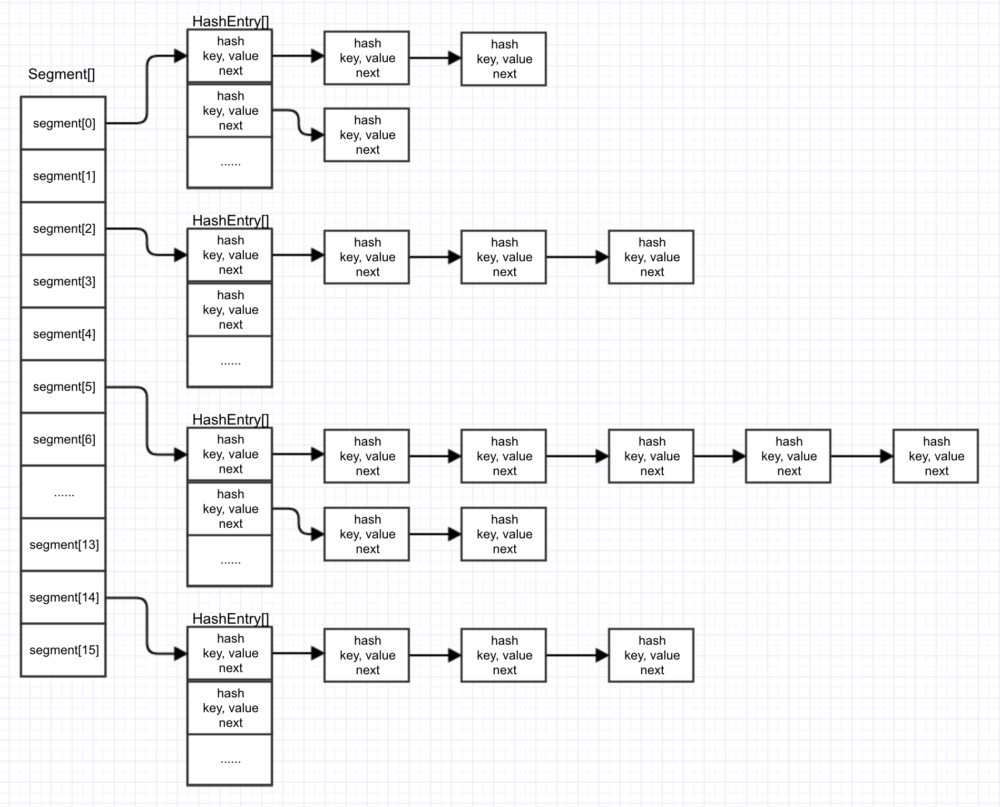
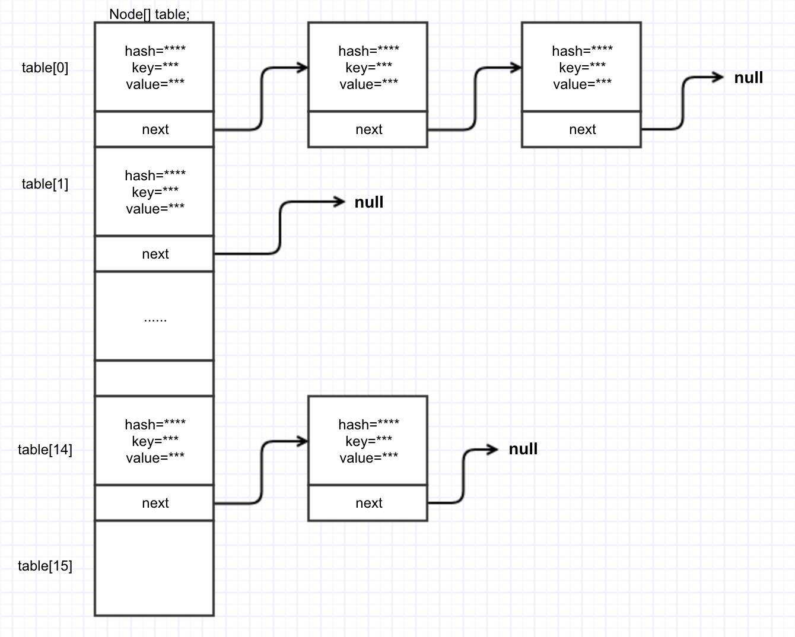

# Java集合

### HashMap原理(*)
- HashMap最多只允许一条Entry的键为Null(多条会覆盖)，但允许多条Entry的值为Null
- HashSet 本身就是在 HashMap 的基础上实现的
- 若负载因子越大，那么对空间的利用更充分，但查找效率的也就越低；若负载因子越小，那么哈希表的数据将越稀疏，对空间造成的浪费也就越严重。系统默认负载因子0.75
- 首先，判断key是否为null，若为null，则直接调用putForNullKey方法；若不为空，则先计算key的hash值，然后根据hash值搜索在table数组中的索引位置，如果table数组在该位置处有元素，则查找是否存在相同的key，若存在则覆盖原来key的value，否则将该元素保存在链头（最先保存的元素放在链尾）。此外，若table在该处没有元素，则直接保存。
- HashMap 永远都是在链表的表头添加新元素。（jdk1.7）


----------


### hash()方法
```
static final int hash(Object key) {
        int h;
        return (key == null) ? 0 : (h = key.hashCode()) ^ (h >>> 16);
    }
```

- hash() 方法用于对Key的hashCode进行重新计算，而当计算出来的hash值与hashMap的(length-1)做了&运算后，会得到位于区间[0，length-1]的一个值。特别地，这个值分布的越均匀，HashMap 的空间利用率也就越高，存取效率也就越好，保证元素均匀分布到table的每个桶中以便充分利用空间。
- hash():使用hash()方法对一个对象的hashCode进行重新计算是为了防止质量低下的hashCode()函数实现。由于hashMap的支撑数组长度总是2的幂次，通过右移可以使低位的数据尽量的不同，从而使hash值的分布尽量均匀。
- 保证元素均匀分布到table的每个桶中; 当length为2的n次方时，h&(length -1)就相当于对h%length，不仅会减少hash碰撞，而且速度比直接取模要快得多，空间利用率也会更高，这是HashMap在速度上的一个优化。

### resize()方法
- 我们在扩充HashMap的时候，不需要像JDK1.7的实现那样重新计算hash，只需要看看原来的hash值新增的那个bit是1还是0就好了，是0的话索引没变，是1的话索引变成"原索引+oldCap"

## ConcurrenytHashMap原理(*)
### JDK1.7图示：



### JDK1.8图示：
  


- 1.7采用的分段锁，而1.8采用的是CAS和synchronize方法
- 1.8锁住的是table级别，而1.7锁住的segment级别，锁粒度更细，并发性能更高
- 但是1.8并发锁住的是table在扩容时会影响其他线程的读写，但是有优化。其他线程一起参与扩容，加快扩容速度
- 并发扩容。引入ForwardingNode类，会改变sizeCtl这个值

### HashMap线程不安全
- 在HashMap进行扩容重哈希时导致Entry链形成环。一旦Entry链中有环，势必会导致在同一个桶中进行插入、查询、删除等操作时陷入死循环。

### Segment数组
- Segment 类继承于 ReentrantLock 类，从而使得 Segment 对象能充当锁的角色
- 在Segment类中，count 变量是一个计数器，它表示每个 Segment 对象管理的 table 数组包含的 HashEntry 对象的个数，也就是 Segment 中包含的 HashEntry 对象的总数。特别需要注意的是，之所以在每个 Segment 对象中包含一个计数器，而不是在 ConcurrentHashMap 中使用全局的计数器，是对 ConcurrentHashMap 并发性的考虑：因为这样当需要更新计数器时，不用锁定整个ConcurrentHashMap。

## ArrayList
- 以无参数构造方法创建 ArrayList 时，实际上初始化赋值的是一个空数组。当真正对数组进行添加元素操作时，才真正分配容量。即向数组中添加第一个元素时，数组容量扩为10

### 扩容
```
    /判断是否需要扩容
    private void ensureExplicitCapacity(int minCapacity) {
        modCount++;

        // overflow-conscious code
        if (minCapacity - elementData.length > 0)
            //调用grow方法进行扩容，调用此方法代表已经开始扩容了
            grow(minCapacity);
    }
    
    /**
     * 要分配的最大数组大小
     */
    private static final int MAX_ARRAY_SIZE = Integer.MAX_VALUE - 8;

    /**
     * ArrayList扩容的核心方法。
     */
    private void grow(int minCapacity) {
        // oldCapacity为旧容量，newCapacity为新容量
        int oldCapacity = elementData.length;
        //将oldCapacity 右移一位，其效果相当于oldCapacity /2，
        //我们知道位运算的速度远远快于整除运算，整句运算式的结果就是将新容量更新为旧容量的1.5倍，
        int newCapacity = oldCapacity + (oldCapacity >> 1);
        //然后检查新容量是否大于最小需要容量，若还是小于最小需要容量，那么就把最小需要容量当作数组的新容量，
        if (newCapacity - minCapacity < 0)
            newCapacity = minCapacity;
       // 如果新容量大于 MAX_ARRAY_SIZE,进入(执行) `hugeCapacity()` 方法来比较 minCapacity 和 MAX_ARRAY_SIZE，
       //如果minCapacity大于最大容量，则新容量则为`Integer.MAX_VALUE`，否则，新容量大小则为 MAX_ARRAY_SIZE 即为 `Integer.MAX_VALUE - 8`。
        if (newCapacity - MAX_ARRAY_SIZE > 0)
            newCapacity = hugeCapacity(minCapacity);
        // minCapacity is usually close to size, so this is a win:
        elementData = Arrays.copyOf(elementData, newCapacity);
    }
```
    

- ***int newCapacity = oldCapacity + (oldCapacity >> 1),所以 ArrayList 每次扩容之后容量都会变为原来的 1.5 倍！*** 
- ArrayList 源码中有一个 ensureCapacity 方法，这个方法 ArrayList 内部没有被调用过，所以很显然是提供给用户调用的，最好在 add 大量元素之前用 ensureCapacity 方法，以减少增量重新分配的次数

## LinkedList
**内部结构**


- LinkedList是一个实现了List接口和Deque接口的双端链表。 
- LinkedList底层的链表结构使它支持高效的插入和删除操作，另外它实现了Deque接口，使得LinkedList类也具有队列的特性; 
- LinkedList不是线程安全的，如果想使LinkedList变成线程安全的，可以调用静态类Collections类中的synchronizedList方法：


## Q&A
1. List的子类特点
- ArrayList:
底层数据结构是数组，查询快，增删慢
线程不安全，效率高
- Vector:
底层数据结构是数组，查询快，增删慢
线程安全，效率低
- LinkedList:
底层数据结构是双向链表，查询慢，增删快
线程不安全，效率高
