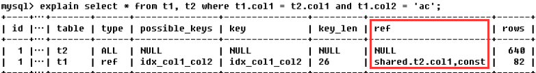
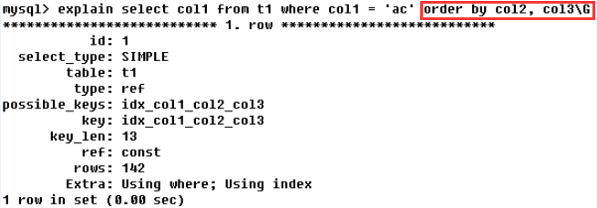

# MySQL

## Mybatis
### Mybatis缓存
 - （默认开启）一级缓存：**作用域是同一个`SqlSession`**，在同一个`sqlSession`中两次执行相同的sql语句，第一次执行完毕会将数据库中查询的数据写到缓存（内存），第二次会从缓存中获取数据将不再从数据库查询，从而提高查询效率。当一个sqlSession结束后该sqlSession中的一级缓存也就不存在了。
 - 二级缓存：**mapper级别的缓存**，多个`SqlSession`去操作同一个Mapper的sql语句，多个`SqlSession`去操作数据库得到数据会存在二级缓存区域，多个`SqlSession`可以共用二级缓存，二级缓存是跨`SqlSession`的。不同的`sqlSession`两次执行相同namespace下的sql语句且向sql中传递参数也相同即最终执行相同的sql语句，第一次执行完毕会将数据库中查询的数据写到缓存（内存），第二次会从缓存中获取数据将不再从数据库查询，从而提高查询效率。Mybatis默认没有开启二级缓存需要在`setting`全局参数中配置开启二级缓存

### Mybatis的执行流程
**注意**：其中获取mapper是通过JDK的动态代理生成`mapperProxy`代理对象，然后执行对应的sql方法，底层是通过`executor`实现具体的sql操作。

**时序图：**
1. SqlSessionFactory 与 SqlSession.
图片没了！！！
2. 利器之MapperProxy:

3. Excutor:


## MySQL索引
### 索引的选择
- 表的主键、外键必须有索引；
- 经常出现在Where子句中的字段，特别是大表的字段，应该建立索引；
- 索引应该建在选择性高的字段上；
- 索引应该建在小字段上，对于大的文本字段甚至超长字段，不要建索引；
- 频繁进行数据操作的表，不要建立太多的索引；

### 索引失效
- 使用的索引列不是复合索引列表中的第一部分
- 应尽量避免在 where 子句中对字段进行 null 值判断
- 应尽量避免在 where 子句中使用!=或<>操作符
- 应尽量避免在 where 子句中使用 or 来连接条件 (用or分割开的条件，如果or前的条件中的列有索引，而后面的列中没有索引，那么涉及的索引都不会被用到)，可以用union all替换
- 尽量避免在索引过的字符数据中，使用非打头字母%搜索
- 应尽量避免在 where 子句中对字段进行表达式操作或者函数操作

### 主键，唯一索引区别
- 主键一定会创建一个唯一索引，但是有唯一索引的列不一定是主键；
- 主键不允许为空值，唯一索引列允许空值；
- 一个表只能有一个主键，但是可以有多个唯一索引；
- 主键可以被其他表引用为外键，唯一索引列不可以；
- 主键是一种约束，而唯一索引是一种索引，是表的冗余数据结构，两者有本质的差别

### MySQL explain分析


**id：反映的是表的读取的顺序，或查询中执行select子句的顺序。**
小表永远驱动大表，三种情况：
1. id相同，执行顺序是由上至下的
2. id不同，如果是子查询，id序号会递增，id值越大优先级越高，越先被执行
3. id存在相同的，也存在不同的，所有组中，id越大越先执行，如果id相同的，从上往下顺序执行


**select_type：反映的是Mysql理解的查询类型**

 - simple：简单的select查询，查询中不包含子查询或union。
 - primary：查询中若包含任何复杂的字部分，最外层查询标记为primary。
 - subquery：select或where列表中的子查询。
 - derived（衍生）：在from列表中包含的子查询，Mysql会递归执行这些子查询，把结果放在临时表里。
 - union：若第二个select出现在union后，则被标记为union，若union包含在from字句的子查询中，外层select将被标记为derived
 - union result：union后的结果集

**table：反映这一行数据是关于哪张表的**

**type：访问类型排序**
反映sql优化的状态，至少达到range级别，最好能达到ref
查询效率：system > const > eq_ref > ref > range > index > all
（完整的排序：system > const > eq_ref > ref > fulltext > ref_or_null > index_merge > unique_subquery > index_subquery > range > index >all）　

 - system：从单表只查出一行记录（等于系统表），这是const类型的特例，一般不会出现
 - const：查询条件用到了常量，通过索引一次就找到，常在使用primary key或unique索引中出现。

 - eq_ref：唯一性索引扫描，对于每个索引键，表中只有一条记录与之匹配，常见于主键或唯一索引扫描。
 - ref：非唯一性索引扫描，返回匹配某个单独值的所有行，本质上也是一种索引访问，它可能会找到多个符合条件的行，与eq_ref的差别是eq_ref只匹配了一条记录。
 - range：只检索给定范围的行，使用一个索引来选择行。key列显示使用了哪个索引，一般是在where语句中出现了between、<、>、in等的查询。这种范围扫描索引扫描比全表扫描要好，因为它只需要开始于索引的某一点，而结束于另一点，不用扫描全部索引。与eq_ref和ref的区别在于筛选条件不是固定值，是范围。

 - index：full Index scan，index和all的区别为index类型只遍历索引树。这通常比all快，因为索引文件通常比数据文件小。

 - all：全表扫描，如果查询数据量很大时，全表扫描效率是很低的。

**possible_keys、key、key_len：反映实际用到了哪个索引，索引是否失效**

 - possible_keys：Mysql推测可能用到的索引有哪些，但不一定被查询实际使用
 - key：实际使用的索引，若为null，则可能没建索引或索引失效。（查询中若使用了覆盖索引，则该索引仅出现在key列表中。覆盖索引：select后面的字段和所建索引的个数、顺序一致）
 


 - key_len：表示索引中使用的字节数，可通过该列计算查询中使用的索引的长度。同样的查询结果下，长度越短越好。key_len显示的值为索引字段的最大可能长度，并非实际使用长度，即key_len是根据表定义计算而得，不是通过表内检索出的。
 
**ref：反映哪些列或常量被用于查找索引列上的值**



**rows：根据表统计信息及索引选用情况，大致估算出找到所需的记录所需要读取的行数**


仅通过主键索引查找是641行


建完相关的复合索引再查，需要查询的行数就变少了

**Extra**
1. using filesort：mysql中无法利用索引完成的排序，这时会对数据使用一个外部的索引排序，而不是按照表内的索引顺序进行读取。


创建索引时就会对数据先进行排序，出现using filesort一般是因为order by后的条件导致索引失效，最好进行优化。



order by的排序最好和所建索引的顺序和个数一致
2. using temporary：使用了临时表保存中间结果，mysql在对查询结果排序时使用临时表。常见于排序order by和分组查询group by。


影响更大，所以要么不建索引，要么group by的顺序要和索引一致


3. using index：表示相应的select操作中使用了覆盖索引，避免访问了表的数据行，效率好
　　- 覆盖索引：select后的数据列只从索引就能取得，不必读取数据行，且与所建索引的个数（查询列小于等于索引个数）、顺序一致。
　　- 所以如果要用覆盖索引，就要注意select的列只取需要用到的列，不用select *，同时如果将所有字段一起做索引会导致索引文件过大，性能会下降。

出现using where，表明索引被用来执行索引键值的查找

如果没有同时出现using where，表明索引用来读取数据而非执行查找动作。
4. using where：表明使用了where过滤
5. using join buffer：使用了连接缓存
6. impossible where：where子句的值是false
7. select tables optimized away
8. distinct：优化distinct操作，在找到第一匹配的元组后即停止找同样值的动作

## InnoDB锁机制


### 乐观锁
实现：在表中的数据进行操作时(更新)，先给数据表加一个版本(version)字段，每操作一次，将那条记录的版本号加1。也就是先查询出那条记录，获取出version字段,如果要对那条记录进行操作(更新),则先判断此刻version的值是否与刚刚查询出来时的version的值相等，如果相等，则说明这段期间，没有其他程序对其进行操作，则可以执行更新，将version字段的值加1；如果更新时发现此刻的version值与刚刚获取出来的version的值不相等，则说明这段期间已经有其他程序对其进行操作了，则不进行更新操作。

### 悲观锁
InnoDB默认使用行锁，实现了两种标准的行锁――共享锁与排他锁；


注意：
1. 除了显式加锁的情况，其他情况下的加锁与解锁都无需人工干预。
2. InnoDB所有的行锁算法都是基于索引实现的，锁定的也都是索引或索引区间；

### 当前读和快照读

 - **当前读**：即加锁读，读取记录的最新版本，会加锁保证其他并发事务不能修改当前记录，直至获取锁的事务释放锁；
    使用当前读的操作主要包括：显式加锁的读操作与插入/更新/删除等写操作，如下所示：
  ```
        select * from table where ? lock in share mode;
        select * from table where ? for update;
        insert into table values (…);
        update table set ? where ?;
        delete from table where ?;
   ```
- **快照读**：即不加锁读，读取记录的快照版本而非最新版本，通过MVCC实现；
InnoDB默认的RR事务隔离级别下，不显式加`lock in share mode`与`for update`的select操作都属于快照读，保证事务执行过程中只有第一次读之前提交的修改和自己的修改可见，其他的均不可见；

### MVCC
(摘自《高性能Mysql》)


举例：
每一个事务在启动的时候，都有一个唯一的递增的版本号。 
1. 在插入操作时 ： 记录的创建版本号就是事务版本号。 
比如我插入一条记录, 事务id 假设是1 ，那么记录如下：也就是说，创建版本号就是事务版本号。
id | name | create version | delete version
:--:|:--:|:--:|:--:
1  | test | 1 | 

2. 在更新操作的时候，采用的是先标记旧的那行记录为已删除，并且删除版本号是事务版本号，然后插入一行新的记录的方式。 
比如，针对上面那行记录，事务Id为2 要把name字段更新
```
update table set name= 'new_value' where id=1;
```
id | name | create version | delete version
:--:|:--:|:--:|:--:
1  | test | 1 | 2
1  | new_value | 2 |

3. 删除操作的时候，就把事务版本号作为删除版本号。比如
```
    delete from table where id=1; 
```
id | name | create version | delete version
:--:|:--:|:--:|:--:
1  | new_value | 2 | 3

4. 查询操作： 
从上面的描述可以看到，在查询时要符合以下两个条件的记录才能被事务查询出来： 

 - 删除版本号大于当前事务版本号，就是说删除操作是在当前事务启动之后做的。 
 - 创建版本号小于或者等于当前事务版本号 ，就是说记录创建是在事务中（等于的情况）或者事务启动之前。


### 锁算法
InnoDB主要实现了三种行锁算法：


不同的事务隔离级别、不同的索引类型、是否为等值查询，使用的行锁算法也会有所不同；下面仅以InnoDB默认的RR隔离级别、等值查询为例，介绍几种行锁算法：


**注意：主要解释下等值查询使用辅助索引**


**Gap锁:** 锁定的是索引记录之间的间隙，是防止幻读的关键；如果没有上图中绿色标识的Gap Lock，其他并发事务在间隙中插入了一条记录如：『insert into stock (id,sku_id) values(2,103);』并提交，那么在此事务中重复执行上图中SQL，就会查询出并发事务新插入的记录，即出现幻读；（幻读是指在同一事务下，连续执行两次同样的SQL语句可能导致不同的结果，第二次的SQL语句可能返回之前不存在的行记录）加上Gap Lock后，并发事务插入新数据前会先检测间隙中是否已被加锁，防止幻读的出现；

### InnoDB和MyISAM的区别
引擎|存储结构|存储空间|可移植性|事务支持|表锁差异|全文索引|表主键|CURD操作|外键
:---:|:---:|:---:|:---:|:---:|:---:|:---:|:---:|:---:|:---:
MyISAM|表定义、数据文件和索引文件|可被压缩，存储空间小|以文件形式存储，方便移植|不支持|表锁|支持|允许没有任何索引和主键的表存在|适合大量select操作|不支持
InnoDB|一个数据文件|存储空间大|需要拷贝数据、备份binlog|支持|行锁和表锁|不支持|由于是聚簇索引（主键索引），必须要有|适合大量insert或update|支持


## Q&A
### Limit大表优化
1.子查询优化法
```
    select * from Member where MemberID >= (select MemberID from Member limit 100000,1) limit 100   
```
缺点：数据必须是连续的，可以说不能有where条件，where条件会筛选数据，导致数据失去连续性

2.使用 id 限定优化
```
    select * from orders_history where id >= 1000001 limit 100;  
```
3.反向查找优化法
当偏移超过一半记录数的时候，先用排序，这样偏移就反转了
```
   总记录数：1,628,775
   每页记录数： 40
   总页数：1,628,775 / 40 = 40720
   中间页数：40720 / 2 = 20360
   
第30000页
   正向查找SQL:
   SELECT * FROM `abc` WHERE `BatchID` = 123 LIMIT 1199960, 40
   时间：2.6493 秒
   
   反向查找sql:
   SELECT * FROM `abc` WHERE `BatchID` = 123 ORDER BY InputDate DESC LIMIT 428775, 40
   时间：1.0035 秒
```
缺点：order by优化比较麻烦，要增加索引，索引影响数据的修改效率，并且要知道总记录数，偏移大于数据的一半


## MySQL主从复制
### 主从部署必要条件：
- 主库开启`binlog`日志（设置`log-bin`参数）
- 主从`server-id`不同
- 从库服务器能连通主库

### 原理


**复制流程：**
1. 从库生成两个线程，一个I/O线程，一个SQL线程；
2. i/o线程去请求主库 的`binlog`，并将得到的`binlog`日志写到`relay-log`（中继日志） 文件中；
3. 主库会生成一个`log dump`线程，用来给从库 i/o线程传`binlog`；
4. SQL 线程，会读取`relay-log`文件中的日志，并解析成具体操作，来实现主从的操作一致，而最终数据一致；

### mysql主从复制存在的问题：
1. 主库宕机后，数据可能丢失
2. 从库只有一个`sql Thread`，主库写压力大，复制很可能延时
 
**解决方法：**
 - 半同步复制---解决数据丢失的问题
 - 并行复制----解决从库复制延迟的问题

### 半同步复制：
确保事务提交后`binlog`至少传输到一个从库，但是不保证从库应用完这个事务的`binlog`


### 并行复制
- 并行是指从库**多线程**`apply binlog`
- 库级别并行应用`binlog`，同一个库数据更改还是串行的(5.7版并行复制基于事务组)

参数设置：
```
    set global slave_parallel_workers=10;
```

### MySQL读写分离数据一致性解决
- **半同步复制**
主从不一致的原因是延时引起的,所以要消除这个延时的影响，可以从主库进行CUD操作时进行规避，办法就是等主从同步完成之后，主库上的写请求再返回，就是大家常说的半同步复制`semi-sync`。

 

    方案优点：利用数据库原生功能，比较简单
    方案缺点：主库的写请求时延会增长，吞吐量会降低

- **数据库中间件**
    - CUD操作
    
    
    - R操作
    
    

    方案优点：能保证绝对一致
    
    方案缺点：数据库中间件的成本比较高

- **缓存记录写key法**
    - CUD操作
       1. 将某个库上的某个key要发生写操作，记录在cache里，并设置“经验主从同步时间”的cache超时时间，例如500ms
       2. 修改数据库
    
    - R操作
       1. 先到cache里查看，对应库的对应key有没有相关数据 
       2. 如果cache hit，有相关数据，说明这个key上刚发生过写操作，此时需要将请求路由到主库读最新的数据 
       3. 如果cache miss，说明这个key上近期没有发生过写操作，此时将请求路由到从库，继续读写分离
    
       方案优点：相对数据库中间件，成本较低
       
       方案缺点：方案缺点：为了保证“一致性”，引入了一个cache组件，并且读写数据库时都多了一步cache操作