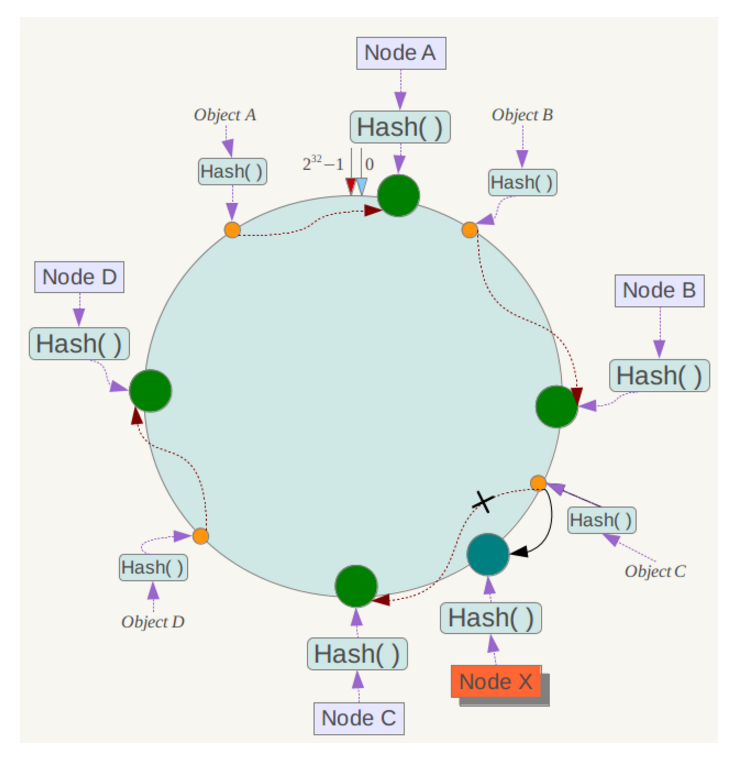

# Redis
## Redis数据结构
redis 主要有以下几种数据类型：

- string
- hash
- list
- set
- sorted set
sorted set的底层数据结构由ziplist、dict和skiplist组成。详见[Redis 为什么用跳表而不用平衡树？](https://juejin.im/post/57fa935b0e3dd90057c50fbc)

## Redis的线程模型
redis 内部使用文件事件处理器 file event handler，这个文件事件处理器是**单线程**的，所以 redis 才叫做单线程的模型。它采用 **IO 多路复用机制**同时监听多个 socket，将产生事件的 socket 压入内存队列中，事件分派器根据 socket 上的事件类型来选择对应的事件处理器进行处理。

文件事件处理器的结构包含 4 个部分：

 - 多个 socket
 - IO 多路复用程序
 - 文件事件分派器
 - 事件处理器（连接应答处理器、命令请求处理器、命令回复处理器）

多个 socket 可能会并发产生不同的操作，每个操作对应不同的文件事件，但是 IO 多路复用程序会监听多个 socket，会将产生事件的 socket 放入队列中排队，事件分派器每次从队列中取出一个 socket，根据 socket 的事件类型交给对应的事件处理器进行处理。

来看客户端与 redis 的一次通信过程：


首先，redis 服务端进程初始化的时候，会将 server socket 的 AE_READABLE 事件与连接应答处理器关联。

客户端 socket01 向 redis 进程的 server socket 请求建立连接，此时 server socket 会产生一个 AE_READABLE 事件，IO 多路复用程序监听到 server socket 产生的事件后，将该 socket 压入队列中。文件事件分派器从队列中获取 socket，交给连接应答处理器。连接应答处理器会创建一个能与客户端通信的 socket01，并将该 socket01 的 AE_READABLE 事件与命令请求处理器关联。

假设此时客户端发送了一个 set key value 请求，此时 redis 中的 socket01 会产生 AE_READABLE 事件，IO 多路复用程序将 socket01 压入队列，此时事件分派器从队列中获取到 socket01 产生的 AE_READABLE 事件，由于前面 socket01 的 AE_READABLE 事件已经与命令请求处理器关联，因此事件分派器将事件交给命令请求处理器来处理。命令请求处理器读取 socket01 的 key value 并在自己内存中完成 key value 的设置。操作完成后，它会将 socket01 的 AE_WRITABLE 事件与命令回复处理器关联。

如果此时客户端准备好接收返回结果了，那么 redis 中的 socket01 会产生一个 AE_WRITABLE 事件，同样压入队列中，事件分派器找到相关联的命令回复处理器，由命令回复处理器对 socket01 输入本次操作的一个结果，比如 ok，之后解除 socket01 的 AE_WRITABLE 事件与命令回复处理器的关联。

这样便完成了一次通信。

## Redis过期策略
redis 过期策略是：定期删除+惰性删除。

**定期删除**：指的是 redis 默认是每隔 **100ms** 就随机抽取一些设置了过期时间的 key，检查其是否过期，如果过期就删除。
**惰性删除**：获取某个 key 的时候，redis 会检查一下 ，这个 key如果过期了此时就会删除，不会给你返回任何东西。

## Redis内存淘汰机制
- noeviction: 当内存不足以容纳新写入数据时，新写入操作会报错，这个一般没人用吧，实在是太恶心了。
- ***allkeys-lru***：当内存不足以容纳新写入数据时，在键空间中，移除最近最少使用的 key（这个是最常用的）。
- allkeys-random：当内存不足以容纳新写入数据时，在键空间中，随机移除某个 key，这个一般没人用吧，为啥要随机，肯定是把最近最少使用的 key 给干掉啊。
- volatile-lru：当内存不足以容纳新写入数据时，在设置了过期时间的键空间中，移除最近最少使用的 key（这个一般不太合适）。
- volatile-random：当内存不足以容纳新写入数据时，在设置了过期时间的键空间中，随机移除某个 key。
- volatile-ttl：当内存不足以容纳新写入数据时，在设置了过期时间的键空间中，有更早过期时间的 key 优先移除。

## Redis 主从架构
### redis 主从复制
**核心原理**


当启动一个 slave node 的时候，它会发送一个 `PSYNC` 命令给 master node。

如果这是 slave node 初次连接到 master node，那么会触发一次 full resynchronization 全量复制。此时 master 会启动一个后台线程，开始生成一份 RDB 快照文件，同时还会将从客户端 client 新收到的所有写命令缓存在内存中。RDB 文件生成完毕后， master 会将这个 RDB 发送给 slave，slave 会先写入本地磁盘，然后再从本地磁盘加载到内存中，接着 master 会将内存中缓存的写命令发送到 slave，slave 也会同步这些数据。slave node 如果跟 master node 有网络故障，断开了连接，会自动重连，连接之后 master node 仅会复制给 slave 部分缺少的数据。

**主从复制的断点续传**
如果主从复制过程中，网络连接断掉了，那么可以接着上次复制的地方，继续复制下去，而不是从头开始复制一份。

master node 会在内存中维护一个 backlog，master 和 slave 都会保存一个 replica offset 还有一个 master run id，offset 就是保存在 backlog 中的。如果 master 和 slave 网络连接断掉了，slave 会让 master 从上次 replica offset 开始继续复制，如果没有找到对应的 offset，那么就会执行一次 resynchronization。

**全量复制**

- master 执行 bgsave ，在本地生成一份 rdb 快照文件。
- master node 将 rdb 快照文件发送给 slave node
- master node 在生成 rdb 时，会将所有新的写命令缓存在内存中，在 slave node 保存了 rdb 之后，再将新的写命令复制给 slave node。
- slave node 接收到 rdb 之后，清空自己的旧数据，然后重新加载 rdb 到自己的内存中，同时基于旧的数据版本对外提供服务。
- 如果 slave node 开启了 AOF，那么会立即执行 BGREWRITEAOF，重写 AOF。

**增量复制**

- 如果全量复制过程中，master-slave 网络连接断掉，那么 slave 重新连接 master 时，会触发增量复制。
- master 直接从自己的 backlog 中获取部分丢失的数据，发送给 slave node，默认 backlog 就是 1MB。
- master 就是根据 slave 发送的 psync 中的 offset 来从 backlog 中获取数据的。

### Redis持久化
- RDB：RDB 持久化机制，是对 redis 中的数据执行周期性的持久化。
- AOF：AOF 机制对每条写入命令作为日志，以 `append-only` 的模式写入一个日志文件中，在 redis 重启的时候，可以通过回放 AOF 日志中的写入指令来重新构建整个数据集。

如果同时使用 RDB 和 AOF 两种持久化机制，那么在 redis 重启的时候，会使用 AOF 来重新构建数据，因为 AOF 中的数据更加**完整**。

**RDB 优缺点**

- RDB 会生成多个数据文件，每个数据文件都代表了某一个时刻中 redis 的数据，这种多个数据文件的方式，非常适合做冷备
- RDB 对 redis 对外提供的读写服务，影响非常小，可以让 redis 保持高性能，因为 redis 主进程只需要 fork 一个子进程，让子进程执行磁盘 IO 操作来进行 RDB 持久化即可。
- 相对于 AOF 持久化机制来说，直接基于 RDB 数据文件来重启和恢复 redis 进程，更加**快速**。
- 如果想要在 redis 故障时，尽可能少的丢失数据，那么 RDB 没有 AOF 好。一般来说，RDB 数据快照文件，都是**每隔 5 分钟**，或者更长时间生成一次，这个时候就得接受一旦 redis 进程宕机，那么会丢失最近 5 分钟的数据。
- RDB 每次在 fork 子进程来执行 RDB 快照数据文件生成的时候，如果数据文件特别大，可能会导致对客户端提供的服务暂停数毫秒，或者甚至数秒。

**AOF 优缺点**

- AOF 可以更好的保护数据不丢失，一般 AOF 会**每隔 1 秒**，通过一个后台线程执行一次fsync操作，最多丢失 1 秒钟的数据。
- AOF 日志文件以 append-only 模式写入，所以没有任何磁盘寻址的开销，写入性能非常高，而且文件不容易破损，即使文件尾部破损，也很容易修复。
- AOF 日志文件即使过大的时候，出现后台重写操作，也不会影响客户端的读写。因为在 rewrite log 的时候，会对其中的指令进行压缩，创建出一份需要恢复数据的最小日志出来。在创建新日志文件的时候，老的日志文件还是照常写入。当新的 merge 后的日志文件 ready 的时候，再交换新老日志文件即可。
- AOF 日志文件的命令通过非常可读的方式进行记录，这个特性非常适合做灾难性的误删除的紧急恢复。比如某人不小心用 flushall 命令清空了所有数据，只要这个时候后台 rewrite 还没有发生，那么就可以立即拷贝 AOF 文件，将最后一条 flushall 命令给删了，然后再将该 AOF 文件放回去，就可以通过恢复机制，自动恢复所有数据。
- 对于同一份数据来说，AOF 日志文件通常比 RDB 数据快照文件更大。
AOF 开启后，支持的写 QPS 会比 RDB 支持的写 QPS 低，因为 AOF 一般会配置成每秒 fsync 一次日志文件，当然，每秒一次 fsync，性能也还是很高的。（如果实时写入，那么 QPS 会大降，redis 性能会大大降低）
- 以前 AOF 发生过 bug，就是通过 AOF 记录的日志，进行数据恢复的时候，没有恢复一模一样的数据出来。所以说，类似 AOF 这种较为复杂的基于命令日志 / merge / 回放的方式，比基于 RDB 每次持久化一份完整的数据快照文件的方式，更加脆弱一些，容易有 bug。不过 AOF 就是为了避免 rewrite 过程导致的 bug，因此每次 rewrite 并不是基于旧的指令日志进行 merge 的，而是基于当时内存中的数据进行指令的重新构建，这样健壮性会好很多。

### Redis哨兵集群
 - 哨兵至少需要 3 个实例，来保证自己的健壮性。
 - 哨兵 + redis 主从的部署架构，是不保证数据零丢失的，只能保证 redis 集群的高可用性。

**redis 哨兵主备切换的数据丢失问题**

- 异步复制导致的数据丢失
- 脑裂导致的数据丢失（脑裂：两个master）
 
```
min-slaves-to-write 1
min-slaves-max-lag 10

表示，要求至少有 1 个 slave，数据复制和同步的延迟不能超过 10 秒。
```

- 减少异步复制数据的丢失
有了 min-slaves-max-lag 这个配置，就可以确保说，一旦 slave 复制数据和 ack 延时太长，就认为可能 master 宕机后损失的数据太多了，那么就拒绝写请求，这样可以把 master 宕机时由于部分数据未同步到 slave 导致的数据丢失降低的可控范围内。

- 减少脑裂的数据丢失
如果一个 master 出现了脑裂，跟其他 slave 丢了连接，那么上面两个配置可以确保说，如果不能继续给指定数量的 slave 发送数据，而且 slave 超过 10 秒没有给自己 ack 消息，那么就直接拒绝客户端的写请求。因此在脑裂场景下，最多就丢失 10 秒的数据。

**哨兵集群的自动发现机制**
哨兵互相之间的发现，是通过 redis 的 pub/sub 系统实现的，每个哨兵都会往 `__sentinel__:hello` 这个 channel 里发送一个消息，这时候所有其他哨兵都可以消费到这个消息，并感知到其他的哨兵的存在。

**slave->master 选举算法**
如果一个 master 被认为 odown 了，而且 majority 数量的哨兵都允许主备切换，那么某个哨兵就会执行主备切换操作，此时首先要选举一个 slave 来，会考虑 slave 的一些信息：

- 跟 master 断开连接的时长
- slave 优先级
- 复制 offset
- run id

## Redis集群
### 节点间的内部通信机制
集群元数据的维护有两种方式：集中式、Gossip 协议。redis cluster 节点间采用 gossip 协议进行通信。


### 分布式寻址算法
**一致性 hash 算法**
一致性 hash 算法将整个 hash 值空间组织成一个虚拟的圆环，整个空间**按顺时针方向**组织，下一步将各个 master 节点（使用服务器的 ip 或主机名）进行 hash。这样就能确定每个节点在其哈希环上的位置。

来了一个 key，首先计算 hash 值，并确定此数据在环上的位置，从此位置沿环顺时针“行走”，遇到的第一个 master 节点就是 key 所在位置。

**存在问题**：
一致性哈希算法在节点太少时，容易因为节点**分布不均匀而造成缓存热点**的问题。为了解决这种热点问题，一致性 hash 算法引入**了虚拟节点机制**，即对每一个节点计算多个 hash，每个计算结果位置都放置一个虚拟节点。这样就实现了数据的均匀分布，负载均衡。


## Redis缓存雪崩

### 解决方案：

事前：redis 高可用，主从+哨兵，redis cluster，避免全盘崩溃。
事中：本地 ehcache 缓存 + hystrix 限流&降级，避免 MySQL 被打死。
事后：redis 持久化，一旦重启，自动从磁盘上加载数据，快速恢复缓存数据。

## Redis缓存穿透

### 解决方案：
每次系统 A 从数据库中只要没查到，就写一个空值到缓存里去，比如 set -999 UNKNOWN。然后设置一个过期时间，这样的话，下次有相同的 key 来访问的时候，在缓存失效之前，都可以直接从缓存中取数据。

## Redis缓存击穿
缓存击穿，就是说某个 key 非常热点，访问非常频繁，处于集中式高并发访问的情况，当这个 key 在失效的瞬间，大量的请求就击穿了缓存，直接请求数据库，就像是在一道屏障上凿开了一个洞。
### 解决方案：
1. 使用互斥锁(mutex key)
业界比较常用的做法，是使用mutex。简单地来说，就是在缓存失效的时候（判断拿出来的值为空），不是立即去load db，而是先使用缓存工具的某些带成功操作返回值的操作（比如Redis的SETNX或者Memcache的ADD）去set一个mutex key，当操作返回成功时，再进行load db的操作并回设缓存；否则，就重试整个get缓存的方法。

2. 永远不过期
 - 从redis上看，确实没有设置过期时间，这就保证了，不会出现热点key过期问题，也就是“物理”不过期。
 - 从功能上看，如果不过期，那不就成静态的了吗？所以我们把过期时间存在key对应的value里，如果发现要过期了，通过一个后台的异步线程进行缓存的构建，也就是“逻辑”过期

## Q&A
### 为什么redis单线程模型效率也能这么高？
 - 纯内存操作
 - 核心是基于非阻塞的 IO 多路复用机制
 - 单线程反而避免了多线程的频繁上下文切换问题

### 如何保证缓存与数据库的双写一致性？
对于操作缓存，一般我们都是采取删除缓存缓存策略的，原因如下：

- 高并发环境下，无论是先操作数据库还是后操作数据库而言，如果加上更新缓存，那就更加容易导致数据库与缓存数据不一致问题。(删除缓存**直接和简单**很多)
- 如果每次更新了数据库，都要更新缓存【这里指的是频繁更新的场景，这会耗费一定的性能】，倒不如直接删除掉。等再次读取时，缓存里没有，那我到数据库找，在数据库找到再写到缓存里边(**体现懒加载**)

**先更新数据库，再删除缓存**

- 第一步成功(操作数据库)，第二步失败(删除缓存)，会导致数据库里是新数据，而缓存里是旧数据。
- 如果第一步(操作数据库)就失败了，我们可以直接返回错误(Exception)，不会出现数据不一致。

高并发场景下的问题：（但是概率特别低）
缓存刚好失效
线程A查询数据库，得一个旧值
线程B将新值写入数据库
线程B删除缓存
线程A将查到的旧值写入缓存

解决方案：

- 将需要删除的key发送到消息队列中
- 自己消费消息，获得需要删除的key
- 不断重试删除操作，直到成功

**先删除缓存，再更新数据库**

- 第一步成功(删除缓存)，第二步失败(更新数据库)，数据库和缓存的数据还是一致的。
- 如果第一步(删除缓存)就失败了，我们可以直接返回错误(Exception)，数据库和缓存的数据还是一致的。

在高并发场景下也是有问题的：
线程A删除了缓存
线程B查询，发现缓存已不存在
线程B去数据库查询得到旧值
线程B将旧值写入缓存
线程A将新值写入数据库
 
解决方案：
将删除缓存、修改数据库、读取缓存等的操作积压到队列里边，实现串行化。


**两种策略比较**：

- 先删除缓存，再更新数据库
    在高并发下表现不如意，在原子性被破坏时表现优异
- 先更新数据库，再删除缓存(Cache Aside Pattern设计模式)
    在高并发下表现优异，在原子性被破坏时表现不如意
