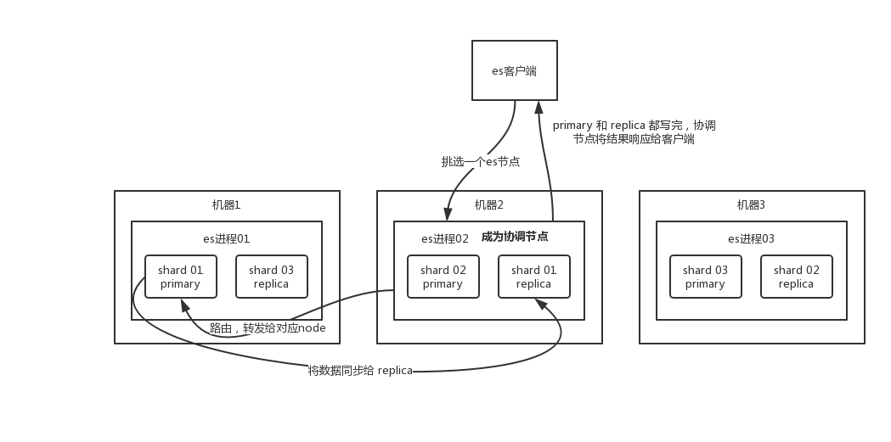
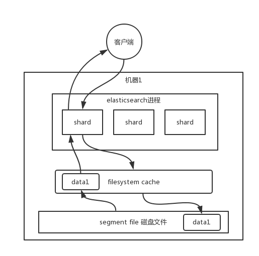

# ElasticSearch

es 中存储数据的基本单位是**索引**，比如说你现在要在 es 中存储一些订单数据，你就应该在 es 中创建一个索引 order_idx，所有的订单数据就都写到这个索引里面去，一个索引差不多就是相当于是 mysql 里的一张表。


```
index -> type -> mapping -> document -> field。
```
 
- type -> 具体表
- mapping -> 表结构
- document -> 某行数据
- field -> 一个字段的值

## es 的分布式架构原理


### Shard
索引可以拆分成多个 shard，每个 shard 存储部分数据。拆分多个 shard 是有好处的，一是支持横向扩展

### es集群Master节点
es 集群多个节点，会自动选举一个节点为 master 节点，这个 master 节点其实就是干一些管理的工作的，比如**维护索引元数据**、**负责切换 primary shard 和 replica shard 身份**等。

master 节点宕机了，那么会重新选举一个节点为 master 节点

### es集群Master节点
如果某个非 master 节点宕机了。那么此节点上的 primary shard 不就没了。那好，master 会让 primary shard 对应的 replica shard（在其他机器上）切换为 primary shard。如果宕机的机器修复了，修复后的节点也不再是 primary shard，而是 replica shard。

## es的写入和查询的工作原理
### es 写数据过程



- 客户端选择一个 node 发送请求过去，这个 node 就是 coordinating node（协调节点）。
- coordinating node 对 document 进行路由，将请求转发给对应的 node（有 primary shard）。
- 实际的 node 上的 primary shard 处理请求，然后将数据同步到 replica node。
- coordinating node 如果发现 primary node 和所有 replica node 都搞定之后，就返回响应结果给客户端。

### es 读数据过程
- 客户端发送请求到任意一个 node，成为 coordinate node。
- coordinate node 对 doc id 进行哈希路由，将请求转发到对应的 node，此时会使用 round-robin 随机轮询算法，在 primary shard 以及其所有 replica 中随机选择一个，让读请求负载均衡。
- 接收请求的 node 返回 document 给 coordinate node。
- coordinate node 返回 document 给客户端。

### es 搜索数据过程
- 客户端发送请求到一个 coordinate node。
- 协调节点将搜索请求转发到所有的 shard 对应的 primary shard 或 replica shard，都可以。
- query phase：每个 shard 将自己的搜索结果（其实就是一些 doc id）返回给协调节点，由协调节点进行数据的合并、排序、分页等操作，产出最终结果。
- fetch phase：接着由协调节点根据 doc id 去各个节点上拉取实际的 document 数据，最终返回给客户端。

### 写数据底层原理


总结一下

1. **refresh**：数据先写入内存 buffer，然后每隔 1s，将数据 refresh 到 os cache，到了 os cache 数据就能被搜索到（所以我们才说 es 从写入到能被搜索到，中间有 1s 的延迟）。
2. **写入 translog**：每隔 5s，将数据写入 translog 文件（这样如果机器宕机，内存数据全没，最多会有 5s 的数据丢失）
3. **commit**：translog 大到一定程度，或者默认每隔 30mins，会触发 commit 操作，将缓冲区的数据都 flush 到 segment file 磁盘文件中。

### es 丢数据的问题
1. es 第一是准实时的，数据写入 1 秒后可以搜索到；
2. 可能会丢失数据的。有 5 秒的数据，停留在 buffer、translog os cache、segment file os cache 中，而不在磁盘上，此时如果宕机，会导致 5 秒的数据丢失。

### 删除/更新数据底层原理
- 如果是删除操作，commit 的时候会生成一个 .del 文件，里面将某个 doc 标识为 deleted 状态，那么搜索的时候根据 .del 文件就知道这个 doc 是否被删除了。

- 如果是更新操作，就是将原来的 doc 标识为 deleted 状态，然后新写入一条数据。
buffer 每 refresh 一次，就会产生一个 segment file，所以默认情况下是 1 秒钟一个 segment file，这样下来 segment file 会越来越多，此时会定期执行 merge。每次 merge 的时候，会将多个 segment file 合并成一个，同时这里会将标识为 deleted 的 doc 给物理删除掉，然后将新的 segment file 写入磁盘，这里会写一个 commit point，标识所有新的 segment file，然后打开 segment file 供搜索使用，同时删除旧的 segment file。

### 底层 lucene
简单来说，lucene 就是一个 jar 包，里面包含了封装好的各种建立倒排索引的算法代码。我们用 Java 开发的时候，引入 lucene jar，然后基于 lucene 的 api 去开发就可以了。

通过 lucene，我们可以将已有的数据建立索引，lucene 会在本地磁盘上面，给我们组织索引的数据结构。

### 倒排
在搜索引擎中，每个文档都有一个对应的文档 ID，文档内容被表示为一系列关键词的集合。例如，文档 1 经过分词，提取了 20 个关键词，每个关键词都会记录它在文档中出现的次数和出现位置。

那么，**倒排索引就是关键词到文档 ID 的映射**，每个关键词都对应着一系列的文件，这些文件中都出现了关键词。

举个栗子。
有以下文档：

| DocId | Doc |
|---|---|
| 1 | 谷歌地图之父跳槽 Facebook |
| 2 | 谷歌地图之父加盟 Facebook |
| 3 | 谷歌地图创始人拉斯离开谷歌加盟 Facebook |
| 4 | 谷歌地图之父跳槽 Facebook 与 Wave 项目取消有关 |
| 5 | 谷歌地图之父拉斯加盟社交网站 Facebook |

对文档进行分词之后，得到以下**倒排索引**。

| WordId | Word | DocIds |
|---|---|---|
| 1 | 谷歌 | 1,2,3,4,5 |
| 2 | 地图 | 1,2,3,4,5 |
| 3 | 之父 | 1,2,4,5 |
| 4 | 跳槽 | 1,4 |
| 5 | Facebook | 1,2,3,4,5 |
| 6 | 加盟 | 2,3,5 |
| 7 | 创始人 | 3 |
| 8 | 拉斯 | 3,5 |
| 9 | 离开 | 3 |
| 10 | 与 | 4 |
| .. | .. | .. |

要注意倒排索引的两个重要细节：

- 倒排索引中的所有词项对应一个或多个文档；
- 倒排索引中的词项**根据字典顺序升序排列**

## es 在数据量很大的情况下（数十亿级别）如何提高查询效率啊？
### filesystem cache
你往 es 里写的数据，实际上都写到磁盘文件里去了，查询的时候，操作系统会将磁盘文件里的数据自动缓存到 `filesystem cache` 里面去。

比如说你现在有一行数据。id,name,age .... 30 个字段。但是你现在搜索，只需要根据 id,name,age 三个字段来搜索。如果你傻乎乎往 es 里写入一行数据所有的字段，就会导致说 90% 的数据是不用来搜索的，结果硬是占据了 es 机器上的 `filesystem cache` 的空间，单条数据的数据量越大，就会导致 `filesystem cahce` 能缓存的数据就越少。其实，仅仅写入 es 中要用来检索的少数几个字段就可以了，比如说就写入 es id,name,age 三个字段，然后你可以把其他的字段数据存在 mysql/hbase 里，我们一般是建议用 es + hbase 这么一个架构。

- 从 es 中根据 name 和 age 去搜索，拿到的结果可能就 20 个 doc id
- 然后根据 doc id 到 hbase 里去查询每个 doc id 对应的完整的数据，给查出来，再返回给前端。



### 数据预热
对于那些你觉得比较热的、经常会有人访问的数据，最好做一个专门的缓存预热子系统，就是对热数据每隔一段时间，就提前访问一下，让数据进入 filesystem cache 里面去。这样下次别人访问的时候，性能一定会好很多。

举个例子，拿微博来说，你可以把一些大V，平时看的人很多的数据，你自己提前后台搞个系统，每隔一会儿，自己的后台系统去搜索一下热数据，刷到 filesystem cache 里去，后面用户实际上来看这个热数据的时候，他们就是直接从内存里搜索了，很快。

### 冷热分离
es 可以做类似于 mysql 的水平拆分，就是说将大量的访问很少、频率很低的数据，单独写一个索引，然后将访问很频繁的热数据单独写一个索引。最好是将冷数据写入一个索引中，然后热数据写入另外一个索引中，这样可以确保热数据在被预热之后，尽量都让他们留在 filesystem os cache 里，别让冷数据给冲刷掉。

### document 模型设计
对于 MySQL，我们经常有一些复杂的关联查询。在 es 里该怎么玩儿，es 里面的复杂的关联查询尽量别用，一旦用了性能一般都不太好。

最好是先在 Java 系统里就完成关联，将关联好的数据直接写入 es 中。搜索的时候，就不需要利用 es 的搜索语法来完成 join 之类的关联搜索了。

### 分页性能优化
es 的分页是较坑的，为啥呢？举个例子吧，假如你每页是 10 条数据，你现在要查询第 100 页，实际上是会把每个 shard 上存储的前 1000 条数据都查到一个协调节点上，如果你有个 5 个 shard，那么就有 5000 条数据，接着协调节点对这 5000 条数据进行一些合并、处理，再获取到最终第 100 页的 10 条数据。

你翻页的时候，翻的越深，每个 shard 返回的数据就越多，而且协调节点处理的时间越长，非常坑爹。所以用 es 做分页的时候，你会发现越翻到后面，就越是慢。

**有什么解决方案吗？**

- 不允许深度分页（默认深度分页性能很差）
跟产品经理说，你系统不允许翻那么深的页，默认翻的越深，性能就越差。

- 类似于 app 里的推荐商品不断下拉出来一页一页的
