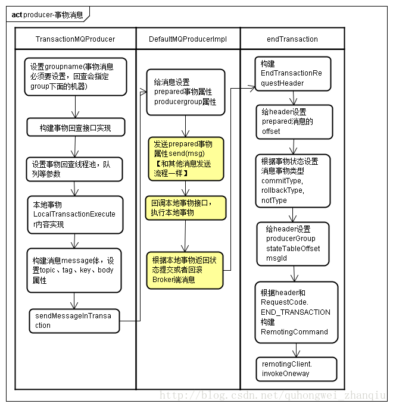

# RocketMQ
## 架构图


 - **NameServer**
NameServer是一个几乎无状态的节点，可集群部署，节点之间无任何信息同步（可以理解为Eureka）
 - **Broker（master,slave）**
Broker相对复杂，Broker分为Master与Slave，一个Master可以对应多个Slaver，但是一个Slaver只能对应一个Master，Master与Slaver的对应关系通过指定相同的BrokerName，不同的BrokerId来定义，BrokerId为0表示Master，非0表示Slaver。Master可以部署多个。每个Broker与NameServer集群中的**所有节点**建立长连接，定时注册Topic信息到所有的NameServer,Master和Slaver之间存在对应的同步机制
 - **Producer**
Producer与NameServer集群中的**其中一个节点**（随机选择）建立长连接，定期从NameServer取Topic路由信息，并向提供Topic服务的Master建立长连接，且定时向Master发送心跳。Producer完全无状态。
 - **Consumer（pull,push）**
Consumer与NameServer集群中的**其中一个节点**（随机选择）建立长连接，定期从NameServer取Topic路由信息，并向提供Topic服务的Master、Slaver建立长连接，且定时向Master、Slaver发送心跳。Consumer即可从Master订阅消息，也可以从Slave订阅消息，订阅规则由Broker配置决定

## 消息发送图

 
## Producer
### 普通消息
**三种发送方式**

 - SYNC 同步等待
 - ASYNC 异步回调
 - ONEWAY 发出去不管返回


**Q&A**

- 获取不同Broker(Master)上Topic下的所有队列如何理解（不同）
 ```
    比如broker1, broker2, borker3三台broker机器都配置了Topic_A

    Broker1 的队列为queue0 , queue1
    
    Broker2 的队列为queue0, queue2, queue3,
    
    Broker3 的队列为queue0
    
    当然一般情况下的broker的配置都是一样的
    
    以上当broker启动的时候注册到namesrv的Topic_A队列为共6个分别为：
    
    broker1_queue0, broker1_queue1,
    
    broker2_queue0, broker2_queue1, broker2_queue2,
    
    broker3_queue0,

 ```
- Producer如何实现轮询队列
 ```
    Producer从namesrv获取的到Topic_A路由信息TopicPublishInfo

   --List<MessageQueue> messageQueueList  //Topic_A的所有的队列

   --AtomicInteger sendWhichQueue        //自增整型

   方法selectOneMessageQueue方法用来选择一个发送队列

    (++sendWitchQueue)% messageQueueList.size为队列集合的下标

    每次获取queue都会通过sendWhichQueue加一来实现对所有queue的轮询
    
    如果入参lastBrokerName不为空，代表上次选择的queue发送失败，这次选择应该避开同一个queue
 ```

- Producer发消息系统重试

```
发送失败后，重试几次 retryTimesWhenSendFailed = 2

发送消息超时 sendMsgTimeout = 3000

Producer通过selectOneMessageQueue方法获取一个MessagQueue对象

--topic            //Topic_A

--brokerName        //代表发送消息到达的broker

--queueId           //代表发送消息的在指定broker上指定topic下的队列编号

向指定broker的指定topic的指定queue发送消息

如果发送失败
- 重试次数不到两次
- 发送此条消息花费时间还没有到3000(毫秒)

换个队列继续发送。 
```

#### 事务消息



**分布式事务是基于二阶段提交的**

- 一阶段，向broker发送一条**prepared**的消息，返回消息的offset即消息地址commitLog中消息偏移量。Prepared状态消息不被消费发送消息ok，执行本地事务分支， 本地事务方法需要实现rocketmq的回调接口。LocalTransactionExecuter，处理本地事务逻辑返回处理的事务状态LocalTransactionState
- 二阶段，处理完本地事务中业务得到事务状态， 根据offset查找到commitLog中的prepared消息，设置消息状态commitType或者rollbackType， 让后将信息添加到commitLog中， 其实二阶段生成了**两条消息**

## Broker
### Mapped模块
![此处输入图片的描述][6]
**Consume Queue**

每个topic下的每个queue都有一个对应的consumequeue文件。文件地址：`${user.home}\store\consumequeue\${topicName}\${queueId}\${fileName}`，是消息的逻辑队列，相当于字典的目录用来指定消息在消息的真正的物理文件commitLog上的位置。这边通过操作系统的PageCache可以提高缓存的命中率，获得和内存一样的效果


按消费端group分组重试队列，如果消费端消费失败，发送到retry消费队列中，比如图中的`%RETRY%ConsumerGroupA`。
按消费端group分组死信队列，如果消费端重试超过指定次数，发送死信队列， 比如图中的`%DLQ%ConsumerGroupA`。

Consume Queue中存储单元是一个**20字节**定长的二进制数据，**顺序写顺序读**，如下图所示：


consumequeue文件存储单元格式

- CommitLog Offset是指这条消息在Commit Log文件中的实际偏移量
- Size存储中消息的大小
- Message Tag HashCode存储消息的Tag的哈希值：主要用于订阅时消息过滤（订阅时如果指定了Tag，会根据HashCode来快速查找到订阅的消息）

**Commit Log**
文件地址：`${user.home} \store\${commitlog}\${fileName}`,一个消息存储单元长度是不定的，**顺序写但是随机读**,commitLog每个文件的大小默认1G =102410241024

**MapedFile**
MapedFile 是PageCache文件封装，操作物理文件在内存中的映射以及将内存数据持久化到物理文件中，代码中写死了要求os系统的页大小为4k

**MapedFileQueue**
队列有多个文件（MapedFile）组成，由集合对象List表示升序排列，前面讲到文件名即是消息在此文件的中初始偏移量，排好序后组成了一个连续的消息队列

## Master && Slaver
![此处输入图片的描述][9]

- WriteSocketService 向slave同步commitLog数据线程
- ReadSocketService 读取slave通过HAClient向master返回同步commitLog的物理偏移量phyOffset值

## Consumer
### consumer负载均衡
消费端会通过**RebalanceService**线程，10秒钟做一次基于topic下的所有队列负载
负载均衡对于consumer的push和pull模式生效。

个人理解：
1. 要做负载均衡，首先要做的就是信号收集。
所谓信号收集，就是得知道每一个consumerGroup有哪些consumer，对应的topic是谁。信号收集分为Client端信号收集与Broker端信号收集两个部分。
2. 负载均衡放在Client端处理。
具体做法是：消费者客户端在启动时完善rebalanceImpl实例，同时拷贝订阅信息存放rebalanceImpl实例对象中，另外也是很重要的一个步骤 -- 通过心跳消息，不停的上报自己到所有Broker，注册RegisterConsumer，等待上述过程准备好之后在Client端不断执行的负载均衡服务线程从Broker端获取一份全局信息（该consumerGroup下所有的消费Client），然后分配这些全局信息，获取当前客户端分配到的消费队列。

### consumer push和pull
consumer被分为2类：MQPullConsumer和MQPushConsumer，其实本质都是拉模式（pull），即consumer轮询从broker拉取消息。 区别是：

- 推模式里，consumer把轮询过程封装了，并注册MessageListener监听器，取到消息后，唤醒MessageListener的consumeMessage()来消费，对用户而言，感觉消息是被推送（push）过来的。
推模式直接通过长连接通道推送到客户端。其优点是及时，一旦有数据变更，客户端立马能感知到；另外对客户端来说逻辑简单，不需要关心有无数据这些逻辑处理。缺点是不知道客户端的数据消费能力，可能导致数据积压在客户端，来不及处理。
- 拉模式里，取消息的过程需要用户自己写，首先通过打算消费的Topic拿到MessageQueue的集合，遍历MessageQueue集合，然后针对每个MessageQueue批量取消息，一次取完后，记录该队列下一次要取的开始offset，直到取完了，再换另一个MessageQueue。
拉模式优点是此过程由客户端发起请求，故不存在推模式中数据积压的问题。缺点是可能不够及时，对客户端来说需要考虑数据拉取相关逻辑，何时去拉，拉的频率怎么控制等等。

## RocketMQ高可用（主要是namesrv和broker的高可用）


### NameServer高可用
- 多个 Namesrv 之间，没有任何关系（不存在类似 Zookeeper 的 Leader/Follower 等角色），不进行通信与数据同步。通过 Broker **循环注册**多个 Namesrv。
- Producer、Consumer 从 Namesrv列表**选择一个可连接**的进行通信。

### Broker高可用
启动多个 Broker分组 **形成 集群** 实现高可用

- 每个分组，Master节点 不断发送新的 CommitLog 给 Slave节点。 Slave节点 不断上报本地的 CommitLog 已经同步到的位置给 Master节点。
- Broker分组 与 Broker分组 之间没有任何关系，不进行通信与数据同步

集群内，Master节点 有两种类型：`Master_SYNC`、`Master_ASYNC`：前者在 Producer 发送消息时，等待 Slave节点 存储完毕后再返回发送结果，而后者不需要等待。


## 消息队列
### 优点
解耦、异步、削峰，能说出三种的应用场景
### 缺点
- 系统可用性降低。因为另外加了MQ进来
- 系统复杂度提高，需要考虑消息重复、丢失、顺序的问题
- 数据一致性问题

### Kafka、ActiveMQ、RabbitMQ、RocketMQ 有什么优缺点？

| 特性 | ActiveMQ | RabbitMQ | RocketMQ | Kafka |
|---|---|---|---|---|
| 单机吞吐量 | 万级，比 RocketMQ、Kafka 低一个数量级 | 同 ActiveMQ | 10 万级，支撑高吞吐 | 10 万级，高吞吐，一般配合大数据类的系统来进行实时数据计算、日志采集等场景 |
| topic 数量对吞吐量的影响 | | | topic 可以达到几百/几千的级别，吞吐量会有较小幅度的下降，这是 RocketMQ 的一大优势，在同等机器下，可以支撑大量的 topic | topic 从几十到几百个时候，吞吐量会大幅度下降，在同等机器下，Kafka 尽量保证 topic 数量不要过多，如果要支撑大规模的 topic，需要增加更多的机器资源 |
| 时效性 | ms 级 | 微秒级，这是 RabbitMQ 的一大特点，延迟最低 | ms 级 | 延迟在 ms 级以内 |
| 可用性 | 高，基于主从架构实现高可用 | 同 ActiveMQ | 非常高，分布式架构 | 非常高，分布式，一个数据多个副本，少数机器宕机，不会丢失数据，不会导致不可用 |
| 消息可靠性 | 有较低的概率丢失数据 | 基本不丢 | 经过参数优化配置，可以做到 0 丢失 | 同 RocketMQ |
| 功能支持 | MQ 领域的功能极其完备 | 基于 erlang 开发，并发能力很强，性能极好，延时很低 | MQ 功能较为完善，还是分布式的，扩展性好 | 功能较为简单，主要支持简单的 MQ 功能，在大数据领域的实时计算以及日志采集被大规模使用 |


## 重复消息以及保证消息消费的幂等性
- 比如你是写 Redis，那没问题了，反正每次都是 set，天然幂等性。
- 让生产者发送每条数据的时候，里面加一个全局唯一的 id，类似订单 id 之类的东西，用redis维护一个set集合存储这个全局id。然后你这里消费到了之后，先根据这个 id 去Redis 里查一下，之前消费过吗？如果没有消费过，你就处理，然后这个 id 写 Redis。
- 数据库的唯一键来保证重复数据不会重复插入多条

## 如何处理消息丢失的问题（如何保证消息的可靠性传输？）
影响消息可靠性的几种情况：

- broker正常关闭
- broker异常crash
- OS crash
- 机器掉电，但能立即恢复供电情况
- 机器不能开机（硬件损坏）
- 磁盘设备损坏

前面1-4四种情况都属于**硬件资源可立即恢复**的情况。rocketmq在这四种情况下能保证消息不丢，或丢失少量数据（依赖刷盘方式是同步还是异步）。

5-6两种情况属**于单点故障，且不能恢复**，一旦发生，在此单点上的消息全部丢失。rocketmq在这两种情况下，通过**异步复制**，可保证99%的消息不丢。通过**同步双写**技术可以完全避免单点，但会影响性能，适合对消息可靠性要求极高的场景，如与钱相关的应用。

## 如何保证消息顺序消息？


### Producer端
Producer端确保消息顺序唯一要做的事情就是将相同的消息路由到相同的messageQueue，在RocketMQ中，通过`MessageQueueSelector`来实现分区的选择。

### Consumer端


1. PullMessageService单线程的从Broker获取消息
2. PullMessageService将消息添加到ProcessQueue中（ProcessMessage是一个消息的缓存），之后提交一个消费任务到ConsumeMessageOrderService
3. ConsumeMessageOrderService多线程执行，每个线程在消费消息时需要拿到MessageQueue的锁
4. 拿到锁之后从ProcessQueue中获取消息

## 如何设计一个消息队列？
1. 首先这个 mq 得支持可伸缩性吧，就是需要的时候快速扩容，就可以增加吞吐量和容量，那怎么搞？设计个分布式的系统呗，参照一下 kafka 的设计理念，broker -> topic -> partition，每个 partition 放一个机器，就存一部分数据。如果现在资源不够了，简单啊，给 topic 增加 partition，然后做数据迁移，增加机器，不就可以存放更多数据，提供更高的吞吐量了？
2. 其次你得考虑一下这个 mq 的数据要不要落地磁盘吧？那肯定要了，落磁盘才能保证别进程挂了数据就丢了。那落磁盘的时候怎么落啊？顺序写，这样就没有磁盘随机读写的寻址开销，磁盘顺序读写的性能是很高的，这就是 kafka 的思路。
3. 其次你考虑一下你的 mq 的可用性啊？这个事儿，具体参考之前可用性那个环节讲解的 kafka 的高可用保障机制。多副本 -> leader & follower -> broker 挂了重新选举 leader 即可对外服务。
4. 能不能支持数据 0 丢失啊？可以的，参考我们之前说的那个 kafka 数据零丢失方案。
