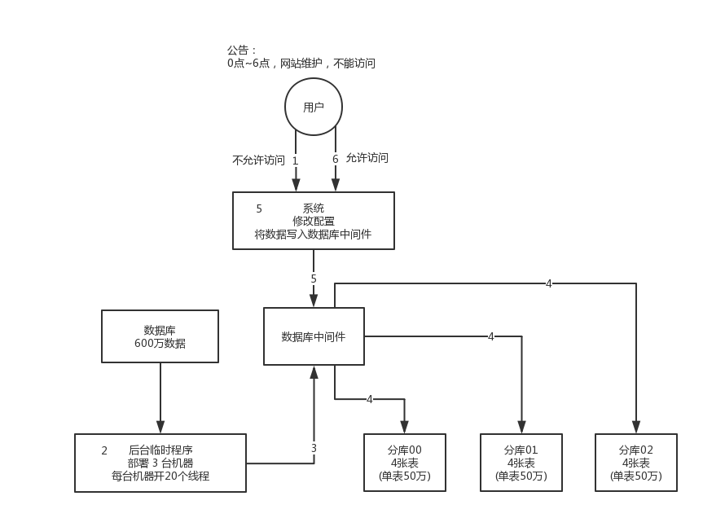
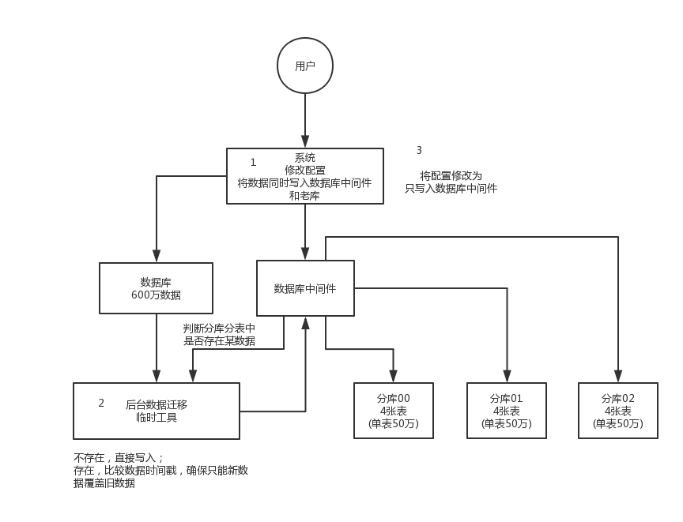

# 分库分表
## 分库分表中间件
- sharding-jdbc 这种 **client 层**方案的优点在于不用部署，运维成本低，不需要代理层的二次转发请求，性能很高，但是如果遇到升级啥的需要各个系统都重新升级版本再发布，各个系统都需要耦合 sharding-jdbc 的依赖；
- mycat 这种 **proxy 层**方案的缺点在于需要部署，自己运维一套中间件，运维成本高，但是好处在于对于各个项目是透明的，如果遇到升级之类的都是自己中间件那里搞就行了。

## 如何设计才可以让系统从未分库分表动态切换到分库分表上？
- **停机迁移方案**

到 0 点停机，系统停掉，没有流量写入了，此时老的单库单表数据库静止了。然后你之前得写好一个导数的一次性工具，此时直接跑起来，然后将单库单表的数据哗哗哗读出来，写到分库分表里面去。导数完了之后，就 ok 了，修改系统的数据库连接配置啥的，包括可能代码和 SQL 也许有修改，那你就用最新的代码，然后直接启动连到新的分库分表上去。

- **双写迁移方案**

简单来说，就是在线上系统里面，之前所有写库的地方，增删改操作，除了对老库增删改，都加上对新库的增删改，这就是所谓的双写，同时写俩库，老库和新库。

然后系统部署之后，新库数据差太远，用之前说的导数工具，跑起来读老库数据写新库，写的时候要根据 gmt_modified 这类字段判断这条数据最后修改的时间，除非是读出来的数据在新库里没有，或者是比新库的数据新才会写。简单来说，就是不允许用老数据覆盖新数据。

导完一轮之后，有可能数据还是存在不一致，那么就程序自动做一轮校验，比对新老库每个表的每条数据，接着如果有不一样的，就针对那些不一样的，从老库读数据再次写。反复循环，直到两个库每个表的数据都完全一致为止。

接着当数据完全一致了，就 ok 了，基于仅仅使用分库分表的最新代码，重新部署一次，不就仅仅基于分库分表在操作了么，还没有几个小时的停机时间，很稳。所以现在基本玩儿数据迁移之类的，都是这么干的。

## 如何设计可以动态扩容缩容的分库分表方案？
谈分库分表的扩容，第一次分库分表，就一次性给他分个够，32 个库，1024 张表，可能对大部分的中小型互联网公司来说，已经可以支撑好几年了。

这里对步骤做一个总结：

1. 设定好几台数据库服务器，每台服务器上几个库，每个库多少个表，推荐是 32库 * 32表，对于大部分公司来说，可能几年都够了。
2. 路由的规则，orderId 模 32 = 库，orderId / 32 模 32 = 表
3. 扩容的时候，申请增加更多的数据库服务器，装好 mysql，呈倍数扩容，4 台服务器，扩到 8 台服务器，再到 16 台服务器。
4. 由 dba 负责将原先数据库服务器的库，迁移到新的数据库服务器上去，库迁移是有一些便捷的工具的。
5. 我们这边就是修改一下配置，调整迁移的库所在数据库服务器的地址。
6. 重新发布系统，上线，原先的路由规则变都不用变，直接可以基于 n 倍的数据库服务器的资源，继续进行线上系统的提供服务。

## 分库分表之后，id 主键如何处理？
- 数据库自增 id
 这个就是说你的系统里每次得到一个 id，都是往一个库的一个表里插入一条没什么业务含义的数据，然后获取一个数据库自增的一个 id。拿到这个 id 之后再往对应的分库分表里去写入。
- 设置数据库 sequence 或者表自增字段步长

- UUID
- snowflake 算法
 snowflake 算法是 twitter 开源的分布式 id 生成算法，采用 Scala 语言实现，是把一个 64 位的 long 型的 id，1 个 bit 是不用的，用其中的 41 bit 作为毫秒数，用 10 bit 作为工作机器 id，12 bit 作为序列号。
