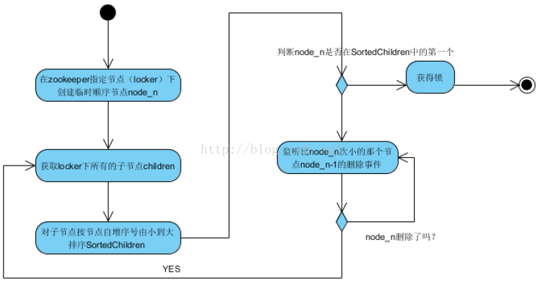
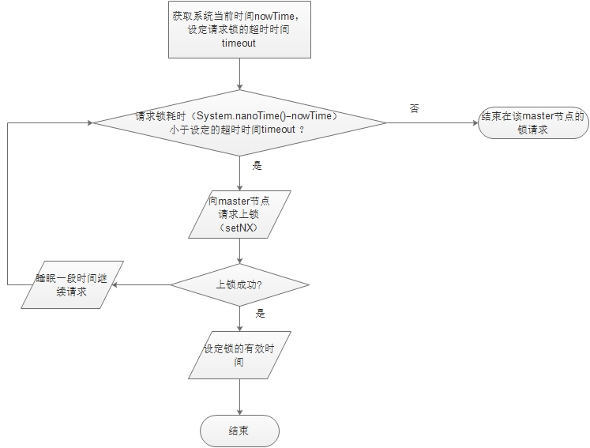

# 分布式锁
## Zookeeper分布式锁
- 在获取分布式锁的时候在locker节点下创建**临时顺序节点**，释放锁的时候删除该临时节点。
- 客户端调用createNode方法在locker下创建临时顺序节点，然后调用getChildren(“locker”)来获取locker下面的所有子节点，注意此时不用设置任何Watcher。
- 客户端获取到所有的子节点path之后，如果发现自己创建的子节点序号最小，那么就认为该客户端获取到了锁。
- 如果发现自己创建的节点并非locker所有子节点中最小的，说明自己还没有获取到锁，此时客户端需要找到比自己小的那个节点，然后对其调用`exist()`方法，同时对其注册事件监听器。
- 之后，让这个被关注的节点删除，则客户端的`Watcher`会收到相应通知，此时再次判断自己创建的节点是否是locker子节点中序号最小的，如果是则获取到了锁，如果不是则重复以上步骤继续获取到比自己小的一个节点并注册监听。



## Redis分布式锁
基于redis实现的Java分布式锁主要依赖redis的`SETNX`命令和`DEL`命令，SETNX相当于上锁(lock)，DEL相当于释放锁（unlock）

**加锁**
```
    /**
     * 尝试获取分布式锁
     * @param jedis Redis客户端
     * @param lockKey 锁
     * @param requestId 请求标识
     * @param expireTime 超期时间
     * @return 是否获取成功
     */
    public static boolean tryGetDistributedLock(Jedis jedis, String lockKey, String requestId, int expireTime) {

        String result = jedis.set(lockKey, requestId, SET_IF_NOT_EXIST, SET_WITH_EXPIRE_TIME, expireTime);

        if (LOCK_SUCCESS.equals(result)) {
            return true;
        }
        return false;

    }
```

- 第一个为key，我们使用key来当锁，因为key是唯一的。
- 第二个为value，我们传的是requestId，很多童鞋可能不明白，有key作为锁不就够了吗，为什么还要用到value？原因就是我们在上面讲到可靠性时，分布式锁要满足第四个条件解铃还须系铃人，通过给value赋值为requestId，我们就知道这把锁是哪个请求加的了，在解锁的时候就可以有依据。requestId可以使用UUID.randomUUID().toString()方法生成。
- 第三个为nxxx，这个参数我们填的是NX，意思是SET IF NOT EXIST，即当key不存在时，我们进行set操作；若key已经存在，则不做任何操作；
- 第四个为expx，这个参数我们传的是PX，意思是我们要给这个key加一个过期的设置，具体时间由第五个参数决定。
- 第五个为time，与第四个参数相呼应，代表key的过期时间。

总的来说，执行上面的set()方法就只会导致两种结果：1. 当前没有锁（key不存在），那么就进行加锁操作，并对锁设置个有效期，同时value表示加锁的客户端。2. 已有锁存在，不做任何操作。

安全可靠的分布式锁应该满足满足下面三个条件：

- **互斥**，不管任何时候，只有一个客户端能持有同一个锁。
- **不会死锁**，最终一定会得到锁，即使持有锁的客户端对应的master节点宕掉。
- **容错**，只要大多数Redis节点正常工作，客户端应该都能获取和释放锁。

### Redlock算法



为了取到锁，客户端应该执行以下操作:

- 获取当前Unix时间，以毫秒为单位。
- 依次尝试从5个实例，使用相同的key和具有唯一性的value（例如UUID）获取锁。当向Redis请求获取锁时，客户端应该设置一个网络连接和响应超时时间，这个超时时间应该小于锁的失效时间。例如你的锁自动失效时间为10秒，则超时时间应该在5-50毫秒之间。这样可以避免服务器端Redis已经挂掉的情况下，客户端还在死死地等待响应结果。如果服务器端没有在规定时间内响应，客户端应该尽快尝试去另外一个Redis实例请求获取锁。
- 客户端使用当前时间减去开始获取锁时间（步骤1记录的时间）就得到获取锁使用的时间。当且仅当从大多数（N/2+1，这里是3个节点）的Redis节点都取到锁，并且使用的时间小于锁失效时间时，锁才算获取成功。
- 如果取到了锁，key的真正有效时间等于有效时间减去获取锁所使用的时间（步骤3计算的结果）。
- 如果因为某些原因，获取锁失败（没有在至少N/2+1个Redis实例取到锁或者取锁时间已经超过了有效时间），客户端应该在所有的Redis实例上进行解锁（即便某些Redis实例根本就没有加锁成功，防止某些节点获取到锁但是客户端没有得到响应而导致接下来的一段时间不能被重新获取锁）。

## redis 分布式锁和zk分布式锁的对比
分布式锁|redis|zookeeper
:-:|:-:|:-:|
性能|需要不断的尝试去获取锁，比较耗性能|只需要注册监听器
释放锁|获取到锁的客户端挂了，只能等待超时时间之后才能释放锁|获取到锁的客户端挂了，znode就没了，会自动释放锁