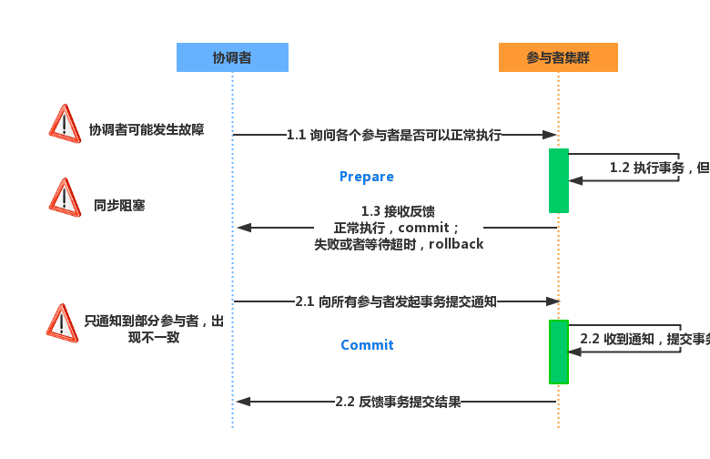
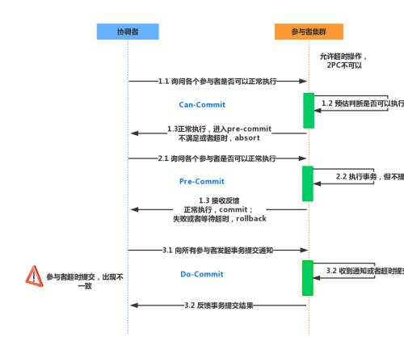
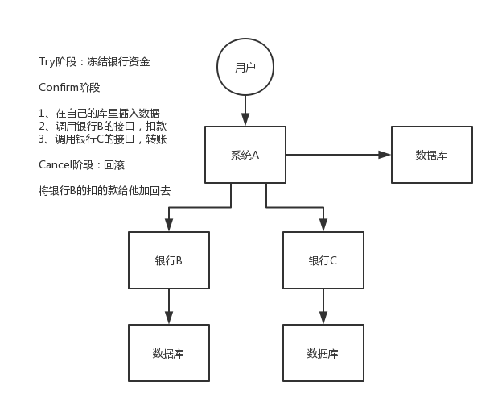

# 分布式事务
## 两阶段提交/XA方案
**协议参与者**
在两阶段提交协议中，系统一般包含两类机器（或节点）：一类为**协调者**（coordinator），通常一个系统中只有一个；另一类为**事务参与者**（participants，cohorts或workers），一般包含多个，在数据存储系统中可以理解为数据副本的个数。协议中假设每个节点都会记录写前日志（write-ahead log）并持久性存储，即使节点发生故障日志也不会丢失。协议中同时假设节点不会发生永久性故障而且任意两个节点都可以互相通信。

**缺点**

- **同步阻塞问题**。执行过程中，所有参与节点都是事务阻塞型的。
当参与者占有公共资源时，其他第三方节点访问公共资源不得不处于阻塞状态。
- **单点故障**。由于协调者的重要性，一旦协调者发生故障。
参与者会一直阻塞下去。尤其在第二阶段，协调者发生故障，那么所有的参与者还都处于锁定事务资源的状态中，而无法继续完成事务操作。（如果是协调者挂掉，可以重新选举一个协调者，但是无法解决因为协调者宕机导致的参与者处于阻塞状态的问题）
- **数据不一致**。在二阶段提交的阶段二中，当协调者向参与者发送commit请求之后，发生了局部网络异常或者在发送commit请求过程中协调者发生了故障，这回导致只有一部分参与者接受到了commit请求。
而在这部分参与者接到commit请求之后就会执行commit操作。但是其他部分未接到commit请求的机器则无法执行事务提交。于是整个分布式系统便出现了数据部一致性的现象。

## 三阶段提交

**三个阶段的执行**
1. **CanCommit**阶段
3PC的CanCommit阶段其实和2PC的准备阶段很像。
协调者向参与者发送commit请求，参与者如果可以提交就返回Yes响应，否则返回No响应。
2. **PreCommit**阶段
Coordinator根据Cohort的反应情况来决定是否可以继续事务的PreCommit操作。
根据响应情况，有以下两种可能。
 - 假如Coordinator从所有的Cohort获得的反馈都是Yes响应，那么就会进行事务的预执行：
发送预提交请求。Coordinator向Cohort发送PreCommit请求，并进入Prepared阶段。
事务预提交。Cohort接收到PreCommit请求后，会执行事务操作，并将undo和redo信息记录到事务日志中。
响应反馈。如果Cohort成功的执行了事务操作，则返回ACK响应，同时开始等待最终指令。
 - 假如有任何一个Cohort向Coordinator发送了No响应，或者等待超时之后，Coordinator都没有接到Cohort的响应，那么就中断事务：
发送中断请求。Coordinator向所有Cohort发送abort请求。
中断事务。Cohort收到来自Coordinator的abort请求之后（或超时之后，仍未收到Cohort的请求），执行事务的中断。
3. **DoCommit**阶段
该阶段进行真正的事务提交，也可以分为以下两种情况:
执行提交
A.发送提交请求。Coordinator接收到Cohort发送的ACK响应，那么他将从预提交状态进入到提交状态。并向所有Cohort发送doCommit请求。
B.事务提交。Cohort接收到doCommit请求之后，执行正式的事务提交。并在完成事务提交之后释放所有事务资源。
C.响应反馈。事务提交完之后，向Coordinator发送ACK响应。
D.完成事务。Coordinator接收到所有Cohort的ACK响应之后，完成事务。

中断事务
Coordinator没有接收到Cohort发送的ACK响应（可能是接受者发送的不是ACK响应，也可能响应超时），那么就会执行中断事务。

**三阶段提交协议和两阶段提交协议的不同**

1. 对于协调者(Coordinator)和参与者(Cohort)都设置了**超时机制**（在2PC中，只有协调者拥有超时机制，即如果在一定时间内没有收到cohort的消息则默认失败）。
2. 在2PC的准备阶段和提交阶段之间，插入预提交阶段，使3PC拥有CanCommit、PreCommit、DoCommit三个阶段。PreCommit是一个缓冲，保证了在最后提交阶段之前**各参与节点的状态是一致**的。

## TCC
TCC 的全称是：Try、Confirm、Cancel。

**Try 阶段**：这个阶段说的是对各个服务的资源做检测以及对资源进行**锁定或者预留**。
**Confirm 阶段**：这个阶段说的是在各个服务中**执行实际的操作**。
**Cancel 阶段**：如果任何一个服务的业务方法执行出错，那么这里就需要进行补偿，就是执行已经执行成功的业务逻辑的**回滚操作**。（把那些执行成功的回滚）

## RocketMQ事务消息
1. A 系统先发送一个 prepared 消息到 mq，如果这个 prepared 消息发送失败那么就直接取消操作别执行了；
2. 如果这个消息发送成功过了，那么接着执行本地事务，如果成功就告诉 mq 发送确认消息，如果失败就告诉 mq 回滚消息；
3. 如果发送了确认消息，那么此时 B 系统会接收到确认消息，然后执行本地的事务；
4. mq 会自动定时轮询所有 prepared 消息回调你的接口，问你，这个消息是不是本地事务处理失败了，所有没发送确认的消息，是继续重试还是回滚？一般来说这里你就可以查下数据库看之前本地事务是否执行，如果回滚了，那么这里也回滚吧。这个就是避免可能本地事务执行成功了，而确认消息却发送失败了。
5. 这个方案里，要是系统 B 的事务失败了咋办？重试咯，自动不断重试直到成功，如果实在是不行，要么就是针对重要的资金类业务进行回滚，比如 B 系统本地回滚后，想办法通知系统 A 也回滚；或者是发送报警由人工来手工回滚和补偿。

