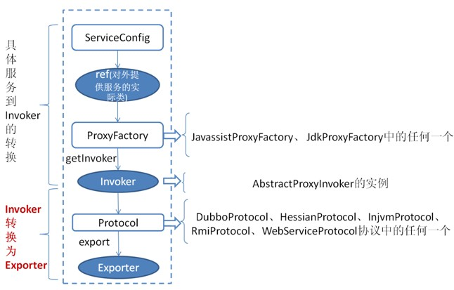
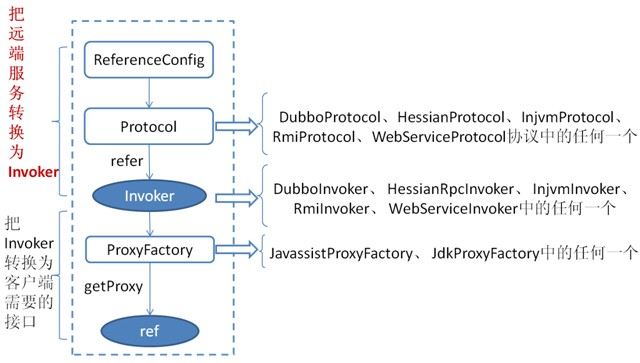
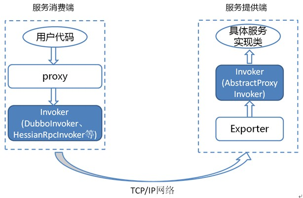

# Dubbo
## 基本知识
### 基本架构图


### 通信协议
- dubbo协议
**默认**就是走 dubbo 协议，单一长连接，进行的是 NIO 异步通信，基于 **hessian** 作为序列化协议。
使用的场景是：**传输数据量小**（每次请求在 100kb 以内），但是**并发量很高**。

 为了要支持高并发场景，一般是服务提供者就几台机器，但是服务消费者有上百台，可能每天调用量达到上亿次！此时用长连接是最合适的，就是跟每个服务消费者维持一个长连接就可以，可能总共就 100 个连接。然后后面直接基于长连接 NIO 异步通信，可以支撑高并发请求。
- rmi 协议
走 Java 二进制序列化，多个短连接，适合消费者和提供者数量差不多的情况，适用于文件的传输，一般较少用。
- hessian 协议
走 hessian 序列化协议，多个短连接，适用于提供者数量比消费者数量还多的情况，适用于文件的传输，一般较少用。
- http 协议
走 json 序列化。
- webservice
走 SOAP 文本序列化。

**各协议比较**
协议名称|实现描述|连接|使用场景
:-:|:-:|:-:|:-:
dubbo|传输：mina、netty、grizzy; 序列化：dubbo、hessian2、java、json | dubbo缺省采用单一长连接和NIO异步通讯|1.传入传出参数数据包较小 2.消费者 比提供者多 3.常规远程服务方法调用 4.不适合传送大数据量的服务，比如文件、传视频
rmi|传输：java  rmi ;序列化：java 标准序列化 |连接个数：多连接; 连接方式：短连接; 传输协议：TCP/IP; 传输方式：BIO|1.常规RPC调用 2.与原RMI客户端互操作 3.可传文件 4.不支持防火墙穿透
hessian|传输：servlet容器; 序列化：表单序列化|连接个数：多连接; 连接方式：短连接; 传输协议：HTTP; 传输方式：同步传输 | 1.提供者多余消费者; 2.数据包混合
webservice| 传输：HTTP; 序列化：SOAP文件序列化 | 连接个数：多连接; 连接方式：短连接; 传输协议：HTTP; 传输方式：同步传输 | 1.系统集成 2.跨语言调用
thrift|与thrift RPC实现集成，并在基础上修改了报文头|长连接、NIO异步传输|


### 序列化协议
dubbo 支持 hession、Java 二进制序列化、json、SOAP 文本序列化多种序列化协议。但是 hessian 是其默认的序列化协议。

### Hessian 的数据结构
- 原始二进制数据
boolean
64-bit date（64 位毫秒值的日期）
64-bit double
32-bit int
64-bit long
null
UTF-8 编码的 string
- 另外还包括 3 种递归类型：
list for lists and arrays
map for maps and dictionaries
object for objects
- 还有一种特殊的类型：
ref：用来表示对共享对象的引用。

### Protocal Buffer
PB 之所以性能如此好，主要得益于两个：

- 它使用 proto 编译器，自动进行序列化和反序列化，速度非常快，应该比 XML 和 JSON 快上了 20~100 倍；
- 它的数据压缩效果好，就是说它序列化后的数据量体积小。因为体积小，传输起来带宽和速度上会有优化。

### 负载均衡策略
- random loadbalance
默认情况下，dubbo 是 random loadbalance 随机调用实现负载均衡，可以对 provider 不同实例设置不同的权重，会按照权重来负载均衡，权重越大分配流量越高，一般就用这个默认的就可以了。

- roundrobin loadbalance
这个的话默认就是均匀地将流量打到各个机器上去，但是如果各个机器的性能不一样，容易导致性能差的机器负载过高。所以此时需要调整权重，让性能差的机器承载权重小一些，流量少一些。

 举个栗子。
跟运维同学申请机器，有的时候，我们运气好，正好公司资源比较充足，刚刚有一批热气腾腾、刚刚做好的一批虚拟机新鲜出炉，配置都比较高：8核+16G 机器，申请到 2 台。过了一段时间，我们感觉 2 台机器有点不太够，我就去找运维同学说，“哥儿们，你能不能再给我一台机器”，但是这时只剩下一台 4核+8G 的机器。我要还是得要。
这个时候，可以给两台 8核16G 的机器设置权重 4，给剩余 1 台 4核8G 的机器设置权重 2。

- leastactive loadbalance
这个就是自动感知一下，如果某个机器性能越差，那么接收的请求越少，越不活跃，此时就会给不活跃的性能差的机器更少的请求。

- consistanthash loadbalance
一致性 Hash 算法，相同参数的请求一定分发到一个 provider 上去，provider 挂掉的时候，会基于虚拟节点均匀分配剩余的流量，抖动不会太大。如果你需要的不是随机负载均衡，是要一类请求都到一个节点，那就走这个一致性 Hash 策略。

### 集群容错策略
- failover cluster 模式
失败自动切换，自动重试其他机器，**默认**就是这个，**常见于读操作**。（失败重试其它机器）
- failfast cluster模式
一次调用失败就立即失败，**常见于写操作**。（调用失败就立即失败）
- failsafe cluster 模式
出现异常时忽略掉，常用于不重要的接口调用，比如**记录日志**。
- failback cluster 模式
失败了后台自动记录请求，然后定时重发，比较**适合于写消息队列**这种。
- forking cluster 模式
并行调用多个 provider，只要一个成功就立即返回。
- broadcacst cluster
逐个调用所有的 provider。

### dubbo动态代理策略
默认使用 **javassist 动态字节码生成**，创建代理类。但是可以通过 spi 扩展机制配置自己的动态代理策略。


## 远程调用细节
### 服务暴露


**上图是服务提供者暴露服务的主过程：**
首先ServiceConfig类拿到对外提供服务的实际类ref(如：HelloWorldImpl),然后通过ProxyFactory类的getInvoker方法使用ref生成一个AbstractProxyInvoker实例，到这一步就完成具体服务到Invoker的转化。接下来就是Invoker转换到Exporter的过程。
Dubbo处理**服务暴露的关键**就在**Invoker转换到Exporter**的过程(如上图中的红色部分)，下面我们以Dubbo和RMI这两种典型协议的实现来进行说明：

- Dubbo的实现
Dubbo协议的Invoker转为Exporter发生在DubboProtocol类的export方法，它主要是打开socket侦听服务，并接收客户端发来的各种请求，通讯细节由Dubbo自己实现。

- RMI的实现
RMI协议的Invoker转为Exporter发生在RmiProtocol类的export方法，
它通过Spring或Dubbo或JDK来实现RMI服务，通讯细节这一块由JDK底层来实现，这就省了不少工作量。

### 服务引用


上图是服务消费的主过程：
首先ReferenceConfig类的init方法调用Protocol的refer方法生成Invoker实例(如上图中的红色部分)，这是服务消费的关键。接下来把Invoker转换为客户端需要的接口(如：HelloWorld)。

### Invoker


为了更好的解释上面这张图，我们结合服务消费和提供者的代码示例来进行说明：

服务消费者代码：
```
    public class DemoClientAction {
 
    private DemoService demoService;
 
    public void setDemoService(DemoService demoService) {
        this.demoService = demoService;
    }
 
    public void start() {
        String hello = demoService.sayHello("world" + i);
    }
}
```

上面代码中的`DemoService`就是上图中服务消费端的proxy，用户代码通过这个proxy调用其对应的Invoker(DubboInvoker、 HessianRpcInvoker、 InjvmInvoker、 RmiInvoker、 WebServiceInvoker中的任何一个)，而**该Invoker实现了真正的远程服务调用**。

服务提供者代码：
```
    public class DemoServiceImpl implements DemoService {
 
    public String sayHello(String name) throws RemoteException {
        return "Hello " + name;
    }
 
}
```

上面这个类会被封装成为一个`AbstractProxyInvoker`实例，并新生成一个
Exporter实例。这样当网络通讯层收到一个请求后，会找到对应的Exporter实例，并调用它所对应的AbstractProxyInvoker实例，从而真正调用了服务提供者的代码。

## Dubbo的SPI思想
### 原理
```
    Protocol protocol = ExtensionLoader.getExtensionLoader(Protocol.class).getAdaptiveExtension();

```
Protocol 接口，在系统运行的时候，dubbo 会判断一下应该选用这个 Protocol 接口的哪个实现类来实例化对象来使用。

它会去找一个你配置的 Protocol，将你配置的 Protocol 实现类，加载到 jvm 中来，然后实例化对象，就用你的那个 Protocol 实现类就可以了。

上面那行代码就是 dubbo 里大量使用的，就是对很多组件，都是保留一个接口和多个实现，然后在系统运行的时候动态根据配置去找到对应的实现类。如果你没配置，那就走默认的实现好了，没问题。

```
@SPI("dubbo")  
public interface Protocol {  
      
    int getDefaultPort();  
  
    @Adaptive  
    <T> Exporter<T> export(Invoker<T> invoker) throws RpcException;  
  
    @Adaptive  
    <T> Invoker<T> refer(Class<T> type, URL url) throws RpcException;  

    void destroy();  
  
}  
```

在 dubbo 自己的 jar 里，在`/META_INF/dubbo/internal/com.alibaba.dubbo.rpc.Protocol`文件中：

```
dubbo=com.alibaba.dubbo.rpc.protocol.dubbo.DubboProtocol
http=com.alibaba.dubbo.rpc.protocol.http.HttpProtocol
hessian=com.alibaba.dubbo.rpc.protocol.hessian.HessianProtocol
```

所以说，这就看到了 dubbo 的 spi 机制默认是怎么玩儿的了，其实就是 Protocol 接口，`@SPI("dubbo")` 说的是，通过 SPI 机制来提供实现类，实现类是通过 dubbo 作为默认 key 去配置文件里找到的，配置文件名称与接口全限定名一样的，通过 dubbo 作为 key 可以找到默认的实现类就是 `com.alibaba.dubbo.rpc.protocol.dubbo.DubboProtocol`。

如果想要动态替换掉默认的实现类，需要使用 `@Adaptive` 接口，Protocol 接口中，有两个方法加了 `@Adaptive` 注解，就是说那俩接口会被代理实现。

啥意思呢？

比如这个 Protocol 接口搞了俩 `@Adaptive` 注解标注了方法，在运行的时候会针对 Protocol 生成代理类，这个代理类的那俩方法里面会有代理代码，代理代码会在运行的时候动态根据 url 中的 protocol 来获取那个 key，默认是 dubbo，你也可以自己指定，你如果指定了别的 key，那么就会获取别的实现类的实例了。

### 如何自己扩展dubbo中的组件
自己写个工程，要是那种可以打成 jar 包的，里面的 `src/main/resources` 目录下，搞一个 `META-INF/services`，里面放个文件叫：`com.alibaba.dubbo.rpc.Protocol`，文件里搞一个`my=com.bingo.MyProtocol`。自己把 jar 弄到 nexus 私服里去。

然后自己搞一个 dubbo provider 工程，在这个工程里面依赖你自己搞的那个 jar，然后在 spring 配置文件里给个配置：
```
<dubbo:protocol name=”my” port=”20000” />
```
provider 启动的时候，就会加载到我们 jar 包里的`my=com.bingo.MyProtocol` 这行配置里，接着会根据你的配置使用你定义好的 MyProtocol 了，这个就是简单说明一下，你通过上述方式，可以替换掉大量的 dubbo 内部的组件，就是扔个你自己的 jar 包，然后配置一下即可。

## 服务治理、服务降级、失败重试和超时重试
### 服务治理
1. 调用链路自动生成
2. 服务访问压力以及时长统计
需要自动统计各个接口和服务之间的调用次数以及访问延时，而且要分成两个级别。
 - 一个级别是接口粒度，就是每个服务的每个接口每天被调用多少次，TP50/TP90/TP99，三个档次的请求延时分别是多少；
 - 第二个级别是从源头入口开始，一个完整的请求链路经过几十个服务之后，完成一次请求，每天全链路走多少次，全链路请求延时的 TP50/TP90/TP99，分别是多少。
3. 其它
 - 服务分层（避免循环依赖）
 - 调用链路失败监控和报警
 - 服务鉴权
 - 每个服务的可用性的监控（接口调用成功率？几个9？99.99%，99.9%，99%。）
 
### 服务降级
我们调用接口失败的时候，可以通过 mock 统一返回 null。
```
<dubbo:reference id="fooService" interface="com.test.service.FooService"  timeout="10000" check="false" mock="return null">
```

mock 的值也可以修改为 true，然后再跟接口同一个路径下实现一个 Mock 类，命名规则是`接口名称+Mock后缀`。然后在 Mock 类里实现自己的降级逻辑。

### 失败重试和超时重试
```
<dubbo:reference id="xxxx" interface="xx" check="true" async="false" retries="3" timeout="2000"/>
```

## Q&A
### 如何保证分布式接口的幂等性？
其实保证幂等性主要是三点：

- 对于每个请求必须有一个唯一的标识，举个栗子：订单支付请求，肯定得包含订单 id，一个订单 id 最多支付一次，对吧。
- 每次处理完请求之后，必须有一个记录标识这个请求处理过了。常见的方案是在 mysql 中记录个状态啥的，比如支付之前记录一条这个订单的支付流水。
- 每次接收请求需要进行判断，判断之前是否处理过。比如说，如果有一个订单已经支付了，就已经有了一条支付流水，那么如果重复发送这个请求，则此时先插入支付流水，orderId 已经存在了，唯一键约束生效，报错插入不进去的。然后你就不用再扣款了。

### 分布式服务接口请求的顺序性如何保证？
首先从业务逻辑上设计的这个系统最好是不需要这种顺序性的保证，因为一旦引入顺序性保障，比如使用分布式锁，会导致系统复杂度上升，而且会带来效率低下，热点数据压力过大等问题。

其次，解决方案：
- 首先你得用 dubbo 的**一致性 hash** 负载均衡策略，将比如某一个订单 id 对应的请求都给分发到某个机器上去。
- 接着就是在那个机器上因为可能还是多线程并发执行的，你可能得立即将某个订单 id 对应的请求**扔一个内存队列**里去，强制排队，这样来确保他们的顺序性。

### 如何设计一个rpc框架？
1. 上来你的服务就得去注册中心注册吧，你是不是得有个注册中心，保留各个服务的信心，可以用 zookeeper 来做，对吧。
2. 然后你的消费者需要去注册中心拿对应的服务信息吧，对吧，而且每个服务可能会存在于多台机器上。
3. 接着你就该发起一次请求了，咋发起？当然是基于动态代理了，你面向接口获取到一个动态代理，这个动态代理就是接口在本地的一个代理，然后这个代理会找到服务对应的机器地址。
4. 然后找哪个机器发送请求？那肯定得有个负载均衡算法了，比如最简单的可以随机轮询是不是。
5. 接着找到一台机器，就可以跟它发送请求了，第一个问题咋发送？你可以说用 netty 了，nio 方式；第二个问题发送啥格式数据？你可以说用 hessian 序列化协议了，或者是别的，对吧。然后请求过去了。
6. 服务器那边一样的，需要针对你自己的服务生成一个动态代理，监听某个网络端口了，然后代理你本地的服务代码。接收到请求的时候，就调用对应的服务代码，对吧。
