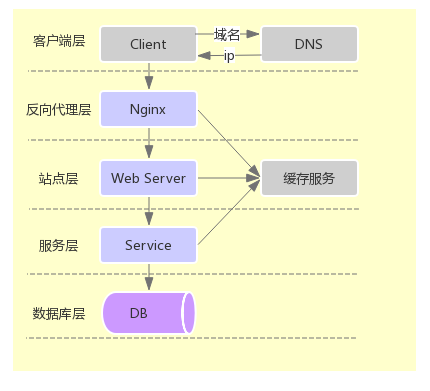

## 高并发场景下秒杀系统的设计
### 常见的互联网分层结构

**客户端层：**手机或PC端操作的客户端页面，域名通过DNS解析路由到NG
**反向代理层：**一般通过NG作为反向代理，将客户端请求均衡路由到后端站点服务，NG也可以水平扩展为多实例，且每个实例可单独部署为主从的高可用方案。
**站点层：**站点层可以水平扩展为多个实例部署，以此来均衡来自客户端请求产生的高并发负载，多个web server之间的session信息可以集中存储于分布式缓存服务（Redis，MemCache）中。
**服务层：**服务层也可水平扩展为多个实例部署，即时下最火的微服务方式
**数据库层：**数据库层的常见部署方式，如读写分离，分库分表等

### 秒杀系统的架构原则
- **尽量将请求拦截在上游**
对于秒杀系统来说，系统的瓶颈一般在数据库层，由于资源是有限的，如库中共1万张票，一瞬间并发进来100万的请求，那么有99万都是无用的请求，所以为了更好的保护底层有限的数据库资源，尽量将请求拦截在上游。

- **充分利用缓存**
缓存不但极大的缩短了数据的访问效率，更重要的是承载了底层数据库的访问压力，所以对于读多写少的业务场景充分利用好缓存

- **热点隔离**
 - 业务隔离：如12306的分时段售票，将热点数据分散处理，来降低系统负载压力
 - 系统隔离：实现系统的软硬隔离，不光是实现软件的隔离，还可以实现硬件的隔离，尽最大限度的减少秒杀带来的高并发安全性问题。
 - 数据隔离：启用单独的cache集群或数据库来存放热点数据

### 优化方案
- **页面端优化**
 - 按钮置灰：禁止用户重复提交请求
 - 通过JS控制：在一定时间内只能提交一次请求

- **web server层优化**
 - 动静分离：如将几乎不变的静态页面直接通过NG或CDN来路由访问，只有动态变换的页面可以请求到web server端
 - 页面缓存化
 - Nginx反向代理实现web server端的水平扩展

- **后端service服务层优化**
 - 使用缓存（Redis、Memchched）：将读多写少的业务数据放入缓存，如秒杀业务中可以将更新频繁的商品库存信息放入Redis缓存处理
**注：**库存信息放入Redis缓存的时候最好分为多份放入不同key的缓存中，如库存为10万可以分为10份分别放入不同key的缓存中，这样将数据分散操作可以达到更高的读写性能。
 - 使用队列处理：将请求放入队列排队处理，以可控的速度来访问底层DB
 - 异步处理：如将秒杀成功的订单通知信息通过消息队列（RabbitMQ、Kafka）来异步处理

- **DB层优化**
 - 读写分离
 - 分表分库
 - 数据库集群