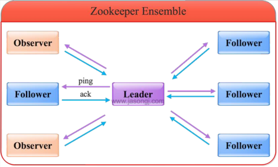

# Zookeeper
## 概念
Zookeeper 是一个分布式协调服务，可用于服务发现，分布式锁，分布式领导选举，配置管理等。
Zookeeper 提供了一个类似于 Linux 文件系统的树形结构（可认为是轻量级的内存文件系统，但
只适合存少量信息，完全不适合存储大量文件或者大文件），同时提供了对于每个节点的监控与通知机制。

## 角色
Zookeeper 集群是一个基于主从复制的高可用集群，每个服务器承担如下三种角色中的一种。
### Leader
1. 一个 Zookeeper 集群同一时间只会有**一个实际工作的Leader**，它会发起并维护与各 Follwer及 Observer 间的心跳。
2. 所有的写操作必须要通过Leader完成再由Leader将写操作广播给其它服务器。只要有**超过半数**节点（不包括observeer节点）写入成功，该写请求就会被提交（类2PC协议）。

### Follower
1. 一个 Zookeeper 集群可能同时存在多个 Follower，它会响应 Leader 的心跳。
2. Follower 可直接处理并返回客户端的读请求，同时会将写请求转发给 Leader 处理。
3. 并且负责在 Leader 处理写请求时对请求进行投票。

### Observer
1. 角色与 Follower 类似，但是**无投票权**。
2. Zookeeper需保证高可用和强一致性，为了支持更多的客户端，需要增加更多Server；
3. Server增多，投票阶段延迟增大，影响性能； 引入 Observer，Observer不参与投票；
4. Observers接受客户端的连接，并将写请求转发给 leader 节点； 加入更多 Observer 节点，提高伸缩性，同时不影响吞吐率。

## ZAB协议
### epoch
epoch：可以理解为**当前集群所处的年代或者周期**，每个leader就像皇帝，都有自己的年号，所以每次改朝换代，leader变更之后，都会在前一个年代的基础上加1。这样就算旧的 leader 崩溃恢复之后，也没有人听他的了，因为 follower 只听从当前年代的leader 的命令。

### 事务编号 Zxid（事务请求计数器+ epoch）
在 ZAB ( ZooKeeper Atomic Broadcast, ZooKeeper原子消息广播协议）协议的事务编号 Zxid设计中， Zxid 是一个 64 位的数字，其中低32位是一个简单的单调递增的计数器， 针对客户端每一个事务请求，计数器加 1；而高 32 位则代表 Leader周期epoch的编号， 每个当选产生一个新的Leader服务器，就会从这个Leader服务器上取出其本地日志中最大事务的 ZXID，并从中读取epoch 值，然后加 1，以此作为新的 epoch，并将低 32 位从 0 开始计数。Zxid（Transactionid）类似于RDBMS中的事务ID，用于标识一次更新操作的 Proposal（提议）ID。为了保证顺序性，该 zkid 必须单调递增。

### Zab协议两种模式
Zab 协议有两种模式，它们分别是恢复模式（选主）和广播模式（同步）。当服务启动或者在领导者崩溃后， Zab 就进入了恢复模式，当领导者被选举出来，且大多数 Server 完成了和 leader 的状态同步以后，恢复模式就结束了。状态同步保证了leader和Server 具有相同的系统状态。

### ZAB 协议四个阶段
- **Leader election（选举阶段-选出准 Leader）**
 节点在一开始都处于选举阶段，只要有一个节点得到超半数节点的票数，它就可以当选准 leader。只有到达广播阶段（broadcast）准leader才会成为真正的leader。这一阶段的目的是就是为了选出一个准 leader，然后进入下一个阶段

- **Discovery（发现阶段-接受提议、生成 epoch、接受 epoch）**
在这个阶段， followers跟准leader进行通信，同步followers最近接收的事务提议。这个一阶段的主要目的是发现当前大多数节点接收的最新提议，并且准 leader 生成新的 epoch，让 followers 接受，更新它们的 accepted Epoch。一个 follower只会连接一个 leader， 如果有一个节点f认为另一个follower p是leader，f在尝试连接p时会被拒绝， f 被拒绝之后，就会进入重新选举阶段。

- **Synchronization（同步阶段-同步 follower 副本）**
同步阶段主要是利用 leader前一阶段获得的最新提议历史，
同步集群中所有的副本。 只有当 大多数节点都同步完成，准 leader 才会成为真正的 leader。follower 只会接收 zxid 比自己的 lastZxid 大的提议。

- **Broadcast（广播阶段-leader 消息广播）**
到了这个阶段， Zookeeper集群才能正式对外提供事务服务，并且leader可以进行消息广播。同时如果有新的节点加入，还需要对新节点进行同步。

ZAB提交事务并不像2PC一样需要全部 follower 都 ACK， 只需要得到超过半数的节点的 ACK 就可以了。

### 投票机制
具体选举过程如下：
1. 每个 Server 启动以后都询问其它的 Server 它要投票给谁。对于其他 server 的询问，server 每次根据自己的状态都回复自己推荐的 leader的id和上一次处理事务的 zxid（系统启动时每个 server 都会推荐自己）
2. 收到所有 Server 回复以后，就计算出 zxid 最大的哪个 Server，并将这个 Server 相关信息设置成下一次要投票的 Server。
3. 计算这过程中获得票数最多的的 sever 为获胜者，如果获胜者的票数超过半数，则改
server 被选为 leader。否则，继续这个过程，直到 leader 被选举出来
4. leader 就会开始等待 server 连接
5. Follower 连接 leader，将最大的 zxid 发送给 leader
6. Leader 根据 follower 的 zxid 确定同步点，至此选举阶段完成。
7. 选举阶段完成 Leader 同步后通知 follower 已经成为 uptodate 状态
8. Follower 收到 uptodate 消息后，又可以重新接受 client 的请求进行服务了

**举例：**
目前有 5 台服务器，每台服务器均没有数据，它们的编号分别是1,2,3,4,5,按编号依次启动，它们的选择举过程如下：
1. 服务器 1 启动，给自己投票，然后发投票信息，由于其它机器还没有启动所以它收不到反馈信息，服务器 1 的状态一直属于 Looking。
2. 服务器 2 启动，给自己投票，同时与之前启动的服务器 1 交换结果，由于服务器 2 的编号大所以服务器 2胜出，但此时投票数没有大于半数，所以两个服务器的状态依然是
LOOKING。
3. 服务器 3 启动，给自己投票，同时与之前启动的服务器 1,2 交换信息，由于服务器 3 的编号最大所以服务器3胜出，此时投票数正好大于半数，所以服务器3成为领导者，服务器1,2 成为小弟。
4. 服务器 4 启动，给自己投票，同时与之前启动的服务器 1,2,3交换信息，尽管服务器 4 的编号大，但之前服务器 3 已经胜出，所以服务器 4 只能成为小弟。
5. 服务器 5 启动，后面的逻辑同服务器 4 成为小弟。

## Znode目录节点
- PERSISTENT：持久的节点。
- EPHEMERAL： 暂时的节点。
- PERSISTENT_SEQUENTIAL：持久化顺序编号目录节点。
- EPHEMERAL_SEQUENTIAL：暂时化顺序编号目录节点

  [1]: https://upload-images.jianshu.io/upload_images/13194828-863153330c27ff8a.png?imageMogr2/auto-orient/
