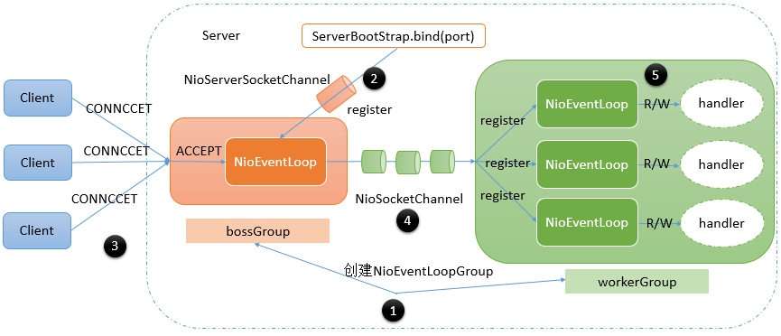

## Reactor线程模型
### Reactor单线程
Reactor单线程模型，指的是所有的IO操作都在同一个NIO线程上面完成


### Rector多线程模型
Rector多线程模型与单线程模型最大的区别就是有一组NIO线程处理IO操作，它的原理图如下：


### 主从Reactor线程模型
服务端用于接收客户端连接的不再是个1个单独的NIO线程，而是一个独立的NIO线程池。


### Netty线程模型
同时支持以上三种。


流程：

netty通过Reactor模型基于多路复用器接收并处理用户请求（能讲就多讲一点），内部实现了两个线程池，boss线程池和work线程池，其中boss线程池的线程负责处理请求的accept事件，当接收到accept事件的请求时，把对应的socket封装到一个NioSocketChannel中，并交给work线程池，其中work线程池负责请求的read和write事件。

## Q&A
### 为什么选择netty？
 - API使用简单，开发门槛低。
 - 功能强大，预置了多种编解码功能，支持多种协议开发。
 - 定制能力强，可以通过ChannelHadler进行扩展。
 - 性能高，对比其它NIO框架，Netty综合性能最优。
 - 经历了大规模的应用验证。在互联网、大数据、网络游戏、企业应用、电信软件得到成功，很多著名的框架通信底层就用了Netty，比如Dubbo
 - 稳定，修复了NIO出现的所有Bug。
### 原生的 NIO 在 JDK 1.7 版本存在 epoll bug？

详见[JDK Epoll空轮询bug](https://www.jianshu.com/p/3ec120ca46b2)

### 什么是TCP 粘包/拆包以及解决方法？
 **原因：**
  - 要发送的数据大于TCP发送缓冲区剩余空间大小，将会发生拆包。
  - 待发送数据大于MSS（最大报文长度），TCP在传输前将进行拆包。
  - 要发送的数据小于TCP发送缓冲区的大小，TCP将多次写入缓冲区的数据一次发送出去，将会发生粘包。
  - 接收数据端的应用层没有及时读取接收缓冲区中的数据，将发生粘包。

  **解决方案：**
  - 消息头部包含数据包的长度
  - 发送端将每个数据包封装为固定长度（不够的可以通过补0填充）
  - 数据包之间设置分隔符

  **Netty解决方案**
  - LineBasedFrameDecoder:以换行符为结束标志的解码器，支持携带结束符或者不携带结束符两种解码方式，同时支持配置单行的最大长度
  - FixedLengthFrameDecoder:固定长度
  - DelimiterBasedFrameDecoder：固定字符切分
 
### Netty的零拷贝
- 从操作系统层面上来讲，zero-copy指的是避免在内核态与用户态之间的数据缓冲区复制（通过mmap避免）
- Netty中的zero-copy更偏向于在**用户态中的数据操作的优化**，就像使用CompositeByteBuf来复用多个ByteBuf以避免额外的复制，也可以使用wrap()方法来将一个字节数组包装成ByteBuf，又或者使用ByteBuf的slice()方法把它分割为多个共享同一内存区域的ByteBuf，这些都是为了优化内存的使用率。
  - DirectByteBuf通过直接在堆外分配内存的方式，避免了数据从堆内拷贝到堆外的过程
  - 通过组合ByteBuf类：即CompositeByteBuf，将多个ByteBuf合并为一个逻辑上的ByteBuf
  - 通过各种包装方法, 将 byte[]、ByteBuf、ByteBuffer等包装成一个ByteBuf对象
  - 通过slice方法, 将一个ByteBuf分解为多个共享同一个存储区域的ByteBuf, 避免了内存的拷贝，这在需要进行拆包操作时非常管用
  - 通过FileRegion包装的FileChannel.tranferTo方法进行文件传输时, 可以直接将文件缓冲区的数据发送到目标Channel, 减少了通过循环write方式导致的内存拷贝。但是这种方式是需要得到操作系统的零拷贝的支持的，如果netty所运行的操作系统不支持零拷贝的特性，则netty仍然无法做到零拷贝

### Netty 内部执行流程
 - 创建ServerBootStrap实例
 - 设置并绑定Reactor线程池：EventLoopGroup，EventLoop就是处理所有注册到本线程的Selector上面的Channel
 - 设置并绑定服务端的channel
 - 创建处理网络事件的ChannelPipeline和handler，网络时间以流的形式在其中流转，handler完成多数的功能定制：比如编解码 SSl安全认证
 - 绑定并启动监听端口（**如果是客户端此步是异步发起TCP连接**）
 - 当轮训到准备就绪的channel后，由Reactor线程：NioEventLoop执行pipline中的方法，最终调度并执行channelHandler 

### Netty 重连实现
 - **心跳检测**
 Netty中提供了一个IdleStateHandler类用于心跳检测
    ```
    ch.pipeline().addLast("ping", new IdleStateHandler(60, 20, 60 * 10, TimeUnit.SECONDS));
    ```
    在处理数据的ClientPoHandlerProto中增加userEventTriggered用来接收心跳检测结果,event.state()的状态分别对应上面三个参数的时间设置，当满足某个时间的条件时会触发事件。
当客户端20秒没往服务端发送过数据，就会触发`IdleState.WRITER_IDLE`事件，这个时候我们就像服务端发送一条心跳数据，跟业务无关，只是心跳。服务端收到心跳之后就会回复一条消息，表示已经收到了心跳的消息，只要收到了服务端回复的消息，那么就不会触发`IdleState.READER_IDLE`事件，如果触发了`IdleState.READER_IDLE`事件就说明服务端没有给客户端响应，这个时候可以选择重新连接。

 - **启动时连接重试**
 增加负责重连的监听器ConnectionListener,并添加到ChannelFuture中去即可使用，连接失败的时候会进入ConnectionListener中的operationComplete方法执行我们的重连逻辑
 ```
 public class ConnectionListener implements ChannelFutureListener {

    private ImConnection imConnection = new ImConnection();

    @Override
    public void operationComplete(ChannelFuture channelFuture) throws Exception {
        if (!channelFuture.isSuccess()) {
            final EventLoop loop = channelFuture.channel().eventLoop();
            loop.schedule(new Runnable() {
                @Override
                public void run() {
                    System.err.println("服务端链接不上，开始重连操作...");
                    imConnection.connect(ImClientApp.HOST, ImClientApp.PORT);
                }
            }, 1L, TimeUnit.SECONDS);
        } else {
            System.err.println("服务端链接成功...");
        }
    }
}
 ```
 
     ```
         public class ImConnection {
        
            private Channel channel;
        
            public Channel connect(String host, int port) {
                doConnect(host, port);
                return this.channel;
            }
        
            private void doConnect(String host, int port) {
                EventLoopGroup workerGroup = new NioEventLoopGroup();
                try {
                    Bootstrap b = new Bootstrap();
                    b.group(workerGroup);
                    b.channel(NioSocketChannel.class);
                    b.option(ChannelOption.SO_KEEPALIVE, true);
                    b.handler(new ChannelInitializer<SocketChannel>() {
                        @Override
                        public void initChannel(SocketChannel ch) throws Exception {
        
                            // 实体类传输数据，protobuf序列化
                            ch.pipeline().addLast("decoder",  
                                    new ProtobufDecoder(MessageProto.Message.getDefaultInstance()));  
                            ch.pipeline().addLast("encoder",  
                                    new ProtobufEncoder());  
                            ch.pipeline().addLast(new ClientPoHandlerProto());
        
                        }
                    });
        
                    ChannelFuture f = b.connect(host, port);
                    f.addListener(new ConnectionListener());
                    channel = f.channel();
                } catch(Exception e) {
                    e.printStackTrace();
                }
            }
        
        }
     ```
   
   - **运行中连接断开时重试**
    在连接断开时都会触发 channelInactive 方法, 处理重连的逻辑跟上面的一样。
       ```
    @Override
    public void channelInactive(ChannelHandlerContext ctx) throws Exception {
        System.err.println("掉线了...");
        //使用过程中断线重连
        final EventLoop eventLoop = ctx.channel().eventLoop();
        eventLoop.schedule(new Runnable() {
            @Override
            public void run() {
                imConnection.connect(ImClientApp.HOST, ImClientApp.PORT);
            }
        }, 1L, TimeUnit.SECONDS);
        super.channelInactive(ctx);
    }
    ```
  ### 遇到的问题和解决方案
   - 问题：
   对netty的不够熟悉，把请求的业务逻辑放在work线程池的线程中进行处理，进行压测的时候，发现qps总是上不去，后来看了源码之后才发现，由于业务逻辑的处理比较耗时，完全占用了work线程池的资源，导致新的请求一直处于等待状态。
   - 解决：
   把处理业务的逻辑封装成一个task提交给一个新建的业务线程池中执行，执行完之后由work线程池执行请求的write事件。
