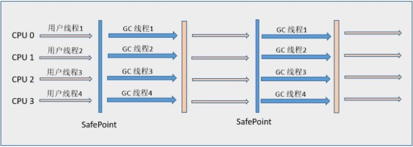

# JVM
## 对象
### 对象的生命周期
1. **创建阶段(Created)**
 - 为对象分配存储空间
 - 开始构造对象
 - 从父类到子类对static成员进行初始化
 - 父类成员变量按照顺序初始化，递归调用父类的构造方法
 - 子类成员变量按照顺序初始化，子类构造方法调用
 - 一旦对象被创建，并有某个引用指向它，这个对象的状态就切换到了应用阶段(In Use)
2. **应用阶段(In Use)**
对象至少被一个强引用持有并且对象在作用域内

3. **不可见阶段(Invisible)**
程序本身不再持有该对象的任何强引用，但是这些引用可能还存在着；
一般具体是指程序的执行已经超过该对象的作用域了

4. **不可达阶段(Unreachable)**
该对象不再被任何强引用所持有；
可能仍被JVM等系统下的某些已经装载的惊天变灵或者线程或JNI所持有，这些特殊的强引用被称为GC root,这种情况容易导致内存泄露，无法被回收

5. **收集阶段(Collected)**
对象不可达，并且GC已经准备好对该对象占用的内存空间重新分配的时候，处于收集阶段。
如果重写了finazlie()方法，则会去执行该方法。
尽量不要重写finazlie()方法，因为有可能影响JVM的对象分配与回收速度或者可能造成该对象的再次复活

6. **终结阶段**
当对象执行完finalize()方法之后，仍然处于不可达状态时，则该对象进入终结阶段。在这个阶段，内存空间等待GC进行回收

7. **对象空间的重新分配**
GC对该对象占有的内存空间进行回收或者再分配，该对象彻底消失

##J VM类加载机制
### 类加载过程

 1. 加载：在内存中生成一个代表这个类的java.lang.Class对象，作为方法区这个类的各种数据的入口
 2. 验证：确保Class文件的字节流中包含的信息是否符合当前虚拟机的要求
 3. 准备：正式为类变量分配内存并设置类变量的初始值阶段，即在方法区中分配这些变量所使用的内存空间
 4. 解析：是指虚拟机将常量池中的符号引用替换为直接引用的过程
 5. 初始化：执行类构造器方法的过程

### 类加载器

 - **启动类加载器(Bootstrap ClassLoader)**：负责加载 JAVA_HOME\lib 
目录中的，或通过-Xbootclasspath参数指定路径中的，且被虚拟机认可（按文件名识别，如rt.jar）的类。
 - **扩展类加载器(Extension ClassLoader)**：负责加载 JAVA_HOME\lib\ext 
目录中的，或通过java.ext.dirs系统变量指定路径中的类库。
 - **应用程序类加载器(Application ClassLoader)**：负责加载用户路径（classpath）上的类库。

**双亲委派模型**
好处：采用双亲委派的一个好处是比如加载位于rt.jar包中的类java.lang.Object，不管是哪个加载器加载这个类，最终都是委托给顶层的启动类加载器进行加载，这样就**保证了使用不同的类加载器最终得到的都是同样一个Object对象**。

  
## JVM内存模型

关键点：
**Java堆：TLAB (线程私有分配缓冲区) :** 虚拟机为新生对象分配内存时，需要考虑多线程申请内存的安全问题，可能出现正在给对象A分配内存，指针还未修改，对象B又同时使用原来的指针分配内存的情况。TLAB 能够给每个线程在Java堆中预先分配一小块内存 TLAB，哪个线程需要分配内存就在自己的TLAB上进行分配，若TLAB用完并分配新的TLAB时，再加同步锁定，这样就大大提升了对象内存分配的效率。
当一个Java线程在自己的TLAB中分配到尽头之后，再要分配就会出发一次“TLAB refill”，也就是说之前自己的TLAB就“不管了”（所有权交回给共享的Eden），然后重新从Eden里分配一块空间作为新的TLAB。通常情况下，在TLAB中分配多次才会填满TLAB、触发TLAB refill，这样使用TLAB分配就比直接从共享部分的Eden分配要均摊（amortized）了同步开销，于是提高了性能。

**虚拟机栈**

- **局部变量表**：局部变量表是一组局部变量值存储空间，用于存放方法参数和方法内部定义的局部变量。
- 操作数栈：在方法的执行过程中，会有各种字节码指令往操作数栈中写入和提取内容，也就是入栈和出栈操作
- 动态连接：每个栈帧都包含一个指向运行时常量池中该栈帧所属性方法的引用，持有这个引用是为了支持方法调用过程中的动态连接。在Class文件的常量池中存有大量的符号引用，字节码中的方法调用指令就以常量池中指向方法的符号引用为参数。这些符号引用一部分会在类加载阶段或第一次使用的时候转化为直接引用，这种转化称为静态解析。*另外一部分将在每一次的运行期期间转化为直接引用，这部分称为动态连接。*
- 方法返回地址：正常完成出口和异常完成出口

**方法区**
方法区与Java堆一样，也是线程共享的并且不需要连续的内存，其用于存储已被虚拟机加载的**类信息**、**常量**、**静态变量**、**即时编译器编译后的代码**等数据
**运行时常量池：**是方法区的一部分，用于存放编译期生成的各种字面量和符号引用。字面量：文本字符串、被声明为final的常量。
符号引用：类和接口的全限定名、字段的名称和描述符 和 方法的名称和描述符。

## 垃圾回收
### 概念：
**可以作为GCROOTS的对象**

 - 虚拟机栈(栈帧中的局部变量表)中引用的对象
 - 方法区中类静态属性引用的对象
 - 方法区中常量引用的对象
 - 本地方法栈中Native方法引用的对象

### 内存分配担保机制
我们知道如果对象在复制到Survivor区时若Survivor空间不足，则会触发担保机制，将对象转入老年代；但老年代的能力也不是无限的，因此需要在minor GC时做一个是否需要Major GC 的判断：

 - 如果老年代的剩余空间 < 之前转入老年代的对象的平均大小，则触发Major GC
 - 如果老年代的剩余空间 > 之前转入老年代的对象的平均大小，并且允许担保失败，则直接Minor GC，不需要做Full GC
 - 如果老年代的剩余空间 > 之前转入老年代的对象的平均大小，并且不允许担保失败，则触发Major GC

出发点还是尽量为对象分配内存。但是一般会配置允许担保失败，避免频繁的去做Full GC。

### 常见OOM错误

 - Java heap space堆内存溢出，此种情况最常见，一般由于内存泄露或者堆的大小设置不当引起。对于内存泄露，需要通过内存监控软件查找程序中的泄露代码，而堆大小可以通过虚拟机参数-Xms,-Xmx等修改。
 - Java PermGen space 永久代溢出，即方法区溢出了，一般出现于大量Class或者jsp页面，或者采用cglib等反射机制的情况，因为上述情况会产生大量的Class信息存储于方法区。此种情况可以通过更改方法区的大小来解决，使用类似-XX:PermSize=64m -XX:MaxPermSize=256m的形式修改。另外，过多的常量尤其是字符串也会导致方法区溢出。
 - java.lang.StackOverflowError, 不会抛OOM error，但也是比较常见的Java内存溢出。JAVA虚拟机栈溢出，一般是由于程序中存在死循环或者深度递归调用造成的，栈大小设置太小也会出现此种溢出。可以通过虚拟机参数-Xss来设置栈的大小。

## 垃圾回收器

### 相关概念：
 - 并行（Parallel）：指多条垃圾收集线程并行工作，但此时用户线程仍然处于等待状态。
 - 并发（Concurrent）：指用户线程与垃圾收集线程同时执行（但不一定是并行的，可能会交替执行），用户程序在继续运行。而垃圾收集程序运行在另一个CPU上。
 - 吞吐量就是CPU用于运行用户代码的时间与CPU总消耗时间的比值，即
吞吐量 = 运行用户代码时间 /（运行用户代码时间 + 垃圾收集时间）。

### Serial收集器
采用**复制算法**的**单线程**收集器。

下图展示了Serial 收集器（老年代采用Serial Old收集器）的运行过程：

### ParNew 收集器
Serial收集器的**多线程**版本。

ParNew收集器的工作过程如下图（老年代采用Serial Old收集器）：

### Parallel Scavenge 收集器
**并行的多线程**新生代收集器。目标是达到一个可控制的吞吐量（Throughput）。主要适合在后台运算而不需要太多交互的任务。Parallel Scavenge收集器无法与CMS收集器配合使用，因为CMS主要注重降低用户线程的停顿时间，而PS收集器主要注重吞吐量，两者的目标不同。

### Serial Old收集器
Serial Old 是 Serial收集器的**老年代**版本，它同样是一个**单线程**收集器，使用“**标记-整理**”（Mark-Compact）算法。

 - 在JDK1.5 以及之前版本（Parallel Old诞生以前）中与Parallel Scavenge收集器搭配使用。
 - 作为CMS收集器的后备预案，在并发收集发生Concurrent Mode Failure时使用。

### Parallel Old收集器
Parallel Scavenge收集器的**老年代**版本，使用**多线程**和“**标记-整理**”算法。

Parallel Scavenge/Parallel Old收集器配合使用的流程图：

### CMS收集器
是一种以获取**最短回收停顿时间**为目标的收集器，使用“**标记-清除**”算法实现的

整个流程分为以下4个步骤：

 - 初始标记（CMS initial mark）：仅仅只是标记一下GC Roots能直接关联到的对象，速度很快，需要“Stop The World”。
 - 并发标记（CMS concurrent mark）：进行GC Roots Tracing的过程，在整个过程中耗时最长。
 - 重新标记（CMS remark）：为了修正并发标记期间因用户程序继续运作而导致标记产生变动的那一部分对象的标记记录，这个阶段的停顿时间一般会比初始标记阶段稍长一些，但远比并发标记的时间短。此阶段也需要“Stop The World”。
 - 并发清除（CMS concurrent sweep）

 
 优点：
 并发收集、低停顿
 缺点：
 
  - 对CPU资源非常敏感。CMS默认启动的回收线程数是（CPU数量+3）/4
  - 无法处理浮动垃圾（Floating Garbage） 可能出现“Concurrent Mode Failure”失败而导致另一次Full GC的产生。原因是浮动垃圾可能是大对象，导致直接分配到老年代时空间不足然后报会此类错误。
  - 标记-清除算法导致的空间碎片

### G1收集器
**具备特点：**

 - **并行与并发**： G1 能充分利用多CPU、多核环境下的硬件优势，使用多个CPU来缩短“Stop The World”停顿时间，部分其他收集器原本需要停顿Java线程执行的GC动作，G1收集器仍然可以通过并发的方式让Java程序继续执行。
 - **分代收集** ：与其他收集器一样，分代概念在G1中依然得以保留。虽然G1可以不需要其他收集器配合就能独立管理整个GC堆，但它能够采用不同方式去处理新创建的对象和已存活一段时间、熬过多次GC的旧对象来获取更好的收集效果。
 - **空间整合**： G1从整体来看是基于“**标记-整理**”算法实现的收集器，从局部（两个Region之间）上来看是基于“**复制**”算法实现的。这意味着G1运行期间不会产生内存空间碎片，收集后能提供规整的可用内存。此特性有利于程序长时间运行，分配大对象时不会因为无法找到连续内存空间而提前触发下一次GC。
 - **可预测的停顿**： 这是G1相对CMS的一大优势，降低停顿时间是G1和CMS共同的关注点，但G1除了降低停顿外，还能建立可预测的停顿时间模型，能让使用者明确指定在一个长度为M毫秒的时间片段内，消耗在GC上的时间不得超过N毫秒，这几乎已经是实时Java（RTSJ）的垃圾收集器的特征了。

**内存布局：**
将整个Java堆划分为多个大小相等的**独立区域（Region）**，虽然还保留新生代和老年代的概念，但新生代和老年代不再是物理隔离的了，而都是一部分Region（不需要连续）的集合。

**建立可预测的时间模型：**
 G1收集器之所以能建立可预测的停顿时间模型，是因为它可以有计划地避免在整个Java堆中进行全区域的垃圾收集。G1跟踪各个Region里面的垃圾堆积的价值大小（回收所获得的空间大小以及回收所需时间的经验值），在后台维护一个优先列表，每次根据允许的收集时间，优先回收价值最大的Region（这也就是Garbage-First名称的来由）。这种使用Region划分内存空间以及有优先级的区域回收方式，保证了G1收集器在有限的时间内可以获取尽可能高的收集效率。
 
 **避免全堆扫描――Remembered Set**
 
 **G1收集器的运作大致可划分为以下几个步骤：**
 
 - **初始标记（Initial Marking）** 仅仅只是标记一下GC Roots 能直接关联到的对象，并且修改TAMS（Nest Top Mark Start）的值，让下一阶段用户程序并发运行时，能在正确可以的Region中创建对象，此阶段需要停顿线程，但耗时很短。
 - **并发标记（Concurrent Marking）** 从GC Root 开始对堆中对象进行可达性分析，找到存活对象，此阶段耗时较长，但可与用户程序并发执行。
 - **最终标记（Final Marking）** 为了修正在并发标记期间因用户程序继续运作而导致标记产生变动的那一部分标记记录，虚拟机将这段时间对象变化记录在线程的Remembered Set Logs里面，最终标记阶段需要把Remembered Set Logs的数据合并到Remembered Set中，这阶段需要停顿线程，但是可并行执行。
 - **筛选回收（Live Data Counting and Evacuation）** 首先对各个Region中的回收价值和成本进行排序，根据用户所期望的GC 停顿是时间来制定回收计划。此阶段其实也可以做到与用户程序一起并发执行，但是因为只回收一部分Region，时间是用户可控制的，而且停顿用户线程将大幅度提高收集效率。
   

### 总结
收集器 | 串行、并行or并发 | 新生代/老年代 | 算法 | 目标 | 使用场景
:-: | :-: | :-: | :-: | :-:
Serial | 串行 | 新生代 | 复制 | 响应速度优先| 单CPU环境下的Client模式
Serial Old	 | 串行 | 老年代 | 标记-整理 | 响应速度优先| 单CPU环境下的Client模式、CMS的后备预案
ParNew | 并行 | 新生代 | 复制 | 响应速度优先| 多CPU环境时在Server模式下与CMS配合
Parallel Scavenge | 并行 | 新生代 | 复制 | 吞吐量优先| 在后台运算而不需要太多交互的任务
Parallel Old | 并行 | 老年代 | 标记-整理 | 吞吐量优先| 在后台运算而不需要太多交互的任务
CMS | 并发 | 老年代 | 标记-清除 | 响应速度优先| 集中在互联网站或B/S系统服务端上的Java应用
G1 | 并发 | both | 标记-整理+复制 | 响应速度优先| 面向服务端应用，将来替换CMS

### JVM调优
**堆设置**

 - Xms:初始堆大小 
 - Xmx:最大堆大小 
 - XX:NewSize=n:设置年轻代大小 
 - XX:NewRatio=n:设置年轻代和年老代的比值。如:为3，表示年轻代与年老代比值为1：3，年轻代占整个年轻代年老代和的1/4 
 - XX:SurvivorRatio=n:年轻代中Eden区与两个Survivor区的比值。注意Survivor区有两个。如：3，表示Eden：Survivor=3：2，一个Survivor区占整个年轻代的1/5 
 - XX:MaxPermSize=n:设置持久代大小

 **收集器设置**

 - XX:+UseSerialGC:设置串行收集器 
 - XX:+UseParallelGC:设置并行收集器 
 - XX:+UseParalledlOldGC:设置并行年老代收集器 
 - XX:+UseConcMarkSweepGC:设置并发收集器

**垃圾回收统计信息**

 - XX:+PrintGC 
 - XX:+PrintGCDetails 
 - XX:+PrintGCTimeStamps 
 - Xloggc:filename

**并行收集器设置**

- XX:ParallelGCThreads=n:设置并行收集器收集时使用的CPU数。并行收集线程数。 
- XX:MaxGCPauseMillis=n:设置并行收集最大暂停时间 
- XX:GCTimeRatio=n:设置垃圾回收时间占程序运行时间的百分比。公式为1/(1+n)

**并发收集器设置**

- XX:+CMSIncrementalMode:设置为增量模式。适用于单CPU情况。 
- XX:ParallelGCThreads=n:设置并发收集器年轻代收集方式为并行收集时，使用的CPU数。并行收集线程数。
