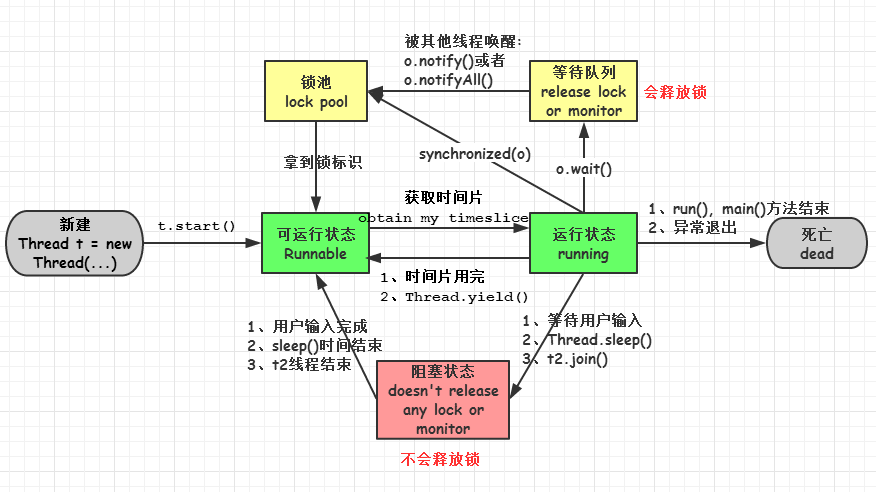

# Java多线程

## Executor框架（线程池、 Callable 、Future）
### 什么是Executor框架
简单的说，就是一个任务的执行和调度框架，涉及的类如下图所示：
其中，最顶层是Executor接口，它的定义很简单，一个用于执行任务的execute方法，如下所示：
```
 public interface Executor {
        void execute(Runnable command);
}
```
另外，我们还可以看到一个Executors类，它是一个工具类（有点类似集合框架的Collections类），用于创建ExecutorService、ScheduledExecutorService、ThreadFactory 和 Callable对象。

### 优点：
任务的提交过程与执行过程解耦，用户只需定义好任务提交，具体如何执行，什么时候执行不需要关心；

### 典型步骤：
定义好任务（如Callable对象），把它提交给ExecutorService（如线程池）去执行，得到Future对象，然后调用Future的get方法等待执行结果即可。

### 什么是任务：
实现Callable接口或Runnable接口的类，其实例就可以成为一个任务提交给ExecutorService去执行；
其中Callable任务可以返回执行结果，Runnable任务无返回结果；

### 什么是线程池
通过Executors工具类可以创建各种类型的线程池，如下为常见的四种：

  - newCachedThreadPool ：大小不受限，当线程释放时，可重用该线程；
  - newFixedThreadPool ：大小固定，无可用线程时，任务需等待，直到有可用线程；
  - newSingleThreadExecutor ：创建一个单线程，任务会按顺序依次执行；
  - newScheduledThreadPool：创建一个定长线程池，支持定时及周期性任务执行
 
### 线程池参数设计
 - 核心线程数：（1+线程IO时间/线程CPU时间）* CPU数
 - 队列长度：queueCapacity = (coreSizePool/taskcost) * rt
 - 最大线程数：最大线程数 = （最大任务数-队列长度）/每个线程每秒处理能力
maxPoolSize = (max(tasks)- queueCapacity)/(1/taskcost)


### 补充：批量任务的执行方式
方式一：首先定义任务集合，然后定义Future集合用于存放执行结果，执行任务，最后遍历Future集合获取结果；
 - 优点：可以依次得到有序的结果；
 - 缺点：不能及时获取已完成任务的执行结果；

方式二：首先定义任务集合，通过CompletionService包装ExecutorService，执行任务，然后调用其take()方法去取Future对象
 - 优点：及时得到已完成任务的执行结果
 - 缺点：不能依次得到结果

这里稍微解释下，在方式一中，从集合中遍历的每个Future对象并不一定处于完成状态，这时调用get()方法就会被阻塞住，所以后面的任务即使已完成也不能得到结果；而方式二中，CompletionService的实现是维护一个保存Future对象的BlockingQueue，只有当这个Future对象状态是结束的时候，才会加入到这个Queue中，所以调用take()能从阻塞队列中拿到最新的已完成任务的结果；

## AbstractQueuedSynchronizer （AQS框架）
### 什么是AQS框架
AQS框架是J.U.C中实现锁及同步机制的基础，其底层是通过调用 LockSupport .unpark()和 LockSupport .park()实现线程的阻塞和唤醒。

AbstractQueuedSynchronizer是一个抽象类，主要是维护了一个int类型的state属性和一个非阻塞、先进先出的线程等待队列；其中state是用volatile修饰的，保证线程之间的可见性，队列的入队和出对操作都是无锁操作，基于自旋锁和CAS实现；另外AQS分为两种模式：独占模式和共享模式，像ReentrantLock是基于独占模式模式实现的，CountDownLatch、CyclicBarrier等是基于共享模式。


### 简单举个例子
非公平锁的lock方法的实现：
```
    final void lock() {
          //CAS操作，如果State为0（表示当前没有其它线程占有该锁），则将它设置为1
          if (compareAndSetState(0, 1))     
              setExclusiveOwnerThread(Thread.currentThread());
          else
              acquire(1);
    }
```
首先是不管先后顺序，直接尝试获取锁（非公平的体现)，成功的话，直接独占访问；
如果获取锁失败，则调用AQS的acquire方法，在该方法内部会调用tryAcquire方法再次尝试获取锁以及是否可重入判断，如果失败，则挂起当前线程并加入到等待队列；
具体可查看ReentrantLock.NonfairSync类和AbstractQueuedSynchronizer类对应的源码。

  
## Locks & Condition（锁和条件变量）
先看一下Lock接口提供的主要方法，如下：

 - lock()  **等待获取锁**
 - lockInterruptibly()  **可中断等待获取锁，synchronized无法实现可中断等待**
 - tryLock() **尝试获取锁，立即返回true或false**
 - tryLock(long time, TimeUnit unit)    **指定时间内等待获取锁**
 - unlock()      **释放锁**
 - newCondition()   **返回一个绑定到此 Lock 实例上的 Condition 实例**

关于Lock接口的实现，我们主要是关注以下两个类：

 - ReentrantLock
 - ReentrantReadWriteLock
 
### ReentrantLock
可重入锁，所谓的可重入锁，也叫递归锁，是指一个线程获取锁后，再次获取该锁时，不需要重新等待获取。ReentrantLock分为公平锁和非公平锁，公平锁指的是严格按照先来先得的顺序排队等待去获取锁，而非公平锁每次获取锁时，是先直接尝试获取锁，获取不到，再按照先来先得的顺序排队等待。

注意：ReentrantLock和synchronized都是可重入锁。

### ReentrantReadWriteLock
可重入读写锁，指的是没有线程进行写操作时，多个线程可同时进行读操作，当有线程进行写操作时，其它读写操作只能等待。即“读-读能共存，读-写不能共存，写-写不能共存”。
在读多于写的情况下，读写锁能够提供比排它锁更好的并发性和吞吐量。

### Condition
Condition对象是由Lock对象创建的，一个Lock对象可以创建多个Condition，其实Lock和Condition都是基于AQS实现的。
Condition对象主要用于线程的等待和唤醒，在JDK 5之前，线程的等待唤醒是用Object对象的wait/notify/notifyAll方法实现的，使用起来不是很方便；
在JDK5之后，J.U.C包提供了Condition，其中：

 - Condition.await对应于Object.wait；
 - Condition.signal 对应于 Object.notify；
 - Condition.signalAll 对应于 Object.notifyAll；

使用Condition对象有一个比较明显的好处是一个锁可以创建多个Condition对象，我们可以给某类线程分配一个Condition，然后就可以唤醒特定类的线程。
 
## Synchronizers（同步器）
 J.U.C中的同步器主要用于协助线程同步，有以下四种：
 
 - 闭锁 CountDownLatch
 - 栅栏 CyclicBarrier
 - 信号量 Semaphore
 - 交换器 Exchanger

### 闭锁 CountDownLatch
闭锁主要用于让一个主线程等待一组事件发生后继续执行，这里的事件其实就是指CountDownLatch对象的countDown方法。注意其它线程调用完countDown方法后，是会继续执行的，具体如下图所示：


在CountDownLatch内部，包含一个计数器，一开始初始化为一个整数（事件个数），发生一个事件后，调用countDown方法，计数器减1，await用于等待计数器为0后继续执行当前线程；
如上图：TA主线程会一直等待，直到计数cnt=0,才继续执行，

### 栅栏 CyclicBarrier
栅栏主要用于等待其它线程，且会阻塞自己当前线程，所有线程必须同时到达栅栏位置后，才能继续执行；且在所有线程到达栅栏处，可以触发执行另外一个预先设置的线程，具体如下图所示：


在上图中，T1、T2、T3每调用一次await，计数减减，且在它们调用await方法的时候，如果计数不为0，会阻塞自己的线程；
另外，TA线程会在所有线程到达栅栏处（计数为0）的时候，才开始执行；

### 信号量Semaphore
信号量主要用于控制访问资源的线程个数，常常用于实现资源池，如数据库连接池，线程池...
在Semaphore中，acquire方法用于获取资源，有的话，继续执行（使用结束后，记得释放资源），没有资源的话将阻塞直到有其它线程调用release方法释放资源；


### 交换器 Exchanger
交换器主要用于线程之间进行数据交换；
当两个线程都到达共同的同步点（都执行到exchanger.exchange的时刻）时，发生数据交换，否则会等待直到其它线程到达；


## Atomic Variables（原子变量）
原子变量主要是方便程序员在多线程环境下，无锁的进行原子操作；

原子类是基于Unsafe实现的包装类，核心操作是CAS原子操作；所谓的CAS操作，即compare and swap，指的是将预期值与当前变量的值比较(compare)，如果相等则使用新值替换(swap)当前变量，否则不作操作；我们可以摘取一段AtomicInteger的源码，如下：

```
    public final boolean compareAndSet(int expect, int update) {
        return unsafe.compareAndSwapInt(this, valueOffset, expect, update);
    }
```
    
在compareAndSwapInt方法中，valueOffset是内存地址，expect是预期值，update是更新值，如果valueOffset地址处的值与预期值相等，则将valueOffset地址处的值更新为update值。PS:现代CPU已广泛支持CAS指令；

在Java中，有四种原子更新方式，如下：

 - 原子方式更新基本类型； AtomicInteger 、 AtomicLong 等
 - 原子方式更新数组； AtomicIntegerArray、 AtomicLongArray等
 - 原子方式更新引用； AtomicReference、 AtomicReferenceFieldUpdater…
 - 原子方式更新字段； AtomicIntegerFieldUpdater、 AtomicStampedReference(解决CAS的ABA问题)

### ABA问题
`AtomicStampedReference`和 `AtomicMarkableReference`是通过版本号（时间戳）来解决ABA问题的，我们也可以使用版本号（verison）来解决ABA。
即乐观锁每次在执行数据的修改操作时，都会带上一个版本号，一旦版本号和数据的版本号一致就可以执行修改操作并对版本号执行+1操作，否则就执行失败。

底层是通过实际的CAS操作比较的是当前的pair对象和新建的pair对象，pair对象封装了引用和时间戳信息。

## BlockingQueue（阻塞队列）
阻塞队列提供了可阻塞的入队和出对操作，如果队列满了，入队操作将阻塞直到有空间可用，如果队列空了，出队操作将阻塞直到有元素可用；


 在Java中，主要有以下类型的阻塞队列：

 - ArrayBlockingQueue ：一个由数组结构组成的有界阻塞队列。
 - LinkedBlockingQueue ：一个由链表结构组成的有界阻塞队列。
 - PriorityBlockingQueue ：一个支持优先级排序的无界阻塞队列。
 - DelayQueue：一个支持延时获取元素的无界阻塞队列。
 - SynchronousQueue：一个不存储元素的阻塞队列。
 - LinkedTransferQueue：一个由链表结构组成的无界阻塞队列。
 - LinkedBlockingDeque：一个由链表结构组成的双向阻塞队列。

阻塞队列有一个比较典型的应用场景是解决生产者-消费者问题

## Concurrent Collections（并发容器）
接下来，我们来看一下工作中比较常见的一块内容，并发容器；
说到并发容器，不得不提同步容器，在JDK5之前，为了线程安全，我们一般都是使用同步容器，同步容器主要有以下缺点：

 - 同步容器对所有容器状态的访问都串行化，严重降低了并发性；
 - 某些复合操作，仍然需要加锁来保护
 - 迭代期间，若其它线程并发修改该容器，会抛出ConcurrentModificationException异常，即快速失败机制

对于复合操作，我们可以举个例子, 因为比较容易被忽视，如下代码：

```
    public static  Integer getLast(Vector<Integer> list){
        int lastIndex = list.size() - 1;
        if(lastIndex < 0) return null;
        return list.get(lastIndex);
    }
```

在以上代码中，虽然list集合是Vector类型，但该方法仍然不是原子操作，因为在list.size()和list.get(lastIndex)之间，可能已经发生了很多事。
那么，在JDK 5之后，有哪些并发容器呢，这里主要说两种，如下：

 - ConcurrentHashMap
 - CopyOnWriteArrayList/Set

### ConcurrentHashMap
ConcurrentHashMap是采用分离锁技术，在同步容器中，是一个容器一个锁，但在ConcurrentHashMap中，会将hash表的数组部分分成若干段，每段维护一个锁；这些段可以并发的进行写操作，以达到高效的并发访问，如下图示例：


### CopyOnWriteArrayList/Set
也叫拷贝容器，指的是写数据的时候，重新拷贝一份进行写操作，完成后，再将原容器的引用指向新的拷贝容器。

***适用情况：当读操作远远大于写操作的时候，考虑用这个并发集合。***

## Fork/Join并行计算框架
这块内容是在JDK7中引入的，个人觉得相当牛逼，可以方便利用多核平台的计算能力，简化并行程序的编写，开发人员仅需关注如何划分任务和组合中间结果。

fork/join框架的核心是ForkJoinPool类，实现了工作窃取算法（对那些处理完自身任务的线程，会从其它线程窃取任务执行）并且能够执行 ForkJoinTask任务。

适用场景：大任务能被递归拆分成多个子任务的应用；
可以参考下图，帮助理解，位于图上部的 Task 依赖于位于其下的 Task 的执行，只有当所有的子任务都完成之后，调用者才能获得 Task 0 的返回结果。其实这是一种分而治之的思想：

其实对于使用fork/join框架的开发人员来说，主要任务还是在于任务划分，可以参考如下伪代码：
```
    if (任务足够小) {
      直接执行该任务;
    } else {
      将任务拆分成多个子任务;
      执行这些子任务并等待结果;
    }
```


### 死锁(deadlock)
两个进程都在等待对方执行完毕才能继续往下执行的时候就发生了死锁。结果就是两个进程都陷入了无限的等待中。
代码描述：
```
    public class DieLockDemo {
        public static void main(String[] args) {
            DieLock dl1 = new DieLock(true);
            DieLock dl2 = new DieLock(false);
            
            dl1.start();
            dl2.start();
        }
    }
    
    public class DieLock extends Thread {
        private boolean flag;
        public DieLock(boolean flag) {
            this.flag = flag;
        }
        @Override
        public void run() {
            if (flag) {
                synchronized (MyLock.objA) {
                    System.out.println("if objA");
                    synchronized (MyLock.objB) {
                        System.out.println("if objB");
                    }
                }
            } else {
                synchronized (MyLock.objB) {
                    System.out.println("else objB");
                    synchronized (MyLock.objA) {
                        System.out.println("else objA");
                    }
                }
            }
        }
    }
```

 - 理想状态下dl1线程为true从if执行先打出"if objA"然后再接着打出"if objB"之后释放A、B的锁对象，之后dl2线程执行else语句打出"else objB"，"else objA"。
 - 非理想状态下dl1先打出"if objA"，之后线程dl2执行打出"else objB"，然后1、2线程的锁对象A和B都处于被锁的状态，两个线程争夺锁对象发生死锁现象。

## 线程同步和通讯
### 线程同步
当使用多个线程来访问同一个数据时，非常容易出现线程安全问题(比如多个线程都在操作同一数据导致数据不一致),所以我们用同步机制来解决这些问题。

实现同步机制有两个方法：

 - 同步代码块：
    synchronized(同一个数据){} 同一个数据：就是N条线程同时访问一个数据。
 - 同步方法：
    public synchronized 数据返回类型 方法名(){}就是使用 synchronized 来修饰某个方法，则该方法称为同步方法。对于同步方法而言，无需显示指定同步监视器，同步方法的同步监视器是 this 也就是该对象的本身（这里指的对象本身有点含糊，其实就是调用该同步方法的对象）通过使用同步方法，可非常方便的将某类变成线程安全的类

### 线程通讯
当使用synchronized 来修饰某个共享资源时(分同步代码块和同步方法两种情况）,当某个线程获得共享资源的锁后就可以执行相应的代码段，直到该线程运行完该代码段后才释放对该 共享资源的锁，让其他线程有机会执行对该共享资源的修改。当某个线程占有某个共享资源的锁时，如果另外一个线程也想获得这把锁运行就需要使用wait() 和notify()/notifyAll()方法来进行线程通讯了。

## interrupt(),interrupted()和isInterrupted()的区别

 - ### interrupt()
 尽管看上去是该方法是用于中断线程的，但是实质上，它的使用效果并不会停止一个正在运行的线程， 
仅仅是在线程中打了一个停止的标记而已，需要加入一个判断才实现停止线程的功能。
```
    /*
 - 测试interrupt()方法
 */
public class Test_interrupt implements Runnable {

    @Override
    public void run() {
        for(int i=0; i<500000; i++){
            System.out.println("i=: "+i);
        }
    }

    public static void main(String[] args) {
        try {
            Test_interrupt r = new Test_interrupt();
            Thread t = new Thread(r,"test");
            t.start();
            Thread.sleep(1000);
            t.interrupt();
        } catch (InterruptedException e) {
            e.printStackTrace();
        }  
    }
}
//结果：线程一直打印，并未终止
```

 - ### interrupted()
 检测当前线程是否中断，如果当前线程处于中断状态，在首次调用该方法时会返回true，标识当前线程已经中断； 
该方法具有在执行后**清除状态标识**的功能，即如果连续两次调用该方法，则第一次会返回true，第二次会返回false。
```
/*
 * 测试interrupted()方法
 */
public class Test_interrupted implements Runnable {

    @Override
    public void run() {
        for(int i=0; i<500000; i++){
            System.out.println("i=: "+i);
        }
    }

    public static void main(String[] args) {

        Test_interrupted r = new Test_interrupted();
        Thread t = new Thread(r,"test");
        t.start();     
        Thread.currentThread().interrupt();    //中断当前main线程, 测试Thread.interrupted()的返回值

        System.out.println("是否停止1?: "+Thread.interrupted());
        System.out.println("是否停止2?: "+Thread.interrupted());        
    }
}

//结果：
> 是否停止1?: true
> 是否停止2?: false
```

 - ### isInterrupted()
 检测该线程是否中断，线程的中断状态不会受到该方法的影响，即连续调用该方法，在执行后**不会清除状态标识**。
```
    /*
 * 测试interrupt()方法
 */
public class Test_interrupted implements Runnable {

    @Override
    public void run() {
        for(int i=0; i<500000; i++){
            System.out.println("i=: "+i);
        }
    }

    public static void main(String[] args) {

        Test_interrupted r = new Test_interrupted();
        Thread t = new Thread(r,"test");
        t.start();
        t.interrupt();    //中断线程t, 测试t.isInterrupted()的返回值

        System.out.println("是否停止1?: "+t.isInterrupted());
        System.out.println("是否停止2?: "+t.isInterrupted());
    }
}
//结果：
> 是否停止1?: true
> 是否停止2?: true
```
## synchronized原理
### 3种使用方法

- 修饰实例方法，作用于当前实例加锁，进入同步代码前要获得当前实例的锁
- 修饰静态方法，作用于当前类对象加锁，进入同步代码前要获得当前类对象的锁
- 修饰代码块，指定加锁对象，对给定对象加锁，进入同步代码库前要获得给定对象的锁

### 对象内存布局


 - 实例变量：存放类的属性数据信息，包括父类的属性信息，如果是数组的实例部分还包括数组的长度，这部分内存按4字节对齐。

 - 填充数据：由于虚拟机要求对象起始地址必须是8字节的整数倍。填充数据不是必须存在的，仅仅是为了字节对齐，这点了解即可。

### 对象头结构
虚拟机位数	 | 头对象结构 | 说明
:-: | :-: | :-:
32/64bit | Mark Word | 存储对象的hashCode、锁信息或分代年龄或GC标志等信息
32/64bit | Class Metadata Address| 类型指针指向对象的类元数据，JVM通过这个指针确定该对象是哪个类的实例
 
 由于对象头的中锁标识指向的就是monitor对象的起始地址，因此每个对象与一个monitor相关联，所以synchronized的实质就是通过线程获取对象的monitor实现的。
 
### synchronized代码块底层原理
 可以从反编译的字节码中可知同步语句块的实现使用的是`monitorenter` 和 `monitorexit` 指令，其中monitorenter指令指向同步代码块的开始位置，monitorexit指令则指明同步代码块的结束位置
 
### synchronized方法底层原理
 方法级的同步是隐式，即无需通过字节码指令来控制的，它实现在方法调用和返回操作之中。JVM可以从方法常量池中的方法表结构(method_info Structure) 中的 `ACC_SYNCHRONIZED` 访问标志区分一个方法是否同步方法。当方法调用时，调用指令将会 检查方法的 ACC_SYNCHRONIZED 访问标志是否被设置，如果设置了，执行线程将先持有monitor（虚拟机规范中用的是管程一词）， 然后再执行方法，最后再方法完成(无论是正常完成还是非正常完成)时释放monitor。
 
### 锁的分类
 
 **偏向锁**
 偏向锁的核心思想是，如果一个线程获得了锁，那么锁就进入偏向模式，此时Mark Word 的结构也变为偏向锁结构，当这个线程再次请求锁时，无需再做任何同步操作，即获取锁的过程，这样就省去了大量有关锁申请的操作，从而也就提高程序的性能。
 
 **轻量锁**
 轻量级锁能够提升程序性能的依据是“对绝大部分的锁，在整个同步周期内都不存在竞争”，注意这是经验数据。需要了解的是，轻量级锁所适应的场景是线程交替执行同步块的场合，如果存在同一时间访问同一锁的场合，就会导致轻量级锁膨胀为重量级锁。
 
 **自旋锁**
 假设在不久将来，当前的线程可以获得锁，因此虚拟机会让当前想要获取锁的线程做几个空循环(这也是称为自旋的原因)，一般不会太久，可能是50个循环或100循环，在经过若干次循环后，如果得到锁，就顺利进入临界区。如果还不能获得锁，那就会将线程在操作系统层面挂起，这就是自旋锁的优化方式

### 等待唤醒机制与synchronized

 - notify/notifyAll和wait方法，在使用这3个方法时，必须处于synchronized代码块或者synchronized方法中，否则就会抛出IllegalMonitorStateException异常，这是因为调用这几个方法前必须拿到当前对象的监视器monitor对象，也就是说notify/notifyAll和wait方法依赖于monitor对象
 - 与sleep方法不同的是wait方法调用完成后，线程将被暂停，但wait方法将会释放当前持有的监视器锁(monitor)，直到有线程调用notify/notifyAll方法后方能继续执行，而sleep方法只让线程休眠并不释放锁。
 - 同时notify/notifyAll方法调用后，并不会马上释放监视器锁，而是在相应的synchronized(){}/synchronized方法执行结束后才自动释放锁。

## Lock的底层实现原理
整体来看Lock主要是通过两个东西来实现的分别是CAS和AQS(AbstractQueuedSynchronizer)。

 1. 读取表示锁状态的变量
 2. 如果表示状态的变量的值为0，那么当前线程尝试将变量值设置为1（通过CAS操作完成），当多个线程同时将表示状态的变量值由0设置成1时，仅一个线程能成功，其它线程都会失败。失败后进入队列自旋转并阻塞当前线程。
 3. 如果表示状态的变量的值为1，那么将当前线程放入等待队列中，然后将自身阻塞

## 进程间的通信方式

 - 管道( pipe )：管道是一种半双工的通信方式，数据只能单向流动，而且只能在具有亲缘关系的进程间使用。进程的亲缘关系通常是指父子进程关系。
 - 有名管道 (namedpipe) ： 有名管道也是半双工的通信方式，但是它允许无亲缘关系进程间的通信。
 - 信号量(semophore ) ：信号量是一个计数器，可以用来控制多个进程对共享资源的访问。它常作为一种锁机制，防止某进程正在访问共享资源时，其他进程也访问该资源。因此，主要作为进程间以及同一进程内不同线程之间的同步手段。
 - 消息队列( messagequeue ) ： 
消息队列是由消息的链表，存放在内核中并由消息队列标识符标识。消息队列克服了信号传递信息少、管道只能承载无格式字节流以及缓冲区大小受限等缺点。
 - 信号 (signal ) ： 信号是一种比较复杂的通信方式，用于通知接收进程某个事件已经发生。
 - 共享内存(shared memory )：共享内存就是映射一段能被其他进程所访问的内存，这段共享内存由一个进程创建，但多个进程都可以访问。共享内存是最快的 IPC方式，它是针对其他进程间通信方式运行效率低而专门设计的。它往往与其他通信机制，如信号量，配合使用，来实现进程间的同步和通信。
 - 套接字(socket ) ： 套解口也是一种进程间通信机制，与其他通信机制不同的是，它可用于不同及其间的进程通信。

## 线程间的通信方式（同步）

 - 锁机制：包括互斥锁、条件变量、读写锁

  - 互斥锁提供了以排他方式防止数据结构被并发修改的方法。
  - 读写锁允许多个线程同时读共享数据，而对写操作是互斥的。
  - 条件变量可以以原子的方式阻塞进程，直到某个特定条件为真为止。对条件的测试是在互斥锁的保护下进行的。条件变量始终与互斥锁一起使用。while+if+volatile变量
 - 信号量机制(Semaphore)：包括无名线程信号量和命名线程信号量
 - 信号机制(Signal)：类似进程间的信号处理
  
## 线程的状态



## Q&A
 ### sleep() 和 wait() 有什么区别?
sleep是线程类（Thread）的方法，导致此线程暂停执行指定时间，给执行机会给其他线程，但是监控状态依然保持，到时后会自动恢复。调用sleep不会释放对象锁。
wait是Object类的方法，对此对象调用wait方法导致本线程放弃对象锁，进入等待此对象的等待锁定池，只有针对此对象发出notify方法（或notifyAll）后本线程才进入对象锁定池准备获得对象锁进入运行状态。
 ### 实现单例模式的几种方法
```
//双重检查锁
public class Singleton() {
        private Singleton(){};
        private volatile static Singleton instance;
        public static Singleton getInstance() {
          if (instance == null)
          {
            synchronized(Singleton.class) {  //1
              if (instance == null)          //2
                instance = new Singleton();  //3
            }
          }
          return instance;
        }
    }
    
//静态内部类
public class Singleton {

    private Singleton() {}

    private static class SingletonInstance {
        private static final Singleton INSTANCE = new Singleton();
    }

    public static Singleton getInstance() {
        return SingletonInstance.INSTANCE;
    }
}

//枚举
 public enum Singleton {
        INSTANCE;
        public void whateverMethod() {
    
        }
}
```

### 线程start()和run()方法的区别
```
    //start()方法
    public static void main(String args[]) {
        Thread t = new Thread() {
            public void run() {
                pong();
            }
        };
        t.start();
        System.out.print("ping");
    }
 
    static void pong() {
        System.out.print("pong");
    }
    //输出:pingpong
```

```
    //run()方法
    public static void main(String args[]) {
        Thread t = new Thread() {
            public void run() {
                pong();
            }
        };
        t.run();
        System.out.print("ping");
    }
 
    static void pong() {
        System.out.print("pong");
    }
    //输出:pongping
```

### 如何避免死锁

 - 确保加锁顺序
 - 设置加锁超时
 - 死锁检测：每当一个线程获得了锁，会在线程和锁相关的数据结构中（map、graph等等）将其记下。除此之外，每当有线程请求锁，也需要记录在这个数据结构中。当一个线程请求锁失败时，这个线程可以遍历锁的关系图看看是否有死锁发生。
