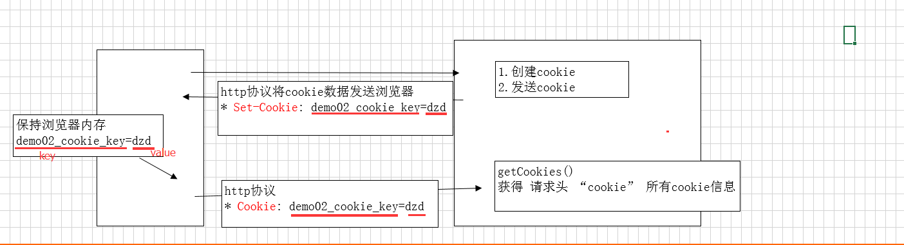
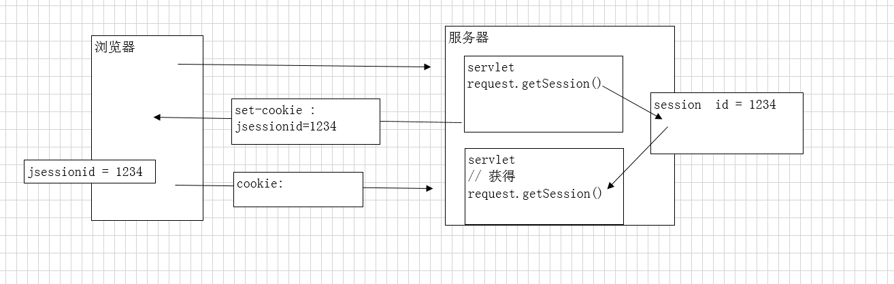
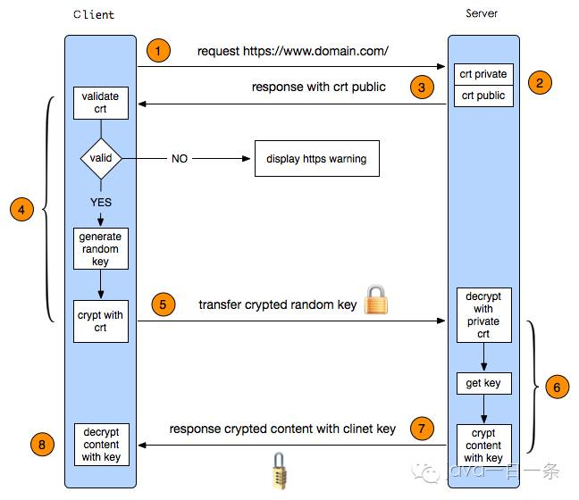
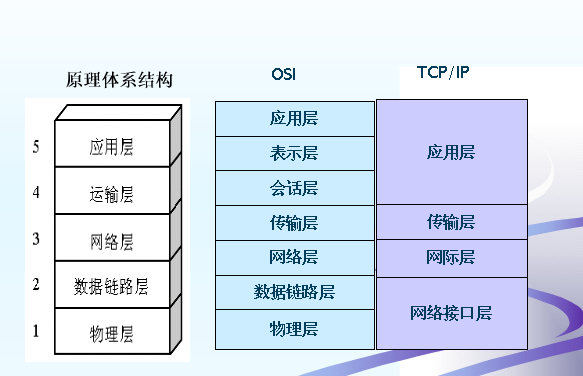

# 计算机网络

### DDoS（Distributed Denial of Service，分布式拒绝服务）
主要通过大量合法的请求占用大量网络资源，从而使合法用户无法得到服务的响应，是目前最强大、最难防御的攻击之一。
防御措施：
1. 分布式集群部署
2. CDN
3. 静态页面
4. 限制IP
5. 扩展带宽

### CSRF（Cross Site Request Forgery），中文是跨站点请求伪造
CSRF攻击者在用户已经登录目标网站之后，诱使用户访问一个攻击页面，利用目标网站对用户的信任，以用户身份在攻击页面对目标网站发起伪造用户操作的请求，达到攻击目的。
防御措施：
1. 尽量使用POST，限制GET
2. 浏览器Cookie策略
3. 加验证码
4. Referer Check
5. Anti CSRF Token

### XSS, 即为（Cross Site Scripting）, 中文名为跨站脚本
是发生在目标用户的浏览器层面上的，当渲染DOM树的过程成发生了不在预期内执行的JS代码时，就发生了XSS攻击。
防御措施：
1. 入参字符过滤
2. 出参进行编码
3. 入参长度限制
4. 设置cookie httponly为true

### Cookie, Session区别
**Cookie工作原理**

1. 服务端创建cookie，保存少量数据，发送浏览器。
2. 浏览器获得服务器发送的cookie数据，将自动的保存到浏览器端。
3. 下次访问时，浏览器将自动携带cookie数据发送给服务器。

**Session工作原理**

分析：
1. 客户端发送请求
2. 服务端检查客户端请求是否包含SESSIONID
3. 如果有说明之前已经创建过session，检索出来使用；
4. 如果不包含SESSIONID，创建新的session并在响应中返回此id
5. 客户端接收响应将SESSIONID存储到cookie中，以便下次访问的时候带上。

**注意：**恰恰是由于关闭浏览器不会导致session被删除，迫使服务器为seesion设置了一个**失效时间**，一般是**30分钟**，当距离客户端上一次使用session的时间超过这个失效时间时，服务器就可以认为客户端已经停止了活动，才会把session删除以节省存储空间。

### HTTPS原理

 1. 客户端发起一个https的请求
 2. 服务端，接收到客户端请求，以证书的形式返回给客户端。证书中还包含了公钥、颁证机构、网址、失效日期等等
 3. 客户端收到服务端响应后，验证证书的合法性
 4. 如果证书验证通过，此时浏览器会生成一串随机数也就是对称的密钥，然后用证书中的公钥加密发送给服务端
 5. 服务端拿到客户端传来的密文，用自己的私钥来解密随机数密码，拿到对称密钥，将要发送的内容用此密钥加密发送给服务端
 6. 客户端用密钥解密密文，获取里面的内容

### TCP 三次握手和四次挥手
**三次握手**

三次握手的目的是建立可靠的通信信道，说到通讯，简单来说就是数据的发送与接收，而三次握手最主要的目的就是**双方确认自己与对方的发送与接收是正常**的。

**四次挥手**

任何一方都可以在数据传送结束后发出连接释放的通知，待对方确认后进入半关闭状态。当另一方也没有数据再发送的时候，则发出连接释放通知，对方确认后就完全关闭了TCP连接。
**举个例子：**A 和 B 打电话，通话即将结束后，A 说“我没啥要说的了”，B回答“我知道了”，但是 B 可能还会有要说的话，A 不能要求 B 跟着自己的节奏结束通话，于是 B 可能又巴拉巴拉说了一通，最后 B 说“我说完了”，A 回答“知道了”，这样通话才算结束。
 
### TCP和UDP

### OSI网络体系结构

