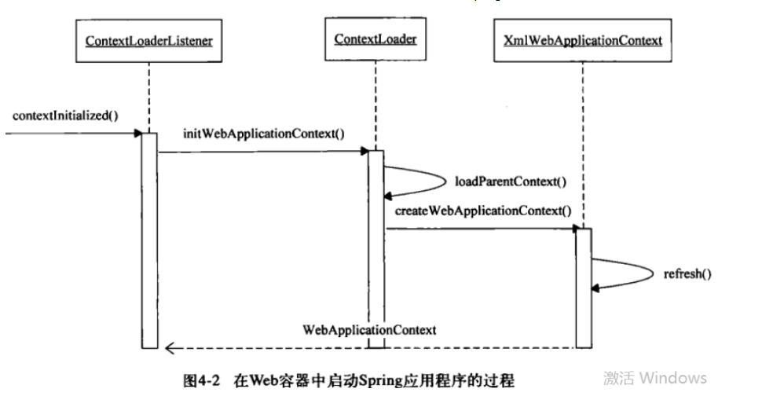
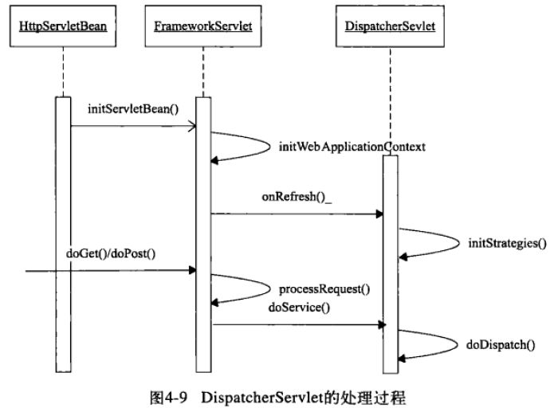
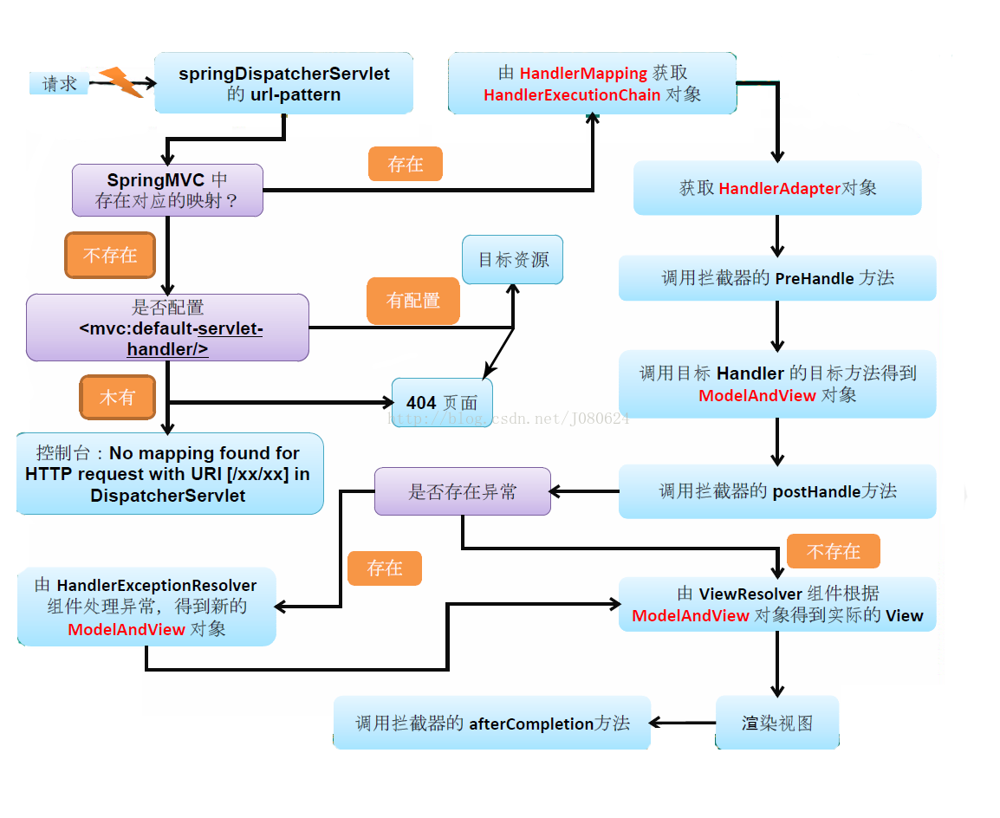
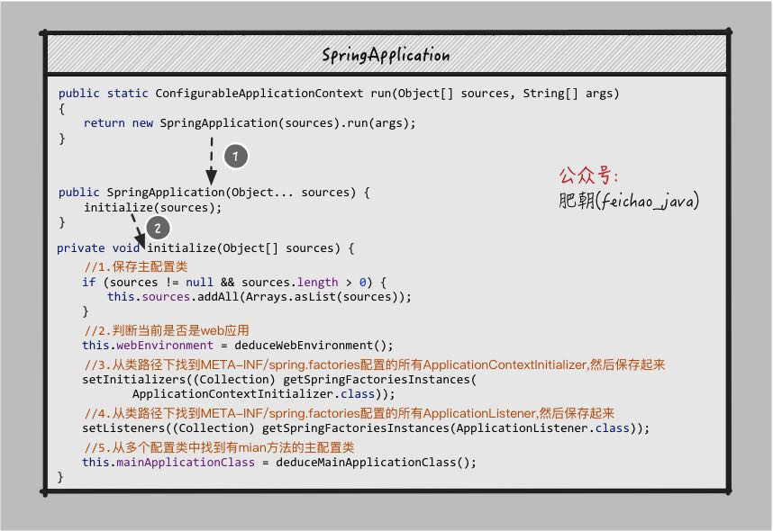
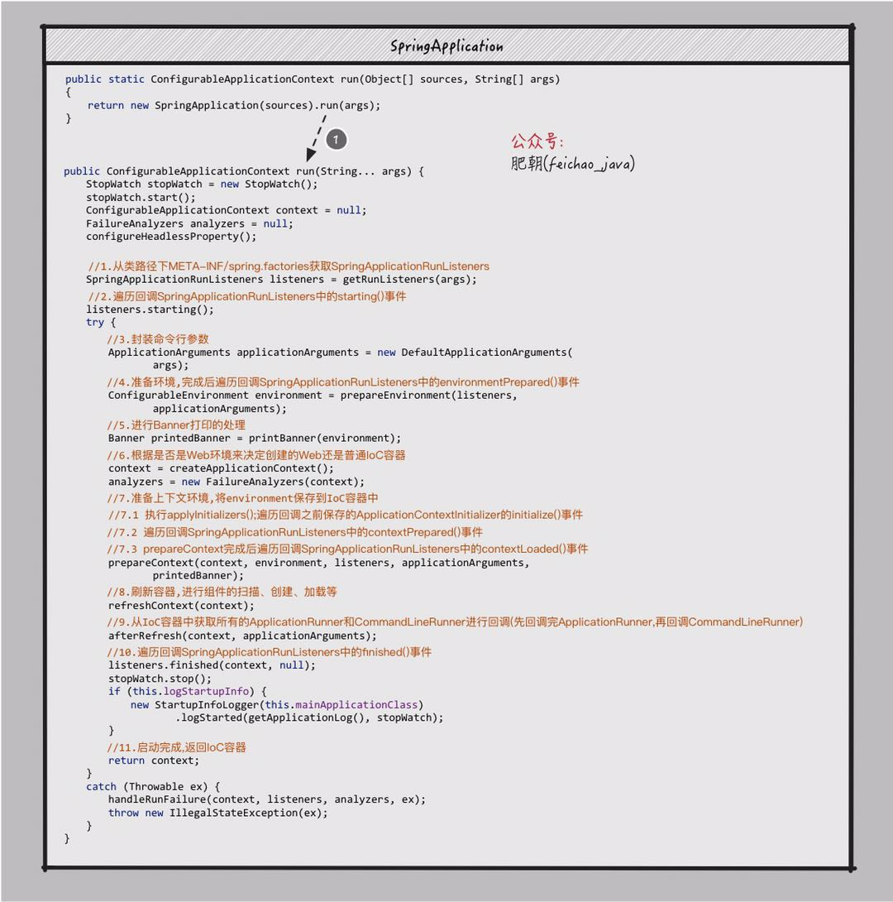
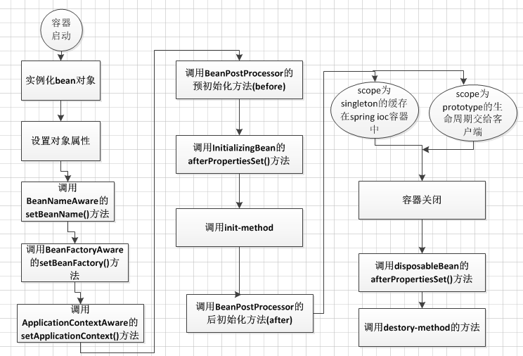
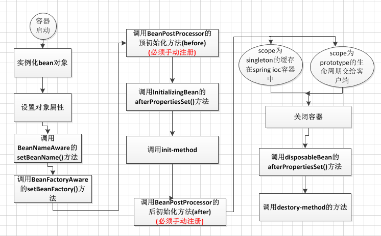

# Spring
## Spring MVC
### 启动流程
Spring MVC启动过程依据这两个配置大致分为两个过程：
1. `ContextLoaderListener`初始化，实例化IoC容器，并将此容器实例注册到`ServletContext`中。
2. `DispatcherServlet`初始化，建立自己的上下文，也注册到`ServletContext`中。

web容器正是通过这两个配置才和Spring关联起来。这两个配置与web容器的`ServletContext`关联，为Spring的Ioc容器提供了一个宿主，在建立起Ioc容器体系之后，把`DispatcherServlet`作为Spring MVC处理web请求的转发器建立起来，从而完成响应Http请求的准备。

**Spring IOC容器的启动**

`ContextLoaderListener`实现`ServletContextListener`，这个接口里面的函数会结合web容器的生命周期被调用。因为`ServletContextListener`是`ServletContext`的监听者，在服务器启动，`ServletContext`被创建的时候，`ServletContextListener`的`contextInitialized()`方法被调用，从而开始初始化Spring IOC容器。

首先从Servlet的启动事件中得到`ServletContext`，然后读取`web.xml`中的各个相关的属性值，接着`ContextLoader`会实例化`WebApplicationContext`，并完成载入和初始化的过程，这个被初始化的第一个上下文作为**根上下文**而存在，这个根上下文载入后，被绑定到web应用程序的`ServletContext`上，这样，IOC容器中的类就可以在任何地方访问到了。

**DispatchServlet的启动**

`DispatchServlet`本质上是一个Servlet，web容器启动的时候，servlet也会初始化，其init方法被调用，开启初始化之旅。
`DispatchServlet`会建立自己的上下文来持有Spring MVC特殊的bean对象，在建立这个自己持有的Ioc容器的时候，会从`ServletContext`中得到根上下文作为`DispatchServlet`上下文的parent上下文。有了这个根上下文，再对自己持有的上下文进行初始化，最后把自己持有的这个上下文保存到`ServletContext`中，供以后检索和使用。



在`initWebApplicationContext`中完成了对自己上下文的初始化，这里面也有一个`refresh`的过程，和普通的Ioc容器初始化大同小异。

另外一些MVC的特性初始化时在`initStrategies()`中实现的，包括支持国际化的`LocalResolver`、**支持Request映射的`HandlerMappings`**，以及视图生成的`ViewResolver`等等。


### 执行流程




## SpringBoot
### 启动流程
1. 进行`SpringApplication`的初始化模块，配置一些基本的环境变量、资源、构造器、监听器
2. 实现了应用具体的启动方案，包括启动流程的监听模块、加载配置环境模块、及核心的创建上下文环境模块
3. 是自动化配置模块，该模块作为springboot自动配置核心

### SpringApplication.run()做了哪些事？
- 创建`SpringApplication`对象，在该对象初始化时，找到配置的事件监听器并保存起来
- 利用创建好的`SpringApplication`对象调用`run()方法`，此时会将刚才保存的事件监听器根据当前时机触发不同的事件，比如容器初始化，容器创建完成等，同时也会刷新IoC容器，进行组件的扫描、创建、加载等工作。




### 启动源码
```
    /**
 * 运行应用程序，创建并刷新一个新的应用程序上下文
 *
 * @param args
 * @return
 */
public ConfigurableApplicationContext run(String... args) {
	/**
	 *  StopWatch: 简单的秒表，允许定时的一些任务，公开每个指定任务的总运行时间和运行时间。
	 *  这个对象的设计不是线程安全的，没有使用同步。SpringApplication是在单线程环境下，使用安全。
	 */
	StopWatch stopWatch = new StopWatch();
	// 设置当前启动的时间为系统时间startTimeMillis = System.currentTimeMillis();
	stopWatch.start();
	// 创建一个应用上下文引用
	ConfigurableApplicationContext context = null;
	// 异常收集，报告启动异常
	Collection<SpringBootExceptionReporter> exceptionReporters = new ArrayList<>();
	/**
	 * 系统设置headless模式（一种缺乏显示设备、键盘或鼠标的环境下，比如服务器），
	 * 通过属性：java.awt.headless=true控制
	 */
	configureHeadlessProperty();
	/*
	 * 获取事件推送监器，负责产生事件，并调用支某类持事件的监听器
	 * 事件推送原理看上面的事件推送原理图
	 */
	SpringApplicationRunListeners listeners = getRunListeners(args);
	/**
	 * 发布一个启动事件(ApplicationStartingEvent)，通过上述方法调用支持此事件的监听器
	 */
	listeners.starting();
	try {
		// 提供对用于运行SpringApplication的参数的访问。取默认实现
		ApplicationArguments applicationArguments = new DefaultApplicationArguments(args);
		/**
		 * 构建容器环境，这里加载配置文件
		 */
		ConfigurableEnvironment environment = prepareEnvironment(listeners, applicationArguments);
		// 对环境中一些bean忽略配置
		configureIgnoreBeanInfo(environment);
		// 日志控制台打印设置
		Banner printedBanner = printBanner(environment);
		// 创建容器
		context = createApplicationContext();
		exceptionReporters = getSpringFactoriesInstances(SpringBootExceptionReporter.class, new Class[] { ConfigurableApplicationContext.class }, context);
		/**
		 * 准备应用程序上下文
		 * 追踪源码prepareContext（）进去我们可以发现容器准备阶段做了下面的事情：
		 * 容器设置配置环境，并且监听容器，初始化容器，记录启动日志，
		 * 将给定的singleton对象添加到此工厂的singleton缓存中。
		 * 将bean加载到应用程序上下文中。
		 */
		prepareContext(context, environment, listeners, applicationArguments, printedBanner);
		/**
		 * 刷新上下文
		 * 1、同步刷新，对上下文的bean工厂包括子类的刷新准备使用，初始化此上下文的消息源，注册拦截bean的处理器，检查侦听器bean并注册它们，实例化所有剩余的(非延迟-init)单例。
		 * 2、异步开启一个同步线程去时时监控容器是否被关闭，当关闭此应用程序上下文，销毁其bean工厂中的所有bean。
		 * 。。。底层调refresh方法代码量较多
		 */
		refreshContext(context);
		afterRefresh(context, applicationArguments);
		// stopwatch 的作用就是记录启动消耗的时间，和开始启动的时间等信息记录下来
		stopWatch.stop();
		if (this.logStartupInfo) {
			new StartupInfoLogger(this.mainApplicationClass).logStarted(getApplicationLog(), stopWatch);
		}
		// 发布一个已启动的事件
		listeners.started(context);
		callRunners(context, applicationArguments);
	}
	catch (Throwable ex) {
		handleRunFailure(context, ex, exceptionReporters, listeners);
		throw new IllegalStateException(ex);
	}
	try {
		// 发布一个运行中的事件
		listeners.running(context);
	}
	catch (Throwable ex) {
		// 启动异常，里面会发布一个失败的事件
		handleRunFailure(context, ex, exceptionReporters, null);
		throw new IllegalStateException(ex);
	}
	return context;
}
```

### 自动配置原理
[自动配置原理](https://www.cnblogs.com/jiadp/p/9276826.html)

## Spring IoC
### BeanFactory和ApplicationContext的区别
1. 利用`MessageSource`进行国际化
2. 强大的事件机制(Event)：
    `ApplicationContext`的事件机制主要通过`ApplicationEvent`和`ApplicationListener`这两个接口来提供的，和java swing中的事件机制一样。即当`ApplicationContext`中发布一个事件的时，所有扩展了`ApplicationListener`的Bean都将会接受到这个事件，并进行相应的处理。  
3. 底层资源的访问  
    `ApplicationContext`扩展了`ResourceLoader`(资源加载器)接口，从而可以用来加载多个Resource，而`BeanFactory`是没有扩展`ResourceLoader ` 
4. 对Web应用的支持  
   与`BeanFactory`通常以编程的方式被创建不同的是，`ApplicationContext`能以声明的方式创建，如使用`ContextLoader`。当然你也可以使用`ApplicationContext`的实现之一来以编程的方式创建`ApplicationContext`实例 。
5. 加载形式
    `BeanFactroy`采用的是延迟加载形式来注入Bean的。而`ApplicationContext`则相反，它是在容器启动时，一次性创建了所有的Bean。
6. `PostProcesor`的使用
    `BeanFactory`和`ApplicationContext`都支持`BeanPostProcessor`、`BeanFactoryPostProcessor`的使用，但两者之间的区别是：`BeanFactory`需要手动注册，而`ApplicationContext`则是自动注册

### Spring Bean生命周期
**ApplicationContext Bean生命周期**



**BeanFactory Bean生命周期**



**两者区别：**
1. `BeanFactory`容器中，不会调用`ApplicationContextAware`接口的`setApplicationContext()`方法
2. `BeanPostProcessor`接口的`postProcessBeforeInitialzation()`方法和`postProcessAfterInitialization()`方法不会自动调用，必须自己通过代码手动注册
3. `BeanFactory`容器启动的时候，不会去实例化所有Bean,包括所有scope为singleton且非懒加载的Bean也是一样，而是在调用的时候去实例化。

### 依赖注入
- 构造函数注入

```
    <bean id="userDao4Oracle" class="com.tgb.spring.dao.UserDao4OracleImpl"/>    
    <bean id="userManager" class="com.tgb.spring.manager.UserManagerImpl"> 
        <constructor-arg ref="userDao4Oracle"/>    
    </bean>    
```
    
```
    public class UserManagerImpl implements UserManager{    
        
        private UserDao userDao;    
        
        //使用构造方式赋值    
        public UserManagerImpl(UserDao userDao) {    
            this.userDao = userDao;    
        }    
        
        @Override    
        public void addUser(String userName, String password) {    
        
            userDao.addUser(userName, password);    
        }    
```

- setter注入
```
    <bean id="userDao4Oracle" class="com.tgb.spring.dao.UserDao4OracleImpl"/> 
    <bean id="userManager" class="com.tgb.spring.manager.UserManagerImpl">
        <property name="userDao" ref="userDao4Oracle"></property>    
    </bean>    
```

```
    public class UserManagerImpl implements UserManager{    
    
    private UserDao userDao;    
    
    //使用设值方式赋值    
    public void setUserDao(UserDao userDao) {    
        this.userDao = userDao;    
    }    
        
    @Override    
    public void addUser(String userName, String password) {    
    
        userDao.addUser(userName, password);    
    }    
} 
```

- 静态工厂注入
```
    public class DaoFactory { 
        //静态工厂 
        public static final FactoryDao getStaticFactoryDaoImpl(){ 
            return new StaticFacotryDaoImpl(); 
        } 
    }
    
    
    public class SpringAction { 
        //注入对象 
        private FactoryDao staticFactoryDao; 
        
        public void staticFactoryOk(){ 
            staticFactoryDao.saveFactory(); 
        } 
        //注入对象的set方法 
        public void setStaticFactoryDao(FactoryDao staticFactoryDao) { 
            this.staticFactoryDao = staticFactoryDao; 
        } 
    } 
    
    
    <!--配置bean,配置后该类由spring管理--> 
    <bean name="springAction" class="com.bless.springdemo.action.SpringAction" > 
    <!--(3)使用静态工厂的方法注入对象,对应下面的配置文件(3)--> 
    <property name="staticFactoryDao" ref="staticFactoryDao"></property> 
    </property> 
    </bean> 
    <!--(3)此处获取对象的方式是从工厂类中获取静态方法--> 
    <bean name="staticFactoryDao" class="com.bless.springdemo.factory.DaoFactory" factory-method="getStaticFactoryDaoImpl"></bean> 
```

- 实例工厂注入
```
    public class DaoFactory { 
        //实例工厂 
        public FactoryDao getFactoryDaoImpl(){ 
        return new FactoryDaoImpl(); 
        } 
    }
    
    public class SpringAction { 
        //注入对象 
        private FactoryDao factoryDao; 
        
        public void factoryOk(){ 
            factoryDao.saveFactory(); 
        } 
        
        public void setFactoryDao(FactoryDao factoryDao) { 
            this.factoryDao = factoryDao; 
        } 
    } 
    
    <!--配置bean,配置后该类由spring管理--> 
    <bean name="springAction" class="com.bless.springdemo.action.SpringAction"> 
    <!--(4)使用实例工厂的方法注入对象,对应下面的配置文件(4)--> 
    <property name="factoryDao" ref="factoryDao"></property> 
    </bean> 
    
    <!--(4)此处获取对象的方式是从工厂类中获取实例方法--> 
    <bean name="daoFactory" class="com.bless.springdemo.factory.DaoFactory"></bean> 
    <bean name="factoryDao" factory-bean="daoFactory" factory-method="getFactoryDaoImpl"></bean> 
```


**四种注入方法比较**

构造方法注入：
1. 构造函数可以保证一些重要的属性在bean实例化的时候就设置好，避免因为一些重要的属性没有提供而导致一个无用的Bean 实例情况
2. 如果一个类属性太多，那么构造函数的参数将变成一个庞然大物，可读性较差
3. 构造函数不利于类的继承和拓展，因为子类需要引用父类复杂的构造函数
4. 构造函数注入有时会造成**循环依赖**的问题

setter方法注入：
具有可选择性和高灵活性的特点

### IOC容器的初始化
初始化的入口在容器实现中的`refresh()`调用来完成

 - `ResourceLoader`：来完成资源文件位置的定位
 - `BeanDefinitionReader`：来完成定义信息的解析和Bean信息的注册

注册过程就是在 IOC 容器内部维护的一个`ConcurrentHashMap`来保存得到的`BeanDefinition`的过程。这个`ConcurrentHashMap`是 IoC 容器持有 bean 信息的场所，以后对 bean 的操作都是围绕这个`ConcurrentHashMap`来实现的.

### IOC容器的依赖注入
1. 单例模式并且是非延迟加载的对象，会在**IOC容器初始化**的时候被创建且初始化。
2. 非单例模式或者是延迟加载的对象，是应用**第一次向容器索要该Bean对象**的时候被创建且初始化。

虽然入口场景不同，但是Bean对象创建过程是一样的，都是调用`AbstractBeanFactory`中`getBean`方法。

### autowiring自动装配实现原理
1. 对Bean的属性迭代调用`getBean`方法，完成依赖Bean的初始化和依赖注入。
2. 将依赖Bean的属性引用设置到被依赖的Bean属性上。
3. 将依赖Bean的名称和被依赖Bean的名称存储在IoC容器的集合中。

### Spring循环依赖
定义： 循环依赖就是循环引用，就是两个或多个Bean相互之间的持有对方，比方A引用B，B引用C，C引用A，形成一个环状引用关系。

首先，需要明确的是spring对循环依赖的处理有三种情况：
1. **构造器的循环依赖**：无法处理。创建A类是，构造器需要B类，那将去创建B，在创建B时又发现需要C类，则又去创建C类，最终在创建C时发现又需要A，从而形成一个环，没办法创建。直接抛出`BeanCurrentlylnCreationException`异常。
2. **单例模式下的setter循环依赖**：通过“三级缓存”处理循环依赖。通过Spring容器提前暴露刚完成构造器注入但未完成其他步骤（比如setter注入）的bean来完成的，而且只能解决单例作用域的bean循环依赖。
3. **非单例循环依赖**：无法处理。因为Spring容器不进行缓存`prototype`作用域的bean，因此无法提前暴露一个创建中的bean，所以检测到循环依赖会直接抛出`BeanCurrentlyInCreationException`异常

- 构造器循环依赖(构造器依赖 A -> B -> C -> A)
    - Spring容器创建A bean，首先去 “当前创建bean池”中查找是否当前bean正在创建（通过beanName），如果发现没有，则继续准备其需要的构造器参数B，并将A标识符放到“当前创建bean池”
    - Spring容器创建B bean，Spring容器创建B bean，首先去 “当前创建bean池”中查找是否当前bean正在创建（通过beanName），如果发现没有，则继续准备其需要的构造器参数C，并将B标识符放到“当前创建bean池”
    - Spring容器创建C bean，Spring容器创建C bean，首先去 “当前创建bean池”中查找是否当前bean正在创建（通过beanName），如果发现没有，则继续准备其需要的构造器参数A，并将C标识符放到“当前创建bean池”
    - C的创建需要先创建A bean，此时发现A已经在“当前创建bean池”中，检测到了循环依赖，直接抛出`BeanCurrentlyInCreationException`异常
    
- setter循环依赖(setter依赖关系 A -> B -> C -> A)
    - （三级）singletonFactories ： 单例对象工厂的cache
    - （二级）earlySingletonObjects ：提前曝光的单例对象的Cache
    - （一级）singletonObjects：单例对象的cache
    
    - Spring容器创建单例A的bean，首先根据无参构造器创建bean，并暴露一个`ObjectFactory`用于返回一个提前暴露一个创建中的bean，并将A标识符放到“当前创建bean池”，然后进行setter注入 B bean
    - Spring容器创建单例B bean，首先根据无参构造器创建bean，并暴露一个`ObjectFactory`用于返回一个提前暴露一个创建中的bean，并将B标识符放到“当前创建bean池”，然后进行setter注入 C bean
    - Spring容器创建单例C bean，首先根据无参构造器创建bean，并暴露一个`ObjectFactory`用于返回一个提前暴露一个创建中的bean，并将C标识符放到“当前创建bean池”，然后进行setter注入 A bean，在进行注入A bean 时由于提前暴露了`ObjectFactory`”工厂，从而使用它返回提前暴露一个创建中的bean
    - 最后从3中循环结束，依次返回完成对 B bean、A bean的setter注入
    

解释：

A首先完成了初始化的第一步，并且将自己提前曝光到`singletonFactories`中，此时进行初始化的第二步，发现自己依赖对象B，此时就尝试去get(B)，发现B还没有被create，所以走create流程，B在初始化第一步的时候发现自己依赖了对象A，于是尝试get(A)，尝试一级缓存`singletonObjects`(肯定没有，因为A还没初始化完全)，尝试二级缓存`earlySingletonObjects`（也没有），尝试三级缓存`singletonFactories`，由于A通过`ObjectFactory`将自己提前曝光了，所以B能够通过`ObjectFactory.getObject`拿到A对象(虽然A还没有初始化完全，但是总比没有好呀)，B拿到A对象后顺利完成了初始化阶段1、2、3，完全初始化之后将自己放入到一级缓存`singletonObjects中`。此时返回A中，A此时能拿到B的对象顺利完成自己的初始化阶段2、3，最终A也完成了初始化，进去了一级缓存`singletonObjects中`，而且更加幸运的是，由于B拿到了A的对象引用，所以B现在hold住的A对象完成了初始化。


## Spring AOP
### 静态代理
缺点是需要为每个目标对象生成不同的代理对象，而且在运行前就需要编写好代理类。

### 动态代理
Bean生成代理的时机：在每个Bean初始化之后，如果需要，调用`AspectJAwareAdvisorAutoProxyCreator`中的`postProcessAfterInitialization`为Bean生成代理

JDK：主要通过`Proxy.newProxyInstance`生成代理对象，调用`InvocationHandler`的`invoke`方法实现拦截
```
    publicObject invoke(Object proxy, Method method, Object[] args) throwsThrowable {
       MethodInvocation invocation = null;
       Object oldProxy = null;
       boolean setProxyContext = false;
 
       TargetSource targetSource = this.advised.targetSource;
       Class targetClass = null;
       Object target = null;
 
       try {
           //eqauls()方法，具目标对象未实现此方法
           if (!this.equalsDefined && AopUtils.isEqualsMethod(method)){
                return (equals(args[0])? Boolean.TRUE : Boolean.FALSE);
           }
 
           //hashCode()方法，具目标对象未实现此方法
           if (!this.hashCodeDefined && AopUtils.isHashCodeMethod(method)){
                return newInteger(hashCode());
           }
 
           //Advised接口或者其父接口中定义的方法,直接反射调用,不应用通知
           if (!this.advised.opaque &&method.getDeclaringClass().isInterface()
                    &&method.getDeclaringClass().isAssignableFrom(Advised.class)) {
                // Service invocations onProxyConfig with the proxy config...
                return AopUtils.invokeJoinpointUsingReflection(this.advised,method, args);
           }
 
           Object retVal = null;
 
           if (this.advised.exposeProxy) {
                // Make invocation available ifnecessary.
                oldProxy = AopContext.setCurrentProxy(proxy);
                setProxyContext = true;
           }
 
           //获得目标对象的类
           target = targetSource.getTarget();
           if (target != null) {
                targetClass = target.getClass();
           }
 
           //获取可以应用到此方法上的Interceptor列表
           List chain = this.advised.getInterceptorsAndDynamicInterceptionAdvice(method,targetClass);
 
           //如果没有可以应用到此方法的通知(Interceptor)，此直接反射调用 method.invoke(target, args)
           if (chain.isEmpty()) {
                retVal = AopUtils.invokeJoinpointUsingReflection(target,method, args);
           } else {
                //创建MethodInvocation
                invocation = newReflectiveMethodInvocation(proxy, target, method, args, targetClass, chain);
                retVal = invocation.proceed();
           }
 
           // Massage return value if necessary.
           if (retVal != null && retVal == target &&method.getReturnType().isInstance(proxy)
                    &&!RawTargetAccess.class.isAssignableFrom(method.getDeclaringClass())) {
                // Special case: it returned"this" and the return type of the method
                // is type-compatible. Notethat we can't help if the target sets
                // a reference to itself inanother returned object.
                retVal = proxy;
           }
           return retVal;
       } finally {
           if (target != null && !targetSource.isStatic()) {
                // Must have come fromTargetSource.
               targetSource.releaseTarget(target);
           }
           if (setProxyContext) {
                // Restore old proxy.
                AopContext.setCurrentProxy(oldProxy);
           }
       }
    }
```

CGLIB:通过`enhander`生成代理对象，再通过`MethodInterceptor`的`intercept`方法实现拦截调用

```
    //CGLIB回调AOP拦截器链  
public Object intercept(Object proxy, Method method, Object[] args, MethodProxy methodProxy) throws Throwable {  
            Object oldProxy = null;  
            boolean setProxyContext = false;  
            Class targetClass = null;  
            Object target = null;  
            try {  
                //如果通知器暴露了代理  
                if (this.advised.exposeProxy) {  
                    //设置给定的代理对象为要被拦截的代理                                          oldProxy = AopContext.setCurrentProxy(proxy);  
                    setProxyContext = true;  
                }  
                //获取目标对象  
                target = getTarget();  
                if (target != null) {  
                    targetClass = target.getClass();  
                }  
                //获取AOP配置的通知  
                List<Object> chain = this.advised.getInterceptorsAndDynamicInterceptionAdvice(method, targetClass);  
                Object retVal;  
                //如果没有配置通知  
                if (chain.isEmpty() && Modifier.isPublic(method.getModifiers())) {  
                    //直接调用目标对象的方法  
                    retVal = methodProxy.invoke(target, args);  
                }  
                //如果配置了通知  
                else {  
                    //通过CglibMethodInvocation来启动配置的通知  
                    retVal = new CglibMethodInvocation(proxy, target, method, args, targetClass, chain, methodProxy).proceed();  
                }  
                //获取目标对象对象方法的回调结果，如果有必要则封装为代理  
                retVal = massageReturnTypeIfNecessary(proxy, target, method, retVal);  
                return retVal;  
            }  
            finally {  
                if (target != null) {  
                    releaseTarget(target);  
                }  
                if (setProxyContext) {  
                    //存储被回调的代理  
                    AopContext.setCurrentProxy(oldProxy);  
                }  
            }  
        }  
```

## Spring事务
### 事务的实现方式：
 - 编程式事务（手动commit/rollback）
 - 声明式事务（XML配置和注解形式）

### 事务的执行流程
核心：**TransactionInterceptor**

1. 调用被事务增强的方法，进入事务切面。
2. 解析事务属性，调用具体的`TxMgr`负责生成`TxStatus`。
3. 如果当前已经有事务，进入step 5。
4. 根据事务传播行为，校验是否需要抛出异常(`如MANDATORY`)，或者挂起事务信息(由于没有真正的物理事务，所以没有需要挂起的事务资源)并创建事务(`REQUIRED`, `REQUIREDS_NEW`, `NESTED`等)，又或者创建一个空事务(`SUPPORTS`, `NOT_SUPPORTED`, `NEVER`等)。进入step 6。
5. 根据事务传播行为，抛出异常(`NEVER`)，或者挂起事务资源与信息并根据情况决定是否创建事务(`NOT_SUPPORTED`, `REQUIRES_NEW`等)，或者根据情况处理嵌套事务(NESTED)或者加入已有事务(SUPPORTS, REQUIRED, MANDATORY等)。
6. 生成`TxInfo`并绑定到线程。
7. 回调`MethodInterceptor`，事务切面前置工作至此完成。
8. 如果发生异常进入step 10。
9. 根据`TxStatus`是否被标记回滚，事务本身是否被标记回滚等决定是否要进入处理回滚的逻辑。只有在某事务最外层边界，才可能进行物理提交/回滚，否则最多就在需要回滚的情况下给事务打标需要回滚，不会有真正的动作。并且一般情况下，如果在事务最外边界发现事务需要回滚，会抛出`UnexpectedRollbackException`。其余情况进入step 11。
10. 根据异常情况与事务属性判断异常是否需要进入处理回滚的逻辑还是进入处理提交的逻辑。如果需要回滚则根据是否到了某事务最外层边界决定是否进行物理回滚，否则给事务打标需要回滚。如果进入处理提交逻辑则同样只有在事务最外层边界才可能有真正的物理提交动作。
11. 无论是否发生异常，都会恢复`TxInfo`为前一个事务的`TxInfo`（类似于弹栈）。
